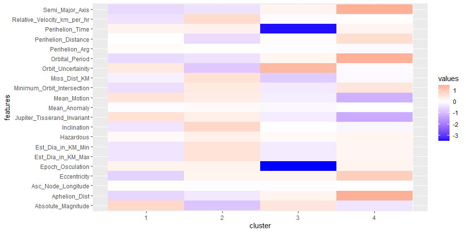

Asteroids Comparison Metaball Featured (sourse:
<a href="https://warpgatenews.com/metaballstudios-asteroid-comparison-video/" class="uri">https://warpgatenews.com/metaballstudios-asteroid-comparison-video/</a>)

NASA Hazardous Asteroids Prediction
===================================

Introduction
============

There are few things more interesting and mysterious than space. The
vastness and largely unknown space have given rise to many stories
including Star Wars and Star Trek. While we may not have to deal with an
extraterrestrial siege in the near future, there are very real dangers
in our solar system in the shape of asteroids. According to Danica Remy,
president of the B612 Foundation, a nonprofit organization in Mill
Valley, “It’s 100 percent certain that we’re going to get hit, but we’re
not 100 percent certain when” (Harper, 2018). With this threat looming
it only seems responsible to monitor all objects heading for earth and
classify the ones that pose a real threat to us. Fortunately, NASA has
been keeping a watchful eye on everything with a trajectory towards
Earth and has used this data to classify if an object is hazardous or
not.

The goal of this project is to use historical data of the
characteristics of asteroids and create models to accurately classify
whether other asteroids are hazardous based on their characteristics.
There has been extensive research about the threat of asteroids to Earth
but there is less literature regarding the specific qualities of those
asteroids that are considered hazardous. I’m interested in the question:
What aspects of an asteroid’s characteristics determine whether it is
hazardous to Earth? To answer this question, I used data from Kaggle
(<a href="https://www.kaggle.com/shrutimehta/nasa-asteroids-classification" class="uri">https://www.kaggle.com/shrutimehta/nasa-asteroids-classification</a>).

Load the data
=============

``` r
library(data.table)
nasa <- fread("data/nasa.csv")
```

``` r
#review the data
library(tidyverse)

summary(nasa)
```

     Neo Reference ID       Name         Absolute Magnitude Est Dia in KM(min) 
     Min.   :2000433   Min.   :2000433   Min.   :11.16      Min.   : 0.001011  
     1st Qu.:3097594   1st Qu.:3097594   1st Qu.:20.10      1st Qu.: 0.033462  
     Median :3514799   Median :3514799   Median :21.90      Median : 0.110804  
     Mean   :3272298   Mean   :3272298   Mean   :22.27      Mean   : 0.204604  
     3rd Qu.:3690060   3rd Qu.:3690060   3rd Qu.:24.50      3rd Qu.: 0.253837  
     Max.   :3781897   Max.   :3781897   Max.   :32.10      Max.   :15.579552  
     Est Dia in KM(max) Est Dia in M(min)   Est Dia in M(max) 
     Min.   : 0.00226   Min.   :    1.011   Min.   :    2.26  
     1st Qu.: 0.07482   1st Qu.:   33.462   1st Qu.:   74.82  
     Median : 0.24777   Median :  110.804   Median :  247.77  
     Mean   : 0.45751   Mean   :  204.604   Mean   :  457.51  
     3rd Qu.: 0.56760   3rd Qu.:  253.837   3rd Qu.:  567.60  
     Max.   :34.83694   Max.   :15579.552   Max.   :34836.94  
     Est Dia in Miles(min) Est Dia in Miles(max) Est Dia in Feet(min)
     Min.   :0.000628      Min.   : 0.001404     Min.   :    3.32    
     1st Qu.:0.020792      1st Qu.: 0.046493     1st Qu.:  109.78    
     Median :0.068850      Median : 0.153954     Median :  363.53    
     Mean   :0.127135      Mean   : 0.284283     Mean   :  671.27    
     3rd Qu.:0.157727      3rd Qu.: 0.352688     3rd Qu.:  832.80    
     Max.   :9.680682      Max.   :21.646663     Max.   :51114.02    
     Est Dia in Feet(max) Close Approach Date Epoch Date Close Approach
     Min.   :     7.41    Length:4687         Min.   : 788947200000    
     1st Qu.:   245.49    Class :character    1st Qu.:1015574400000    
     Median :   812.88    Mode  :character    Median :1203062400000    
     Mean   :  1501.01                        Mean   :1179880584425    
     3rd Qu.:  1862.19                        3rd Qu.:1355558400000    
     Max.   :114294.42                        Max.   :1473318000000    
     Relative Velocity km per sec Relative Velocity km per hr Miles per hour   
     Min.   : 0.3355              Min.   :  1208              Min.   :  750.5  
     1st Qu.: 8.4329              1st Qu.: 30358              1st Qu.:18863.5  
     Median :12.9179              Median : 46504              Median :28896.0  
     Mean   :13.9708              Mean   : 50295              Mean   :31251.3  
     3rd Qu.:18.0776              3rd Qu.: 65080              3rd Qu.:40437.9  
     Max.   :44.6337              Max.   :160681              Max.   :99841.2  
     Miss Dist.(Astronomical) Miss Dist.(lunar)   Miss Dist.(kilometers)
     Min.   :0.0001779        Min.   :  0.06919   Min.   :   26610      
     1st Qu.:0.1334196        1st Qu.: 51.90021   1st Qu.:19959283      
     Median :0.2650286        Median :103.09612   Median :39647712      
     Mean   :0.2567782        Mean   : 99.88671   Mean   :38413467      
     3rd Qu.:0.3841541        3rd Qu.:149.43592   3rd Qu.:57468628      
     Max.   :0.4998841        Max.   :194.45491   Max.   :74781600      
     Miss Dist.(miles)  Orbiting Body         Orbit ID     Orbit Determination Date
     Min.   :   16535   Length:4687        Min.   :  1.0   Length:4687             
     1st Qu.:12402124   Class :character   1st Qu.:  9.0   Class :character        
     Median :24635948   Mode  :character   Median : 16.0   Mode  :character        
     Mean   :23869022                      Mean   : 28.3                           
     3rd Qu.:35709350                      3rd Qu.: 31.0                           
     Max.   :46467132                      Max.   :611.0                           
     Orbit Uncertainity Minimum Orbit Intersection Jupiter Tisserand Invariant
     Min.   :0.000      Min.   :0.0000021          Min.   :2.196              
     1st Qu.:0.000      1st Qu.:0.0145851          1st Qu.:4.050              
     Median :3.000      Median :0.0473655          Median :5.071              
     Mean   :3.517      Mean   :0.0823201          Mean   :5.056              
     3rd Qu.:6.000      3rd Qu.:0.1235935          3rd Qu.:6.019              
     Max.   :9.000      Max.   :0.4778910          Max.   :9.025              
     Epoch Osculation   Eccentricity      Semi Major Axis   Inclination      
     Min.   :2450165   Min.   :0.007522   Min.   :0.6159   Min.   : 0.01451  
     1st Qu.:2458001   1st Qu.:0.240858   1st Qu.:1.0006   1st Qu.: 4.96234  
     Median :2458001   Median :0.372450   Median :1.2410   Median :10.31184  
     Mean   :2457724   Mean   :0.382569   Mean   :1.4003   Mean   :13.37384  
     3rd Qu.:2458001   3rd Qu.:0.512411   3rd Qu.:1.6784   3rd Qu.:19.51168  
     Max.   :2458020   Max.   :0.960261   Max.   :5.0720   Max.   :75.40667  
     Asc Node Longitude Orbital Period   Perihelion Distance Perihelion Arg    
     Min.   :  0.0019   Min.   : 176.6   Min.   :0.08074     Min.   :  0.0069  
     1st Qu.: 83.0812   1st Qu.: 365.6   1st Qu.:0.63083     1st Qu.: 95.6259  
     Median :172.6254   Median : 504.9   Median :0.83315     Median :189.7616  
     Mean   :172.1573   Mean   : 635.6   Mean   :0.81338     Mean   :183.9322  
     3rd Qu.:255.0269   3rd Qu.: 794.2   3rd Qu.:0.99723     3rd Qu.:271.7776  
     Max.   :359.9059   Max.   :4172.2   Max.   :1.29983     Max.   :359.9931  
     Aphelion Dist    Perihelion Time    Mean Anomaly       Mean Motion     
     Min.   :0.8038   Min.   :2450100   Min.   :  0.0032   Min.   :0.08628  
     1st Qu.:1.2661   1st Qu.:2457815   1st Qu.: 87.0069   1st Qu.:0.45329  
     Median :1.6182   Median :2457973   Median :185.7189   Median :0.71295  
     Mean   :1.9871   Mean   :2457728   Mean   :181.1679   Mean   :0.73824  
     3rd Qu.:2.4512   3rd Qu.:2458108   3rd Qu.:276.5319   3rd Qu.:0.98467  
     Max.   :8.9839   Max.   :2458839   Max.   :359.9180   Max.   :2.03900  
       Equinox          Hazardous      
     Length:4687        Mode :logical  
     Class :character   FALSE:3932     
     Mode  :character   TRUE :755      
                                       
                                       
                                       

``` r
glimpse(nasa)
```

    Rows: 4,687
    Columns: 40
    $ `Neo Reference ID`             <int> 3703080, 3723955, 2446862, 3092506, ...
    $ Name                           <int> 3703080, 3723955, 2446862, 3092506, ...
    $ `Absolute Magnitude`           <dbl> 21.6, 21.3, 20.3, 27.4, 21.6, 19.6, ...
    $ `Est Dia in KM(min)`           <dbl> 0.127219878, 0.146067964, 0.23150212...
    $ `Est Dia in KM(max)`           <dbl> 0.28447230, 0.32661790, 0.51765448, ...
    $ `Est Dia in M(min)`            <dbl> 127.219879, 146.067964, 231.502122, ...
    $ `Est Dia in M(max)`            <dbl> 284.47230, 326.61790, 517.65448, 19....
    $ `Est Dia in Miles(min)`        <dbl> 0.079050743, 0.090762397, 0.14384870...
    $ `Est Dia in Miles(max)`        <dbl> 0.17676284, 0.20295089, 0.32165548, ...
    $ `Est Dia in Feet(min)`         <dbl> 417.38807, 479.22562, 759.52142, 28....
    $ `Est Dia in Feet(max)`         <dbl> 933.30809, 1071.58106, 1698.34153, 6...
    $ `Close Approach Date`          <chr> "1995-01-01", "1995-01-01", "1995-01...
    $ `Epoch Date Close Approach`    <int64> 788947200000, 788947200000, 789552...
    $ `Relative Velocity km per sec` <dbl> 6.115834, 18.113985, 7.590711, 11.17...
    $ `Relative Velocity km per hr`  <dbl> 22017.004, 65210.346, 27326.560, 402...
    $ `Miles per hour`               <dbl> 13680.510, 40519.173, 16979.662, 249...
    $ `Miss Dist.(Astronomical)`     <dbl> 0.41948253, 0.38301446, 0.05095602, ...
    $ `Miss Dist.(lunar)`            <dbl> 163.17871, 148.99263, 19.82189, 110....
    $ `Miss Dist.(kilometers)`       <dbl> 62753692, 57298148, 7622912, 4268361...
    $ `Miss Dist.(miles)`            <dbl> 38993336, 35603420, 4736658, 2652236...
    $ `Orbiting Body`                <chr> "Earth", "Earth", "Earth", "Earth", ...
    $ `Orbit ID`                     <int> 17, 21, 22, 7, 25, 40, 43, 22, 100, ...
    $ `Orbit Determination Date`     <chr> "2017-04-06 08:36:37", "2017-04-06 0...
    $ `Orbit Uncertainity`           <int> 5, 3, 0, 6, 1, 1, 1, 0, 0, 0, 6, 4, ...
    $ `Minimum Orbit Intersection`   <dbl> 0.025281900, 0.186935000, 0.04305790...
    $ `Jupiter Tisserand Invariant`  <dbl> 4.634, 5.457, 4.557, 5.093, 5.154, 4...
    $ `Epoch Osculation`             <dbl> 2458001, 2458001, 2458001, 2458001, ...
    $ Eccentricity                   <dbl> 0.4255491, 0.3516743, 0.3482483, 0.2...
    $ `Semi Major Axis`              <dbl> 1.4070113, 1.1077760, 1.4588238, 1.2...
    $ Inclination                    <dbl> 6.025981, 28.412996, 4.237961, 7.905...
    $ `Asc Node Longitude`           <dbl> 314.373913, 136.717242, 259.475979, ...
    $ `Orbital Period`               <dbl> 609.5998, 425.8693, 643.5802, 514.08...
    $ `Perihelion Distance`          <dbl> 0.8082589, 0.7181996, 0.9507910, 0.9...
    $ `Perihelion Arg`               <dbl> 57.257470, 313.091975, 248.415038, 1...
    $ `Aphelion Dist`                <dbl> 2.005764, 1.497352, 1.966857, 1.5279...
    $ `Perihelion Time`              <dbl> 2458162, 2457795, 2458120, 2457902, ...
    $ `Mean Anomaly`                 <dbl> 264.837533, 173.741112, 292.893654, ...
    $ `Mean Motion`                  <dbl> 0.5905514, 0.8453298, 0.5593708, 0.7...
    $ Equinox                        <chr> "J2000", "J2000", "J2000", "J2000", ...
    $ Hazardous                      <lgl> TRUE, FALSE, TRUE, FALSE, TRUE, FALS...

``` r
count(nasa)
```

          n
    1: 4687

Data Cleaning
=============

``` r
#replace all white spaces in names with _
names(nasa)<- gsub("\\s","_",names(nasa))


nasa<- as.data.frame(nasa)
checkvars <- c('Orbiting_Body','Equinox', 'Orbit_ID', 'Close_Approach_Date', 'Epoch_Date_Close_Approach','Orbit_Determination_Date')

#head(nasa[checkvars], 10)
#table(nasa$Orbiting_Body)
#table(nasa$Equinox)
```

``` r
#Take out variables not usable

mydata <- nasa %>% 
  select(-c("Name","Orbiting_Body", "Equinox", "Orbit_ID", "Close_Approach_Date", "Epoch_Date_Close_Approach", 
              "Orbit_Determination_Date"))
```

``` r
#Change response variable to 0 or 1 
mydata <- mydata %>% 
  mutate(Hazardous = ifelse(Hazardous == TRUE, 1, 0))

table(nasa$Hazardous)
```


    FALSE  TRUE 
     3932   755 

``` r
table(mydata$Hazardous)
```


       0    1 
    3932  755 

``` r
#check missing values
anyNA(mydata)       
```

    [1] FALSE

``` r
#summary statistics:
psych::describe(mydata)
```

                                 vars    n        mean          sd      median
    Neo_Reference_ID                1 4687  3272297.77   548601.08  3514799.00
    Absolute_Magnitude              2 4687       22.27        2.89       21.90
    Est_Dia_in_KM(min)              3 4687        0.20        0.37        0.11
    Est_Dia_in_KM(max)              4 4687        0.46        0.83        0.25
    Est_Dia_in_M(min)               5 4687      204.60      369.57      110.80
    Est_Dia_in_M(max)               6 4687      457.51      826.39      247.77
    Est_Dia_in_Miles(min)           7 4687        0.13        0.23        0.07
    Est_Dia_in_Miles(max)           8 4687        0.28        0.51        0.15
    Est_Dia_in_Feet(min)            9 4687      671.27     1212.51      363.53
    Est_Dia_in_Feet(max)           10 4687     1501.01     2711.26      812.88
    Relative_Velocity_km_per_sec   11 4687       13.97        7.29       12.92
    Relative_Velocity_km_per_hr    12 4687    50294.92    26255.60    46504.40
    Miles_per_hour                 13 4687    31251.31    16314.21    28896.03
    Miss_Dist.(Astronomical)       14 4687        0.26        0.15        0.27
    Miss_Dist.(lunar)              15 4687       99.89       56.72      103.10
    Miss_Dist.(kilometers)         16 4687 38413466.87 21811097.77 39647712.00
    Miss_Dist.(miles)              17 4687 23869021.68 13552787.80 24635948.00
    Orbit_Uncertainity             18 4687        3.52        3.08        3.00
    Minimum_Orbit_Intersection     19 4687        0.08        0.09        0.05
    Jupiter_Tisserand_Invariant    20 4687        5.06        1.24        5.07
    Epoch_Osculation               21 4687  2457723.61      920.30  2458000.50
    Eccentricity                   22 4687        0.38        0.18        0.37
    Semi_Major_Axis                23 4687        1.40        0.52        1.24
    Inclination                    24 4687       13.37       10.94       10.31
    Asc_Node_Longitude             25 4687      172.16      103.28      172.63
    Orbital_Period                 26 4687      635.58      370.95      504.95
    Perihelion_Distance            27 4687        0.81        0.24        0.83
    Perihelion_Arg                 28 4687      183.93      103.51      189.76
    Aphelion_Dist                  29 4687        1.99        0.95        1.62
    Perihelion_Time                30 4687  2457728.11      944.23  2457972.77
    Mean_Anomaly                   31 4687      181.17      107.50      185.72
    Mean_Motion                    32 4687        0.74        0.34        0.71
    Hazardous                      33 4687        0.16        0.37        0.00
                                     trimmed         mad        min         max
    Neo_Reference_ID              3351961.02   321976.24 2000433.00  3781897.00
    Absolute_Magnitude                 22.20        3.11      11.16       32.10
    Est_Dia_in_KM(min)                  0.14        0.13       0.00       15.58
    Est_Dia_in_KM(max)                  0.32        0.29       0.00       34.84
    Est_Dia_in_M(min)                 143.47      129.96       1.01    15579.55
    Est_Dia_in_M(max)                 320.81      290.59       2.26    34836.94
    Est_Dia_in_Miles(min)               0.09        0.08       0.00        9.68
    Est_Dia_in_Miles(max)               0.20        0.18       0.00       21.65
    Est_Dia_in_Feet(min)              470.70      426.36       3.32    51114.02
    Est_Dia_in_Feet(max)             1052.51      953.38       7.41   114294.42
    Relative_Velocity_km_per_sec       13.31        7.04       0.34       44.63
    Relative_Velocity_km_per_hr     47903.13    25353.72    1207.81   160681.49
    Miles_per_hour                  29765.14    15753.82     750.49    99841.23
    Miss_Dist.(Astronomical)            0.26        0.19       0.00        0.50
    Miss_Dist.(lunar)                 100.61       72.21       0.07      194.45
    Miss_Dist.(kilometers)       38691315.07 27769050.56   26609.89 74781600.00
    Miss_Dist.(miles)            24041668.56 17254884.28   16534.62 46467132.00
    Orbit_Uncertainity                  3.37        4.45       0.00        9.00
    Minimum_Orbit_Intersection          0.07        0.06       0.00        0.48
    Jupiter_Tisserand_Invariant         5.04        1.46       2.20        9.03
    Epoch_Osculation              2457984.43        0.00 2450164.50  2458019.50
    Eccentricity                        0.38        0.20       0.01        0.96
    Semi_Major_Axis                     1.33        0.43       0.62        5.07
    Inclination                        11.89        9.49       0.01       75.41
    Asc_Node_Longitude                170.66      128.60       0.00      359.91
    Orbital_Period                    577.33      256.33     176.56     4172.23
    Perihelion_Distance                 0.82        0.26       0.08        1.30
    Perihelion_Arg                    184.62      130.93       0.01      359.99
    Aphelion_Dist                       1.84        0.67       0.80        8.98
    Perihelion_Time               2457945.76      210.94 2450100.32  2458838.86
    Mean_Anomaly                      181.61      140.91       0.00      359.92
    Mean_Motion                         0.72        0.40       0.09        2.04
    Hazardous                           0.08        0.00       0.00        1.00
                                       range  skew kurtosis        se
    Neo_Reference_ID              1781464.00 -1.10    -0.28   8013.26
    Absolute_Magnitude                 20.94  0.19    -0.54      0.04
    Est_Dia_in_KM(min)                 15.58 17.66   651.61      0.01
    Est_Dia_in_KM(max)                 34.83 17.66   651.61      0.01
    Est_Dia_in_M(min)               15578.54 17.66   651.61      5.40
    Est_Dia_in_M(max)               34834.68 17.66   651.61     12.07
    Est_Dia_in_Miles(min)               9.68 17.66   651.61      0.00
    Est_Dia_in_Miles(max)              21.65 17.66   651.61      0.01
    Est_Dia_in_Feet(min)            51110.70 17.66   651.61     17.71
    Est_Dia_in_Feet(max)           114287.01 17.66   651.61     39.60
    Relative_Velocity_km_per_sec       44.30  0.89     0.81      0.11
    Relative_Velocity_km_per_hr    159473.67  0.89     0.81    383.51
    Miles_per_hour                  99090.74  0.89     0.81    238.30
    Miss_Dist.(Astronomical)            0.50 -0.10    -1.19      0.00
    Miss_Dist.(lunar)                 194.39 -0.10    -1.19      0.83
    Miss_Dist.(kilometers)       74754990.11 -0.10    -1.19 318588.47
    Miss_Dist.(miles)            46450597.38 -0.10    -1.19 197961.69
    Orbit_Uncertainity                  9.00  0.15    -1.57      0.04
    Minimum_Orbit_Intersection          0.48  1.47     1.75      0.00
    Jupiter_Tisserand_Invariant         6.83  0.11    -0.76      0.02
    Epoch_Osculation                 7855.00 -4.03    17.44     13.44
    Eccentricity                        0.95  0.30    -0.51      0.00
    Semi_Major_Axis                     4.46  1.11     0.92      0.01
    Inclination                        75.39  1.36     2.23      0.16
    Asc_Node_Longitude                359.90  0.09    -1.12      1.51
    Orbital_Period                   3995.67  1.53     3.24      5.42
    Perihelion_Distance                 1.22 -0.26    -0.56      0.00
    Perihelion_Arg                    359.99 -0.05    -1.19      1.51
    Aphelion_Dist                       8.18  1.31     1.39      0.01
    Perihelion_Time                  8738.54 -3.72    15.64     13.79
    Mean_Anomaly                      359.91 -0.03    -1.25      1.57
    Mean_Motion                         1.95  0.42    -0.41      0.01
    Hazardous                           1.00  1.84     1.40      0.01

``` r
corrplot::corrplot.mixed(cor(mydata [, 2:ncol(mydata)]))
```


``` r
#some variables are the same but in different units
#EST_Dia series and Miss_Dist. Series, relative_velocity series
cor(mydata$Relative_Velocity_km_per_hr, mydata$Miles_per_hour)
```

    [1] 1

``` r
#relative velocity km per hour is also perfectly correlated with miles per hour. So they measure the same thing
#We will choose only one of them
cor(mydata$`Est_Dia_in_KM(min)`, mydata$`Est_Dia_in_KM(max)`)
```

    [1] 1

``` r
mydata <- as.data.table(mydata)[, c('Est_Dia_in_M(min)', 'Est_Dia_in_M(max)', 'Est_Dia_in_Miles(min)', 'Est_Dia_in_Miles(max)',
                     'Est_Dia_in_Feet(min)', 'Est_Dia_in_Feet(max)', 'Miss_Dist.(Astronomical)', 'Miss_Dist.(lunar)',
                     'Miss_Dist.(miles)', 'Relative_Velocity_km_per_sec','Miles_per_hour'):=NULL]
#remove the () in column names
mydata <- mydata %>% 
  rename( Est_Dia_in_KM_Min = `Est_Dia_in_KM(min)`, 
          Est_Dia_in_KM_Max = `Est_Dia_in_KM(max)`, 
          Miss_Dist_KM = `Miss_Dist.(kilometers)`)
```

``` r
#updated correlation plot with usable data
library(PerformanceAnalytics)
chart.Correlation(mydata[,2:ncol(mydata)], histogram = TRUE,  method = c("pearson"))
```


``` r
# summary(mydata)
# psych::describe(mydata)
```

Data visualization
==================

``` r
ggplot(mydata, aes(x = Absolute_Magnitude, fill = as.factor(Hazardous))) + # Set x and y aesthetics
  geom_density(alpha = 0.3) + # Set geom density for density plot
  theme_bw() + # Set theme bw
  theme(panel.grid.major = element_blank(), # Turn of the background grid
        panel.grid.minor = element_blank(),
        panel.border = element_blank(),
        panel.background = element_blank()) +
  labs(x = "Absolute Magnitude",  # Set plot labels
       fill = "Hazardous",
       title = "Absolute Magnitude vs. Hazardous") +
  scale_fill_manual(values = c("1" = "red", "0" = "blue"), # Manually set fill values
                    labels = c("1" = "Hazardous", "0" = "Non-Hazardous"))
```


``` r
ggplot(mydata, aes(x = Mean_Anomaly, fill = as.factor(Hazardous))) + # Set x and y aesthetics
  geom_density(alpha = 0.3) + # Set geom density for density plot
  theme_bw() + # Set theme bw
  theme(panel.grid.major = element_blank(), # Turn of the background grid
        panel.grid.minor = element_blank(),
        panel.border = element_blank(),
        panel.background = element_blank()) +
  labs(x = "Mean Anomaly",  # Set plot labels
       fill = "Hazardous",
       title = "Mean Anomaly vs. Hazardous") +
  scale_fill_manual(values = c("1" = "red", "0" = "blue"), # Manually set fill values
                    labels = c("1" = "Hazardous", "0" = "Non-Hazardous"))
```


``` r
mydata %>% 
  filter(Est_Dia_in_KM_Max <=4) %>% 
ggplot(aes(x = Est_Dia_in_KM_Max, fill = as.factor(Hazardous))) + # Set x and y aesthetics
  geom_density(alpha = 0.3) + # Set geom density for density plot
  theme_bw() + # Set theme bw
  theme(panel.grid.major = element_blank(), # Turn of the background grid
        panel.grid.minor = element_blank(),
        panel.border = element_blank(),
        panel.background = element_blank()) +
  labs(x = "Estimated Diameter in KM (Max)",  # Set plot labels
       fill = "Hazardous",
       title = "Estimated Diameter in KM (Max) vs. Hazardous") +
  scale_fill_manual(values = c("1" = "red", "0" = "blue"), # Manually set fill values
                    labels = c("1" = "Hazardous", "0" = "Non-Hazardous"))
```


``` r
ggplot(mydata, aes(x = Minimum_Orbit_Intersection, fill = as.factor(Hazardous))) + # Set x and y aesthetics
  geom_density(alpha = 0.3) + # Set geom density for density plot
  theme_bw() + # Set theme bw
  theme(panel.grid.major = element_blank(), # Turn of the background grid
        panel.grid.minor = element_blank(),
        panel.border = element_blank(),
        panel.background = element_blank()) +
  labs(x = "Minimum Orbit Intersection",  # Set plot labels
       fill = "Hazardous",
       title = "Minimum Orbit Intersection vs. Hazardous") +
  scale_fill_manual(values = c("1" = "red", "0" = "blue"), # Manually set fill values
                    labels = c("1" = "Hazardous", "0" = "Non-Hazardous"))
```


``` r
ggplot(mydata, aes(x = Orbit_Uncertainity, fill = as.factor(Hazardous))) + # Set x and y aesthetics
  geom_density(alpha = 0.3) + # Set geom density for density plot
  theme_bw() + # Set theme bw
  theme(panel.grid.major = element_blank(), # Turn of the background grid
        panel.grid.minor = element_blank(),
        panel.border = element_blank(),
        panel.background = element_blank()) +
  labs(x = "Orbit Uncertainty",  # Set plot labels
       fill = "Hazardous",
       title = "Orbit Uncertainty vs. Hazardous") +
  scale_fill_manual(values = c("1" = "red", "0" = "blue"), # Manually set fill values
                    labels = c("1" = "Hazardous", "0" = "Non-Hazardous"))
```


``` r
ggplot(data = mydata, aes(x =  Absolute_Magnitude, y = Minimum_Orbit_Intersection)) + 
  geom_point(aes(color=as.factor(Hazardous)), alpha=0.3) + 
  theme_bw() + # Set theme bw
  theme(panel.grid.major = element_blank(), # Turn of the background grid
        panel.grid.minor = element_blank(),
        panel.border = element_blank(),
        panel.background = element_blank())+
  labs(x = "Absolute Magnitude",  # Set plot labels
       y = "Minimum Orbit Intersection",
       title = "Absolute Magnitude vs. Minimum Orbit Intersection by Hazardous",
       color ="Hazardous") +
  scale_color_manual(values = c("1" = "indianred1", "0" = "cadetblue1"),
    labels = c('1' = "Hazardous", '0' = "Non-Hazardous"))
```


Split taining and testing data
==============================

``` r
library(splitstackshape) # Used for stratified sampling

 set.seed(123456) # Set seed
# Perform stratified sampling
 split_dat <- stratified(mydata[,2:ncol(mydata)], group = "Hazardous", size = 0.2, bothSets = TRUE )
 # Extract train data
 train_data <- split_dat[[2]]
 # Extract test data
 test_data <- split_dat[[1]]


nrow(train_data)
```

    [1] 3750

``` r
nrow(test_data)
```

    [1] 937

``` r
# summary(train_data)
table(train_data$Hazardous)
```


       0    1 
    3146  604 

``` r
table(test_data$Hazardous)
```


      0   1 
    786 151 

Logistic Regression
===================

In order to make the logistic regression comparable with other models,
we use the training data to fit the model

``` r
log_mod <- glm(Hazardous ~ ., # Set formula
             family=binomial(link='logit'),
             data=train_data)
summary(log_mod) # Summarize model
```


    Call:
    glm(formula = Hazardous ~ ., family = binomial(link = "logit"), 
        data = train_data)

    Deviance Residuals: 
        Min       1Q   Median       3Q      Max  
    -2.2905  -0.0487  -0.0034   0.0000   5.5448  

    Coefficients: (1 not defined because of singularities)
                                  Estimate Std. Error z value Pr(>|z|)    
    (Intercept)                  2.556e+02  2.652e+02   0.964  0.33506    
    Absolute_Magnitude          -2.738e+00  1.834e-01 -14.923  < 2e-16 ***
    Est_Dia_in_KM_Min           -9.005e+09  2.797e+09  -3.219  0.00128 ** 
    Est_Dia_in_KM_Max            4.027e+09  1.251e+09   3.219  0.00128 ** 
    Relative_Velocity_km_per_hr -1.374e-06  5.565e-06  -0.247  0.80502    
    Miss_Dist_KM                -2.471e-09  4.747e-09  -0.521  0.60271    
    Orbit_Uncertainity          -1.285e-01  4.603e-02  -2.791  0.00526 ** 
    Minimum_Orbit_Intersection  -1.219e+02  7.097e+00 -17.179  < 2e-16 ***
    Jupiter_Tisserand_Invariant  6.082e+00  2.842e+00   2.140  0.03234 *  
    Epoch_Osculation             3.201e-04  5.645e-04   0.567  0.57067    
    Eccentricity                -2.805e+00  2.368e+00  -1.184  0.23624    
    Semi_Major_Axis              1.019e+01  1.057e+01   0.963  0.33535    
    Inclination                  4.137e-02  1.918e-02   2.156  0.03105 *  
    Asc_Node_Longitude           6.285e-04  9.236e-04   0.681  0.49619    
    Orbital_Period              -8.508e-03  1.180e-02  -0.721  0.47070    
    Perihelion_Distance         -4.606e+00  2.423e+00  -1.901  0.05729 .  
    Perihelion_Arg              -1.188e-05  9.560e-04  -0.012  0.99009    
    Aphelion_Dist                       NA         NA      NA       NA    
    Perihelion_Time             -4.069e-04  5.499e-04  -0.740  0.45926    
    Mean_Anomaly                 8.207e-04  9.966e-04   0.824  0.41020    
    Mean_Motion                 -1.844e+01  7.856e+00  -2.347  0.01892 *  
    ---
    Signif. codes:  0 '***' 0.001 '**' 0.01 '*' 0.05 '.' 0.1 ' ' 1

    (Dispersion parameter for binomial family taken to be 1)

        Null deviance: 3310.8  on 3749  degrees of freedom
    Residual deviance:  765.4  on 3730  degrees of freedom
    AIC: 805.4

    Number of Fisher Scoring iterations: 11

Lasso Logistic Regression
=========================

``` r
# scale the data
scale_data <- train_data [,1:20]  #take out the dependent variable
scale_data <- as.data.frame(scale(scale_data))
scale_data$Hazardous <- train_data$Hazardous
```

Find the lambda
---------------

``` r
library(glmnet) # Load glmnet
library(plotmo) # for plot_glmnet

# Create x variables
x_vars <- model.matrix(Hazardous ~., 
                       scale_data)[,-1]

# Fit lasso model
lasso_fit <- glmnet(x = x_vars, # Set explantory variables
                    y = scale_data$Hazardous, # Set response variable
                    alpha = 1, # Set alpha value
                    family = "binomial")
plot_glmnet(lasso_fit, # Plot lasso coefficients by lambda
            xvar = "lambda")
```


``` r
coef(lasso_fit)
```

    21 x 81 sparse Matrix of class "dgCMatrix"
                                                                             
    (Intercept)                 -1.650313 -1.65296608 -1.66591304 -1.68955568
    Absolute_Magnitude           .        -0.06467832 -0.18012109 -0.28437736
    Est_Dia_in_KM_Min            .         .           .           .         
    Est_Dia_in_KM_Max            .         .           .           .         
    Relative_Velocity_km_per_hr  .         .           .           .         
    Miss_Dist_KM                 .         .           .           .         
    Orbit_Uncertainity           .        -0.04091509 -0.06783356 -0.09279711
    Minimum_Orbit_Intersection   .        -0.02879268 -0.16471648 -0.29587004
    Jupiter_Tisserand_Invariant  .         .           .           .         
    Epoch_Osculation             .         .           .           .         
    Eccentricity                 .         .           .           .         
    Semi_Major_Axis              .         .           .           .         
    Inclination                  .         .           .           .         
    Asc_Node_Longitude           .         .           .           .         
    Orbital_Period               .         .           .           .         
    Perihelion_Distance          .         .           .           .         
    Perihelion_Arg               .         .           .           .         
    Aphelion_Dist                .         .           .           .         
    Perihelion_Time              .         .           .           .         
    Mean_Anomaly                 .         .           .           .         
    Mean_Motion                  .         .           .           .         
                                                                           
    (Intercept)                 -1.7219460 -1.7618218 -1.8083613 -1.8610479
    Absolute_Magnitude          -0.3801804 -0.4695864 -0.5541382 -0.6350486
    Est_Dia_in_KM_Min            .          .          .          .        
    Est_Dia_in_KM_Max            .          .          .          .        
    Relative_Velocity_km_per_hr  .          .          .          .        
    Miss_Dist_KM                 .          .          .          .        
    Orbit_Uncertainity          -0.1161444 -0.1380382 -0.1585727 -0.1778026
    Minimum_Orbit_Intersection  -0.4246986 -0.5530202 -0.6822327 -0.8134746
    Jupiter_Tisserand_Invariant  .          .          .          .        
    Epoch_Osculation             .          .          .          .        
    Eccentricity                 .          .          .          .        
    Semi_Major_Axis              .          .          .          .        
    Inclination                  .          .          .          .        
    Asc_Node_Longitude           .          .          .          .        
    Orbital_Period               .          .          .          .        
    Perihelion_Distance          .          .          .          .        
    Perihelion_Arg               .          .          .          .        
    Aphelion_Dist                .          .          .          .        
    Perihelion_Time              .          .          .          .        
    Mean_Anomaly                 .          .          .          .        
    Mean_Motion                  .          .          .          .        
                                                                          
    (Intercept)                 -1.9195394 -1.9836535 -2.053293 -2.1284239
    Absolute_Magnitude          -0.7131891 -0.7893125 -0.864003 -0.9377378
    Est_Dia_in_KM_Min            .          .          .         .        
    Est_Dia_in_KM_Max            .          .          .         .        
    Relative_Velocity_km_per_hr  .          .          .         .        
    Miss_Dist_KM                 .          .          .         .        
    Orbit_Uncertainity          -0.1957896 -0.2125734 -0.228202 -0.2427261
    Minimum_Orbit_Intersection  -0.9476297 -1.0854807 -1.227673 -1.3747521
    Jupiter_Tisserand_Invariant  .          .          .         .        
    Epoch_Osculation             .          .          .         .        
    Eccentricity                 .          .          .         .        
    Semi_Major_Axis              .          .          .         .        
    Inclination                  .          .          .         .        
    Asc_Node_Longitude           .          .          .         .        
    Orbital_Period               .          .          .         .        
    Perihelion_Distance          .          .          .         .        
    Perihelion_Arg               .          .          .         .        
    Aphelion_Dist                .          .          .         .        
    Perihelion_Time              .          .          .         .        
    Mean_Anomaly                 .          .          .         .        
    Mean_Motion                  .          .          .         .        
                                                                          
    (Intercept)                 -2.2090370 -2.2951421 -2.3867262 -2.483906
    Absolute_Magnitude          -1.0108982 -1.0838060 -1.1567044 -1.229937
    Est_Dia_in_KM_Min            .          .          .          .       
    Est_Dia_in_KM_Max            .          .          .          .       
    Relative_Velocity_km_per_hr  .          .          .          .       
    Miss_Dist_KM                 .          .          .          .       
    Orbit_Uncertainity          -0.2562036 -0.2686945 -0.2802673 -0.290972
    Minimum_Orbit_Intersection  -1.5271536 -1.6852289 -1.8492040 -2.019475
    Jupiter_Tisserand_Invariant  .          .          .          .       
    Epoch_Osculation             .          .          .          .       
    Eccentricity                 .          .          .          .       
    Semi_Major_Axis              .          .          .          .       
    Inclination                  .          .          .          .       
    Asc_Node_Longitude           .          .          .          .       
    Orbital_Period               .          .          .          .       
    Perihelion_Distance          .          .          .          .       
    Perihelion_Arg               .          .          .          .       
    Aphelion_Dist                .          .          .          .       
    Perihelion_Time              .          .          .          .       
    Mean_Anomaly                 .          .          .          .       
    Mean_Motion                  .          .          .          .       
                                                                           
    (Intercept)                 -2.5863795 -2.694115 -2.8069678 -2.92398112
    Absolute_Magnitude          -1.3034193 -1.377354 -1.4518344 -1.54946149
    Est_Dia_in_KM_Min            .          .         .         -0.02504305
    Est_Dia_in_KM_Max            .          .         .          .         
    Relative_Velocity_km_per_hr  .          .         .          .         
    Miss_Dist_KM                 .          .         .          .         
    Orbit_Uncertainity          -0.3009161 -0.310160 -0.3187752 -0.32284787
    Minimum_Orbit_Intersection  -2.1956489 -2.377796 -2.5657716 -2.75300860
    Jupiter_Tisserand_Invariant  .          .         .          .         
    Epoch_Osculation             .          .         .          .         
    Eccentricity                 .          .         .          .         
    Semi_Major_Axis              .          .         .          .         
    Inclination                  .          .         .          .         
    Asc_Node_Longitude           .          .         .          .         
    Orbital_Period               .          .         .          .         
    Perihelion_Distance          .          .         .          .         
    Perihelion_Arg               .          .         .          .         
    Aphelion_Dist                .          .         .          .         
    Perihelion_Time              .          .         .          .         
    Mean_Anomaly                 .          .         .          .         
    Mean_Motion                  .          .         .          .         
                                                                             
    (Intercept)                 -3.04468891 -3.16949097 -3.2975453 -3.4296509
    Absolute_Magnitude          -1.64696060 -1.74669081 -1.8567345 -1.9960848
    Est_Dia_in_KM_Min           -0.04904324 -0.07565354 -0.1171671 -0.1975310
    Est_Dia_in_KM_Max            .           .           .          .        
    Relative_Velocity_km_per_hr  .           .           .          .        
    Miss_Dist_KM                 .           .           .          .        
    Orbit_Uncertainity          -0.32648074 -0.32973014 -0.3320457 -0.3312317
    Minimum_Orbit_Intersection  -2.94352674 -3.13745935 -3.3308498 -3.5189112
    Jupiter_Tisserand_Invariant  .           .           .          .        
    Epoch_Osculation             .           .           .          .        
    Eccentricity                 .           .           .          .        
    Semi_Major_Axis              .           .           .          .        
    Inclination                  .           .           .          .        
    Asc_Node_Longitude           .           .           .          .        
    Orbital_Period               .           .           .          .        
    Perihelion_Distance          .           .           .          .        
    Perihelion_Arg               .           .           .          .        
    Aphelion_Dist                .           .           .          .        
    Perihelion_Time              .           .           .          .        
    Mean_Anomaly                 .           .           .          .        
    Mean_Motion                  .           .           .          .        
                                                                           
    (Intercept)                 -3.5662875 -3.7079946 -3.8536986 -4.0030868
    Absolute_Magnitude          -2.1472513 -2.2972258 -2.4455614 -2.5928286
    Est_Dia_in_KM_Min           -0.2918907 -0.3818749 -0.4676480 -0.5501690
    Est_Dia_in_KM_Max            .          .          .          .        
    Relative_Velocity_km_per_hr  .          .          .          .        
    Miss_Dist_KM                 .          .          .          .        
    Orbit_Uncertainity          -0.3293081 -0.3276641 -0.3263203 -0.3252317
    Minimum_Orbit_Intersection  -3.7073072 -3.9013254 -4.0995132 -4.3013939
    Jupiter_Tisserand_Invariant  .          .          .          .        
    Epoch_Osculation             .          .          .          .        
    Eccentricity                 .          .          .          .        
    Semi_Major_Axis              .          .          .          .        
    Inclination                  .          .          .          .        
    Asc_Node_Longitude           .          .          .          .        
    Orbital_Period               .          .          .          .        
    Perihelion_Distance          .          .          .          .        
    Perihelion_Arg               .          .          .          .        
    Aphelion_Dist                .          .          .          .        
    Perihelion_Time              .          .          .          .        
    Mean_Anomaly                 .          .          .          .        
    Mean_Motion                  .          .          .          .        
                                                                            
    (Intercept)                 -4.1556920 -4.3115632 -4.46773938 -4.6249441
    Absolute_Magnitude          -2.7394224 -2.8860193 -3.02898495 -3.1711457
    Est_Dia_in_KM_Min           -0.6303315 -0.7089887 -0.78637920 -0.8633062
    Est_Dia_in_KM_Max            .          .          .           .        
    Relative_Velocity_km_per_hr  .          .          .           .        
    Miss_Dist_KM                 .          .          .           .        
    Orbit_Uncertainity          -0.3243829 -0.3237390 -0.32510885 -0.3269748
    Minimum_Orbit_Intersection  -4.5062344 -4.7140586 -4.92224776 -5.1303924
    Jupiter_Tisserand_Invariant  .          .          .           .        
    Epoch_Osculation             .          .          .           .        
    Eccentricity                 .          .          .           .        
    Semi_Major_Axis              .          .          .           .        
    Inclination                  .          .          .           .        
    Asc_Node_Longitude           .          .          .           .        
    Orbital_Period               .          .          .           .        
    Perihelion_Distance          .          .          .           .        
    Perihelion_Arg               .          .          .           .        
    Aphelion_Dist                .          .          .           .        
    Perihelion_Time              .          .          .           .        
    Mean_Anomaly                 .          .          .           .        
    Mean_Motion                  .          .         -0.00633803 -0.0136556
                                                                               
    (Intercept)                 -4.78411020 -4.94426886 -5.10495693 -5.26576172
    Absolute_Magnitude          -3.31400423 -3.45736993 -3.60146437 -3.74662599
    Est_Dia_in_KM_Min           -0.94048847 -1.01842266 -1.09778429 -1.17940067
    Est_Dia_in_KM_Max            .           .           .           .         
    Relative_Velocity_km_per_hr  .           .           .           .         
    Miss_Dist_KM                 .           .           .           .         
    Orbit_Uncertainity          -0.32893158 -0.33098337 -0.33310408 -0.33526030
    Minimum_Orbit_Intersection  -5.33946051 -5.54798715 -5.75518812 -5.96028824
    Jupiter_Tisserand_Invariant  .           .           .           .         
    Epoch_Osculation             .           .           .           .         
    Eccentricity                 .           .           .           .         
    Semi_Major_Axis              .           .           .           .         
    Inclination                  .           .           .           .         
    Asc_Node_Longitude           .           .           .           .         
    Orbital_Period               .           .           .           .         
    Perihelion_Distance          .           .           .           .         
    Perihelion_Arg               .           .           .           .         
    Aphelion_Dist                .           .           .           .         
    Perihelion_Time              .           .           .           .         
    Mean_Anomaly                 .           .           .           .         
    Mean_Motion                 -0.02065291 -0.02737071 -0.03382023 -0.04000824
                                                                                 
    (Intercept)                 -5.42632260 -5.5855889699 -5.74462600 -5.90205719
    Absolute_Magnitude          -3.89331679 -4.0414571711 -4.19253470 -4.34583867
    Est_Dia_in_KM_Min           -1.26425889 -1.3532469151 -1.44786323 -1.54796354
    Est_Dia_in_KM_Max            .           .             .           .         
    Relative_Velocity_km_per_hr  .           .             .           .         
    Miss_Dist_KM                 .           .             .           .         
    Orbit_Uncertainity          -0.33741250 -0.3395113420 -0.34117994 -0.34282656
    Minimum_Orbit_Intersection  -6.16251731 -6.3601400155 -6.55411688 -6.74268916
    Jupiter_Tisserand_Invariant  .           .             .           .         
    Epoch_Osculation             .           .             .           .         
    Eccentricity                 .           .             .           .         
    Semi_Major_Axis              .           .             .           .         
    Inclination                  .           .             .           .         
    Asc_Node_Longitude           .           .             .           .         
    Orbital_Period               .           .             .           .         
    Perihelion_Distance          .           .             .           .         
    Perihelion_Arg               .           .             .           .         
    Aphelion_Dist                .           .             .           .         
    Perihelion_Time              .           .             .           .         
    Mean_Anomaly                 .           0.0006778829  0.00701492  0.01283143
    Mean_Motion                 -0.04593935 -0.0516745817 -0.05742044 -0.06292870
                                                                               
    (Intercept)                 -6.05930726 -6.21551926 -6.36570776 -6.51752378
    Absolute_Magnitude          -4.50290973 -4.66246560 -4.81775557 -4.97649029
    Est_Dia_in_KM_Min           -1.65430123 -1.76563816 -1.87635787 -1.99150652
    Est_Dia_in_KM_Max            .           .           .           .         
    Relative_Velocity_km_per_hr  .           .           .           .         
    Miss_Dist_KM                 .           .           .           .         
    Orbit_Uncertainity          -0.34433936 -0.34577339 -0.34730114 -0.35022444
    Minimum_Orbit_Intersection  -6.92758187 -7.10807255 -7.27945317 -7.44999573
    Jupiter_Tisserand_Invariant  .           .           .           .         
    Epoch_Osculation             .           .           .           .         
    Eccentricity                 .           .           .           .         
    Semi_Major_Axis              .           .           .           .         
    Inclination                  .           .           .           .         
    Asc_Node_Longitude           .           .           .           .         
    Orbital_Period               .           .           .           .         
    Perihelion_Distance          .           .           .           .         
    Perihelion_Arg               .           .           .           .         
    Aphelion_Dist                .           .           .           .         
    Perihelion_Time              .           .           .          -0.00405617
    Mean_Anomaly                 0.01811514  0.02289051  0.02722455  0.03122561
    Mean_Motion                 -0.06816557 -0.07317903 -0.07807892 -0.08287321
                                                                                
    (Intercept)                 -6.671412232 -6.81393435 -6.96057698 -7.09461366
    Absolute_Magnitude          -5.135430337 -5.28075996 -5.42996324 -5.56679519
    Est_Dia_in_KM_Min           -2.108539746 -2.21692444 -2.32701826 -2.42838201
    Est_Dia_in_KM_Max            .            .           .           .         
    Relative_Velocity_km_per_hr  .            .           .           .         
    Miss_Dist_KM                 .            .           .           .         
    Orbit_Uncertainity          -0.354135921 -0.35855021 -0.36290002 -0.36696284
    Minimum_Orbit_Intersection  -7.623335453 -7.78445565 -7.94970747 -8.09998619
    Jupiter_Tisserand_Invariant  .            .           .           .         
    Epoch_Osculation             .            .           .           .         
    Eccentricity                 .            .           .           .         
    Semi_Major_Axis              .            .           .           .         
    Inclination                  0.003603010  0.00935722  0.01469391  0.01969698
    Asc_Node_Longitude           .            .           .           .         
    Orbital_Period               .            .           .           .         
    Perihelion_Distance          .            .           .           .         
    Perihelion_Arg               .            .           .           .         
    Aphelion_Dist                .            .           .           .         
    Perihelion_Time             -0.008181153 -0.01226334 -0.01598142 -0.01950954
    Mean_Anomaly                 0.034723566  0.03786758  0.04070742  0.04332996
    Mean_Motion                 -0.087977669 -0.09328566 -0.09835150 -0.10321590
                                                                                  
    (Intercept)                 -7.228581474 -7.357885101 -7.482570064 -7.60273051
    Absolute_Magnitude          -5.705679510 -5.841965951 -5.972894196 -6.09944070
    Est_Dia_in_KM_Min           -2.528699786 -2.625237706 -2.717316265 -2.80477719
    Est_Dia_in_KM_Max            .            .            .            .         
    Relative_Velocity_km_per_hr  .            .            .            .         
    Miss_Dist_KM                 .            .            .            .         
    Orbit_Uncertainity          -0.370145656 -0.372489390 -0.374745292 -0.37622114
    Minimum_Orbit_Intersection  -8.251113773 -8.397646525 -8.538791336 -8.67338391
    Jupiter_Tisserand_Invariant  .            .            .            .         
    Epoch_Osculation             .            .            .            .         
    Eccentricity                 .            .            .           -0.00776712
    Semi_Major_Axis              .            .            .            .         
    Inclination                  0.023822099  0.027126280  0.030161510  0.03237327
    Asc_Node_Longitude           0.002374890  0.006088995  0.009584623  0.01284215
    Orbital_Period               .            .            .            .         
    Perihelion_Distance          0.004200991  0.012044067  0.019510970  0.01823097
    Perihelion_Arg               .            .            .            .         
    Aphelion_Dist                .            .            .            .         
    Perihelion_Time             -0.022915098 -0.026240004 -0.029332898 -0.03222146
    Mean_Anomaly                 0.045755375  0.048047555  0.050160807  0.05223836
    Mean_Motion                 -0.105934936 -0.106743068 -0.107517480 -0.11465055
                                                                                 
    (Intercept)                 -7.71799355 -7.827962707 -7.93155970 -8.030434758
    Absolute_Magnitude          -6.22087667 -6.336352118 -6.44506303 -6.548436860
    Est_Dia_in_KM_Min           -2.88762582 -2.965951808 -3.03950719 -3.109267902
    Est_Dia_in_KM_Max            .           .            .           .          
    Relative_Velocity_km_per_hr  .           .            .          -0.001783811
    Miss_Dist_KM                 .           .            .           .          
    Orbit_Uncertainity          -0.37722674 -0.378207341 -0.37922557 -0.380486103
    Minimum_Orbit_Intersection  -8.80151143 -8.923650642 -9.03883962 -9.149951039
    Jupiter_Tisserand_Invariant  .           .            .           .          
    Epoch_Osculation             .           .            .           .          
    Eccentricity                -0.02028508 -0.032273237 -0.04232434 -0.047137062
    Semi_Major_Axis              .           .            .           .          
    Inclination                  0.03403310  0.035529615  0.03694008  0.039262778
    Asc_Node_Longitude           0.01588818  0.018742728  0.02140719  0.023900060
    Orbital_Period               .           .            .           .          
    Perihelion_Distance          0.01136439  0.004670428  .           .          
    Perihelion_Arg               .           .            .           .          
    Aphelion_Dist                .           .            .           .          
    Perihelion_Time             -0.03491088 -0.037407953 -0.03974941 -0.041978012
    Mean_Anomaly                 0.05424415  0.056101245  0.05781059  0.059295670
    Mean_Motion                 -0.12570698 -0.136308486 -0.14514157 -0.150110265
                                                                                 
    (Intercept)                 -8.123294971 -8.210839943 -8.29423254 -8.37189504
    Absolute_Magnitude          -6.645401184 -6.736597968 -6.82308107 -6.90357823
    Est_Dia_in_KM_Min           -3.174659042 -3.235935781 -3.29368441 -3.34736548
    Est_Dia_in_KM_Max            .            .            .           .         
    Relative_Velocity_km_per_hr -0.005285328 -0.008563266 -0.01162279 -0.01446543
    Miss_Dist_KM                 .            .            .           .         
    Orbit_Uncertainity          -0.381818723 -0.383090593 -0.38429617 -0.38544111
    Minimum_Orbit_Intersection  -9.254549372 -9.353120550 -9.44708496 -9.53450196
    Jupiter_Tisserand_Invariant  .            .            .           .         
    Epoch_Osculation             .            .            .           .         
    Eccentricity                -0.050410429 -0.053459164 -0.05632033 -0.05897575
    Semi_Major_Axis              .            .            .           .         
    Inclination                  0.042338800  0.045191385  0.04782463  0.05025967
    Asc_Node_Longitude           0.026243315  0.028421915  0.03044607  0.03232212
    Orbital_Period               .            .            .           .         
    Perihelion_Distance          .            .            .           .         
    Perihelion_Arg               .            .            .           .         
    Aphelion_Dist                .            .            .           .         
    Perihelion_Time             -0.044098488 -0.046066763 -0.04788147 -0.04956910
    Mean_Anomaly                 0.060606953  0.061813255  0.06292208  0.06394187
    Mean_Motion                 -0.154595569 -0.158804073 -0.16275630 -0.16644872
                                                                               
    (Intercept)                 -8.44360154 -8.51233994 -8.57504094 -8.63403484
    Absolute_Magnitude          -6.97795059 -7.04881320 -7.11360162 -7.17436710
    Est_Dia_in_KM_Min           -3.39697451 -3.44386205 -3.48683592 -3.52696557
    Est_Dia_in_KM_Max            .           .           .           .         
    Relative_Velocity_km_per_hr -0.01709922 -0.01955365 -0.02181831 -0.02391806
    Miss_Dist_KM                 .           .           .           .         
    Orbit_Uncertainity          -0.38652495 -0.38754136 -0.38849959 -0.38939589
    Minimum_Orbit_Intersection  -9.61509573 -9.69249917 -9.76295735 -9.82929450
    Jupiter_Tisserand_Invariant  .           .           .           .         
    Epoch_Osculation             .           .           .           .         
    Eccentricity                -0.06142811 -0.06373522 -0.06585124 -0.06782203
    Semi_Major_Axis              .           .           .           .         
    Inclination                  0.05251108  0.05458142  0.05649457  0.05825435
    Asc_Node_Longitude           0.03405722  0.03566538  0.03714805  0.03851764
    Orbital_Period               .           .           .           .         
    Perihelion_Distance          .           .           .           .         
    Perihelion_Arg               .           .           .           .         
    Aphelion_Dist                .           .           .           .         
    Perihelion_Time             -0.05114090 -0.05257822 -0.05391951 -0.05515207
    Mean_Anomaly                 0.06487966  0.06573971  0.06653022  0.06725509
    Mean_Motion                 -0.16988670 -0.17310869 -0.17609341 -0.17887371
                                                                       
    (Intercept)                 -8.68909152 -8.7403211371  -8.787935938
    Absolute_Magnitude          -7.23097028 -7.2837876704  -7.332938774
    Est_Dia_in_KM_Min           -3.56424418 -3.5989782877  -3.631247917
    Est_Dia_in_KM_Max            .           .              .          
    Relative_Velocity_km_per_hr -0.02586067 -0.0273449277  -0.028568803
    Miss_Dist_KM                 .          -0.0007143434  -0.001605896
    Orbit_Uncertainity          -0.39023378 -0.3910216961  -0.391743579
    Minimum_Orbit_Intersection  -9.89121211 -9.9485746552 -10.001771036
    Jupiter_Tisserand_Invariant  .           .              .          
    Epoch_Osculation             .           .              .          
    Eccentricity                -0.06964962 -0.0715331187  -0.073371484
    Semi_Major_Axis              .           .              .          
    Inclination                  0.05987327  0.0612451951   0.062436436
    Asc_Node_Longitude           0.03978096  0.0409133805   0.041944833
    Orbital_Period               .           .              .          
    Perihelion_Distance          .           .              .          
    Perihelion_Arg               .           .              .          
    Aphelion_Dist                .           .              .          
    Perihelion_Time             -0.05628717 -0.0572802178  -0.058174357
    Mean_Anomaly                 0.06791970  0.0685227539   0.069074053
    Mean_Motion                 -0.18145675 -0.1837855094  -0.185924288
                                                                         
    (Intercept)                  -8.831049574 -8.872565e+00 -8.909617e+00
    Absolute_Magnitude           -7.377617916 -7.420372e+00 -7.458582e+00
    Est_Dia_in_KM_Min            -3.660746905 -3.688778e+00 -3.713458e+00
    Est_Dia_in_KM_Max             .            .             .           
    Relative_Velocity_km_per_hr  -0.029593158 -3.046184e-02 -3.119607e-02
    Miss_Dist_KM                 -0.002364889 -3.018971e-03 -3.438968e-03
    Orbit_Uncertainity           -0.392532405 -3.933573e-01 -3.936804e-01
    Minimum_Orbit_Intersection  -10.049993325 -1.009667e+01 -1.013801e+01
    Jupiter_Tisserand_Invariant   .            .             .           
    Epoch_Osculation              .            2.751166e-04  1.980444e-02
    Eccentricity                 -0.075498753 -7.784661e-02 -7.966968e-02
    Semi_Major_Axis               .            .             .           
    Inclination                   0.063514406  6.447507e-02  6.534148e-02
    Asc_Node_Longitude            0.042871533  4.371452e-02  4.452951e-02
    Orbital_Period                0.001822626  4.940814e-03  6.959043e-03
    Perihelion_Distance           .            .             .           
    Perihelion_Arg                .            .             2.716521e-04
    Aphelion_Dist                 .            .             .           
    Perihelion_Time              -0.059045073 -6.013622e-02 -8.004822e-02
    Mean_Anomaly                  0.069575624  7.005255e-02  7.220571e-02
    Mean_Motion                  -0.186708639 -1.865221e-01 -1.866088e-01
                                                                         
    (Intercept)                 -8.942908e+00  -8.974047366  -9.002873411
    Absolute_Magnitude          -7.492747e+00  -7.524476902  -7.553738700
    Est_Dia_in_KM_Min           -3.735529e+00  -3.755899627  -3.774622925
    Est_Dia_in_KM_Max            .              .             .          
    Relative_Velocity_km_per_hr -3.189340e-02  -0.032539035  -0.033134769
    Miss_Dist_KM                -3.758534e-03  -0.004019872  -0.004243203
    Orbit_Uncertainity          -3.939810e-01  -0.394243244  -0.394479916
    Minimum_Orbit_Intersection  -1.017510e+01 -10.209851492 -10.242052805
    Jupiter_Tisserand_Invariant  .              .             .          
    Epoch_Osculation             4.316704e-02   0.067528229   0.091203947
    Eccentricity                -8.121277e-02  -0.082584291  -0.083819842
    Semi_Major_Axis              .              .             .          
    Inclination                  6.621151e-02   0.067041836   0.067820326
    Asc_Node_Longitude           4.530422e-02   0.046017464   0.046672406
    Orbital_Period               8.588539e-03   0.009949808   0.011137357
    Perihelion_Distance          .              .             .          
    Perihelion_Arg               8.810261e-04   0.001418475   0.001902501
    Aphelion_Dist                .              .             .          
    Perihelion_Time             -1.036973e-01  -0.128271031  -0.152119754
    Mean_Anomaly                 7.464715e-02   0.077150017   0.079564807
    Mean_Motion                 -1.867755e-01  -0.186998111  -0.187235579
                                                                         
    (Intercept)                  -9.029993306  -9.055086106  -9.078126105
    Absolute_Magnitude           -7.580901345  -7.606015678  -7.629066830
    Est_Dia_in_KM_Min            -3.791972237  -3.807838834  -3.822301986
    Est_Dia_in_KM_Max             .             .             .          
    Relative_Velocity_km_per_hr  -0.034783890  -0.036843555  -0.038932347
    Miss_Dist_KM                 -0.004324596  -0.004398111  -0.004467938
    Orbit_Uncertainity           -0.394797237  -0.395021912  -0.395186433
    Minimum_Orbit_Intersection  -10.270967549 -10.296909668 -10.320424193
    Jupiter_Tisserand_Invariant   .             .             .          
    Epoch_Osculation              0.113882025   0.135929370   0.157156324
    Eccentricity                 -0.093385045  -0.107501489  -0.122507413
    Semi_Major_Axis               .             .             .          
    Inclination                   0.068884253   0.069979337   0.071027248
    Asc_Node_Longitude            0.047272184   0.047830372   0.048346612
    Orbital_Period                0.017327660   0.025367733   0.033508452
    Perihelion_Distance          -0.011015745  -0.027674194  -0.045439287
    Perihelion_Arg                0.002273439   0.002557934   0.002791699
    Aphelion_Dist                 .             .             .          
    Perihelion_Time              -0.174992759  -0.197225057  -0.218616035
    Mean_Anomaly                  0.081833215   0.084057987   0.086208464
    Mean_Motion                  -0.191747980  -0.199007664  -0.206948776
                                                                         
    (Intercept)                  -9.099241131  -9.118535012  -9.137179599
    Absolute_Magnitude           -7.650167095  -7.669422477  -7.687850643
    Est_Dia_in_KM_Min            -3.835490217  -3.847492924  -3.858825872
    Est_Dia_in_KM_Max             .             .             .          
    Relative_Velocity_km_per_hr  -0.040926155  -0.042759036  -0.044437414
    Miss_Dist_KM                 -0.004528290  -0.004592892  -0.004679255
    Orbit_Uncertainity           -0.395322486  -0.395442108  -0.395524140
    Minimum_Orbit_Intersection  -10.341855436 -10.361469955 -10.380535807
    Jupiter_Tisserand_Invariant   .             0.003723766   0.014508329
    Epoch_Osculation              0.177256394   0.196025271   0.214435813
    Eccentricity                 -0.137055695  -0.150241933  -0.162710049
    Semi_Major_Axis               .             .             .          
    Inclination                   0.072010010   0.073106663   0.074468293
    Asc_Node_Longitude            0.048821292   0.049230291   0.049613192
    Orbital_Period                0.041252406   0.049326204   0.058224678
    Perihelion_Distance          -0.062693643  -0.078665639  -0.094367833
    Perihelion_Arg                0.002993042   0.003176220   0.003327948
    Aphelion_Dist                 .             .             .          
    Perihelion_Time              -0.238861011  -0.257753764  -0.276257948
    Mean_Anomaly                  0.088244351   0.090134777   0.091973398
    Mean_Motion                  -0.214736799  -0.224812249  -0.240777598
                                                           
    (Intercept)                  -9.178997742  -9.179274756
    Absolute_Magnitude           -7.720572797  -7.720963319
    Est_Dia_in_KM_Min            -3.873304508  -3.874371663
    Est_Dia_in_KM_Max             .             .          
    Relative_Velocity_km_per_hr  -0.043314817  -0.043430014
    Miss_Dist_KM                 -0.007264828  -0.007394606
    Orbit_Uncertainity           -0.393987788  -0.394309749
    Minimum_Orbit_Intersection  -10.426712417 -10.426920360
    Jupiter_Tisserand_Invariant   0.455579430   0.456680178
    Epoch_Osculation              0.265706557   0.265777338
    Eccentricity                 -0.178435226  -0.178221299
    Semi_Major_Axis               .             .          
    Inclination                   0.095807812   0.096286611
    Asc_Node_Longitude            0.050497209   0.050700029
    Orbital_Period                0.136403798   0.137625141
    Perihelion_Distance          -0.152030101  -0.152039160
    Perihelion_Arg                0.002542511   0.002775540
    Aphelion_Dist                 .             .          
    Perihelion_Time              -0.326817344  -0.327193390
    Mean_Anomaly                  0.096771496   0.096904409
    Mean_Motion                  -0.647145837  -0.647599273

``` r
set.seed(12345)
# Set sequence of lambda values
lambda_seq <- 10^seq(4, -4, by = -.1)
# Fit cross-validated lasso model
cv.lasso <- cv.glmnet(x = x_vars, # Set x variables
                 y = scale_data$Hazardous, # Set response variables
                 alpha = 1, # Set alpha = 1 for lasso
                 family = "binomial", # Set family as binomial for logistic regression
                 lambda = lambda_seq, # Set lambda values to try
                 nfolds = 10)
best_lam <- cv.lasso$lambda.min # Extract best lambda
best_lam  # Print best lambda TOO SMALL
```

    [1] 0.0001258925

Use the best lambda for lasso fit
---------------------------------

``` r
lasso_fit2 <- glmnet(x = x_vars, # Set explantory variables
                    y = scale_data$Hazardous, # Set response variable
                    alpha = 1, # Set alpha as 1 for lasso
                    family = "binomial", # Set as logistic regression
                    lambda = best_lam) # Set lambda as best lambda

temp <- cbind.data.frame(coef(log_mod), as.vector(coef(lasso_fit2))) # Join Coefficients from models
names(temp) <- c("logisitic Regression", "Logistic Lasso") # Name coefficient columns
rownames(temp) <- names(coef(log_mod)) # Add rownames to coefficients
temp # Print coefficients
```

                                logisitic Regression Logistic Lasso
    (Intercept)                         2.556362e+02   -9.044221568
    Absolute_Magnitude                 -2.737513e+00   -7.594692154
    Est_Dia_in_KM_Min                  -9.004506e+09   -3.800184242
    Est_Dia_in_KM_Max                   4.026938e+09    0.000000000
    Relative_Velocity_km_per_hr        -1.373774e-06   -0.037314598
    Miss_Dist_KM                       -2.471122e-09   -0.004088109
    Orbit_Uncertainity                 -1.284713e-01   -0.394456565
    Minimum_Orbit_Intersection         -1.219238e+02  -10.283129445
    Jupiter_Tisserand_Invariant         6.081996e+00    0.000000000
    Epoch_Osculation                    3.200947e-04    0.164785482
    Eccentricity                       -2.805109e+00   -0.115317238
    Semi_Major_Axis                     1.018546e+01    0.000000000
    Inclination                         4.136529e-02    0.070119925
    Asc_Node_Longitude                  6.285133e-04    0.047668016
    Orbital_Period                     -8.508299e-03    0.026591366
    Perihelion_Distance                -4.606147e+00   -0.037943526
    Perihelion_Arg                     -1.187667e-05    0.001978260
    Aphelion_Dist                                 NA    0.000000000
    Perihelion_Time                    -4.069441e-04   -0.225497474
    Mean_Anomaly                        8.207454e-04    0.086695766
    Mean_Motion                        -1.843838e+01   -0.204970047

``` r
temp<- as.data.frame(temp)

newvars <- rownames(temp[temp$`Logistic Lasso` != 0,])[-1]

log_mod2 <- glm(as.formula(paste("Hazardous~", paste(newvars, collapse =  "+"))), # Set formula
             family=binomial(link='logit'),
             data=train_data)
summary(log_mod2) # Sumamrize model
```


    Call:
    glm(formula = as.formula(paste("Hazardous~", paste(newvars, collapse = "+"))), 
        family = binomial(link = "logit"), data = train_data)

    Deviance Residuals: 
        Min       1Q   Median       3Q      Max  
    -2.1124  -0.0509  -0.0038   0.0000   5.5566  

    Coefficients:
                                  Estimate Std. Error z value Pr(>|z|)    
    (Intercept)                  1.965e+02  2.622e+02   0.749  0.45357    
    Absolute_Magnitude          -2.721e+00  1.807e-01 -15.059  < 2e-16 ***
    Est_Dia_in_KM_Min           -1.045e+01  1.011e+00 -10.332  < 2e-16 ***
    Relative_Velocity_km_per_hr -2.466e-06  5.376e-06  -0.459  0.64648    
    Miss_Dist_KM                -2.144e-10  4.606e-09  -0.047  0.96288    
    Orbit_Uncertainity          -1.284e-01  4.553e-02  -2.819  0.00481 ** 
    Minimum_Orbit_Intersection  -1.185e+02  6.851e+00 -17.296  < 2e-16 ***
    Epoch_Osculation             4.737e-04  5.598e-04   0.846  0.39745    
    Eccentricity                -1.763e+00  1.985e+00  -0.888  0.37446    
    Inclination                  7.562e-03  1.189e-02   0.636  0.52486    
    Asc_Node_Longitude           5.245e-04  9.154e-04   0.573  0.56666    
    Orbital_Period               3.619e-04  7.709e-04   0.469  0.63872    
    Perihelion_Distance         -1.155e+00  1.690e+00  -0.683  0.49439    
    Perihelion_Arg               4.557e-05  9.494e-04   0.048  0.96172    
    Perihelion_Time             -5.270e-04  5.467e-04  -0.964  0.33501    
    Mean_Anomaly                 1.064e-03  9.854e-04   1.080  0.28027    
    Mean_Motion                 -9.208e-01  7.461e-01  -1.234  0.21715    
    ---
    Signif. codes:  0 '***' 0.001 '**' 0.01 '*' 0.05 '.' 0.1 ' ' 1

    (Dispersion parameter for binomial family taken to be 1)

        Null deviance: 3310.76  on 3749  degrees of freedom
    Residual deviance:  780.96  on 3733  degrees of freedom
    AIC: 814.96

    Number of Fisher Scoring iterations: 9

``` r
summary(log_mod)
```


    Call:
    glm(formula = Hazardous ~ ., family = binomial(link = "logit"), 
        data = train_data)

    Deviance Residuals: 
        Min       1Q   Median       3Q      Max  
    -2.2905  -0.0487  -0.0034   0.0000   5.5448  

    Coefficients: (1 not defined because of singularities)
                                  Estimate Std. Error z value Pr(>|z|)    
    (Intercept)                  2.556e+02  2.652e+02   0.964  0.33506    
    Absolute_Magnitude          -2.738e+00  1.834e-01 -14.923  < 2e-16 ***
    Est_Dia_in_KM_Min           -9.005e+09  2.797e+09  -3.219  0.00128 ** 
    Est_Dia_in_KM_Max            4.027e+09  1.251e+09   3.219  0.00128 ** 
    Relative_Velocity_km_per_hr -1.374e-06  5.565e-06  -0.247  0.80502    
    Miss_Dist_KM                -2.471e-09  4.747e-09  -0.521  0.60271    
    Orbit_Uncertainity          -1.285e-01  4.603e-02  -2.791  0.00526 ** 
    Minimum_Orbit_Intersection  -1.219e+02  7.097e+00 -17.179  < 2e-16 ***
    Jupiter_Tisserand_Invariant  6.082e+00  2.842e+00   2.140  0.03234 *  
    Epoch_Osculation             3.201e-04  5.645e-04   0.567  0.57067    
    Eccentricity                -2.805e+00  2.368e+00  -1.184  0.23624    
    Semi_Major_Axis              1.019e+01  1.057e+01   0.963  0.33535    
    Inclination                  4.137e-02  1.918e-02   2.156  0.03105 *  
    Asc_Node_Longitude           6.285e-04  9.236e-04   0.681  0.49619    
    Orbital_Period              -8.508e-03  1.180e-02  -0.721  0.47070    
    Perihelion_Distance         -4.606e+00  2.423e+00  -1.901  0.05729 .  
    Perihelion_Arg              -1.188e-05  9.560e-04  -0.012  0.99009    
    Aphelion_Dist                       NA         NA      NA       NA    
    Perihelion_Time             -4.069e-04  5.499e-04  -0.740  0.45926    
    Mean_Anomaly                 8.207e-04  9.966e-04   0.824  0.41020    
    Mean_Motion                 -1.844e+01  7.856e+00  -2.347  0.01892 *  
    ---
    Signif. codes:  0 '***' 0.001 '**' 0.01 '*' 0.05 '.' 0.1 ' ' 1

    (Dispersion parameter for binomial family taken to be 1)

        Null deviance: 3310.8  on 3749  degrees of freedom
    Residual deviance:  765.4  on 3730  degrees of freedom
    AIC: 805.4

    Number of Fisher Scoring iterations: 11

AIC is higher with the best\_lambda. Lambda is too large.

Use a larger lambda

``` r
lasso_fit3 <- glmnet(x = x_vars, # Set explantory variables
                    y = scale_data$Hazardous, # Set response variable
                    alpha = 1, # Set alpha as 1 for lasso
                    family = "binomial", # Set as logistic regression
                    lambda = 0.002) # set lambda

temp <- cbind.data.frame(coef(log_mod), as.vector(coef(lasso_fit3))) # Join Coefficients from models
names(temp) <- c("logisitic Regression", "Logistic Lasso") # Name coefficient columns
rownames(temp) <- names(coef(log_mod)) # Add rownames to coefficients
temp # Print coefficients
```

                                logisitic Regression Logistic Lasso
    (Intercept)                         2.556362e+02   -6.666138094
    Absolute_Magnitude                 -2.737513e+00   -5.129430975
    Est_Dia_in_KM_Min                  -9.004506e+09   -2.102097131
    Est_Dia_in_KM_Max                   4.026938e+09    0.000000000
    Relative_Velocity_km_per_hr        -1.373774e-06    0.000000000
    Miss_Dist_KM                       -2.471122e-09    0.000000000
    Orbit_Uncertainity                 -1.284713e-01   -0.353359336
    Minimum_Orbit_Intersection         -1.219238e+02   -7.617893371
    Jupiter_Tisserand_Invariant         6.081996e+00    0.000000000
    Epoch_Osculation                    3.200947e-04    0.000000000
    Eccentricity                       -2.805109e+00    0.000000000
    Semi_Major_Axis                     1.018546e+01    0.000000000
    Inclination                         4.136529e-02    0.002829898
    Asc_Node_Longitude                  6.285133e-04    0.000000000
    Orbital_Period                     -8.508299e-03    0.000000000
    Perihelion_Distance                -4.606147e+00    0.000000000
    Perihelion_Arg                     -1.187667e-05    0.000000000
    Aphelion_Dist                                 NA    0.000000000
    Perihelion_Time                    -4.069441e-04   -0.007599251
    Mean_Anomaly                        8.207454e-04    0.034385379
    Mean_Motion                        -1.843838e+01   -0.087293325

Use selected features to fit the logistic model

``` r
temp<- as.data.frame(temp)

newvars <- rownames(temp[temp$`Logistic Lasso` != 0,])[-1]

log_mod_final <- glm(as.formula(paste("Hazardous~", paste(newvars, collapse =  "+"))), # Set formula
             family=binomial(link='logit'),
             data=train_data)
summary(log_mod_final) # Summarize model
```


    Call:
    glm(formula = as.formula(paste("Hazardous~", paste(newvars, collapse = "+"))), 
        family = binomial(link = "logit"), data = train_data)

    Deviance Residuals: 
        Min       1Q   Median       3Q      Max  
    -2.1805  -0.0514  -0.0038   0.0000   5.5565  

    Coefficients:
                                 Estimate Std. Error z value Pr(>|z|)    
    (Intercept)                 2.216e+02  2.565e+02   0.864  0.38757    
    Absolute_Magnitude         -2.674e+00  1.738e-01 -15.381  < 2e-16 ***
    Est_Dia_in_KM_Min          -1.038e+01  1.006e+00 -10.320  < 2e-16 ***
    Orbit_Uncertainity         -1.393e-01  4.399e-02  -3.166  0.00155 ** 
    Minimum_Orbit_Intersection -1.181e+02  6.767e+00 -17.454  < 2e-16 ***
    Inclination                 7.317e-03  9.772e-03   0.749  0.45401    
    Perihelion_Time            -6.467e-05  1.045e-04  -0.619  0.53591    
    Mean_Anomaly                6.640e-04  8.751e-04   0.759  0.44800    
    Mean_Motion                -5.134e-01  2.754e-01  -1.864  0.06229 .  
    ---
    Signif. codes:  0 '***' 0.001 '**' 0.01 '*' 0.05 '.' 0.1 ' ' 1

    (Dispersion parameter for binomial family taken to be 1)

        Null deviance: 3310.76  on 3749  degrees of freedom
    Residual deviance:  783.89  on 3741  degrees of freedom
    AIC: 801.89

    Number of Fisher Scoring iterations: 9

``` r
summary(log_mod)
```


    Call:
    glm(formula = Hazardous ~ ., family = binomial(link = "logit"), 
        data = train_data)

    Deviance Residuals: 
        Min       1Q   Median       3Q      Max  
    -2.2905  -0.0487  -0.0034   0.0000   5.5448  

    Coefficients: (1 not defined because of singularities)
                                  Estimate Std. Error z value Pr(>|z|)    
    (Intercept)                  2.556e+02  2.652e+02   0.964  0.33506    
    Absolute_Magnitude          -2.738e+00  1.834e-01 -14.923  < 2e-16 ***
    Est_Dia_in_KM_Min           -9.005e+09  2.797e+09  -3.219  0.00128 ** 
    Est_Dia_in_KM_Max            4.027e+09  1.251e+09   3.219  0.00128 ** 
    Relative_Velocity_km_per_hr -1.374e-06  5.565e-06  -0.247  0.80502    
    Miss_Dist_KM                -2.471e-09  4.747e-09  -0.521  0.60271    
    Orbit_Uncertainity          -1.285e-01  4.603e-02  -2.791  0.00526 ** 
    Minimum_Orbit_Intersection  -1.219e+02  7.097e+00 -17.179  < 2e-16 ***
    Jupiter_Tisserand_Invariant  6.082e+00  2.842e+00   2.140  0.03234 *  
    Epoch_Osculation             3.201e-04  5.645e-04   0.567  0.57067    
    Eccentricity                -2.805e+00  2.368e+00  -1.184  0.23624    
    Semi_Major_Axis              1.019e+01  1.057e+01   0.963  0.33535    
    Inclination                  4.137e-02  1.918e-02   2.156  0.03105 *  
    Asc_Node_Longitude           6.285e-04  9.236e-04   0.681  0.49619    
    Orbital_Period              -8.508e-03  1.180e-02  -0.721  0.47070    
    Perihelion_Distance         -4.606e+00  2.423e+00  -1.901  0.05729 .  
    Perihelion_Arg              -1.188e-05  9.560e-04  -0.012  0.99009    
    Aphelion_Dist                       NA         NA      NA       NA    
    Perihelion_Time             -4.069e-04  5.499e-04  -0.740  0.45926    
    Mean_Anomaly                 8.207e-04  9.966e-04   0.824  0.41020    
    Mean_Motion                 -1.844e+01  7.856e+00  -2.347  0.01892 *  
    ---
    Signif. codes:  0 '***' 0.001 '**' 0.01 '*' 0.05 '.' 0.1 ' ' 1

    (Dispersion parameter for binomial family taken to be 1)

        Null deviance: 3310.8  on 3749  degrees of freedom
    Residual deviance:  765.4  on 3730  degrees of freedom
    AIC: 805.4

    Number of Fisher Scoring iterations: 11

Lambda = 0.002, the AIC is 801.89, lower than original model 805.4

Check the confusion matrix
--------------------------

``` r
library(caret)
log_preds <- predict(log_mod_final, test_data, type = "response") # Create predictions for random forest model

# Convert predictions to classes, using 0.5
log_pred_class <- rep(0, length(log_preds))
log_pred_class[log_preds >= 0.5] <- 1

t <- table(log_pred_class, test_data$Hazardous) # Create table
confusionMatrix(t, positive = "1") # Produce confusion matrix
```

    Confusion Matrix and Statistics

                  
    log_pred_class   0   1
                 0 773  21
                 1  13 130
                                              
                   Accuracy : 0.9637          
                     95% CI : (0.9497, 0.9747)
        No Information Rate : 0.8388          
        P-Value [Acc > NIR] : <2e-16          
                                              
                      Kappa : 0.8629          
                                              
     Mcnemar's Test P-Value : 0.2299          
                                              
                Sensitivity : 0.8609          
                Specificity : 0.9835          
             Pos Pred Value : 0.9091          
             Neg Pred Value : 0.9736          
                 Prevalence : 0.1612          
             Detection Rate : 0.1387          
       Detection Prevalence : 0.1526          
          Balanced Accuracy : 0.9222          
                                              
           'Positive' Class : 1               
                                              

cut-off point of 0.5 results in 0.9637 accuracy and only 0.8609
sensitivity.

Find the optimal cut-off point

``` r
#install.packages("OptimalCutpoints")
library(OptimalCutpoints)

log_preds_1 <- predict(log_mod_final, train_data, type = "response") 

pred_dat <- cbind.data.frame(log_preds_1, train_data$Hazardous)
names(pred_dat) <- c("predictions", "response")
oc<- optimal.cutpoints(X = "predictions",
                       status = "response",
                       tag.healthy = 0,
                       data = pred_dat,
                       methods = "MaxEfficiency")

# Convert predictions to classes, using optimal cut point
log_pred_class <- rep(0, length(log_preds))
log_pred_class[log_preds >= oc$MaxEfficiency$Global$optimal.cutoff$cutoff[1]] <- 1

t <- table(log_pred_class, test_data$Hazardous) # Create table
confusionMatrix(t, positive = "1") # Produce confusion matrix
```

    Confusion Matrix and Statistics

                  
    log_pred_class   0   1
                 0 779  29
                 1   7 122
                                              
                   Accuracy : 0.9616          
                     95% CI : (0.9472, 0.9729)
        No Information Rate : 0.8388          
        P-Value [Acc > NIR] : < 2.2e-16       
                                              
                      Kappa : 0.849           
                                              
     Mcnemar's Test P-Value : 0.0004653       
                                              
                Sensitivity : 0.8079          
                Specificity : 0.9911          
             Pos Pred Value : 0.9457          
             Neg Pred Value : 0.9641          
                 Prevalence : 0.1612          
             Detection Rate : 0.1302          
       Detection Prevalence : 0.1377          
          Balanced Accuracy : 0.8995          
                                              
           'Positive' Class : 1               
                                              

The calculated optimal cut-off point performs worse in sensitivity and
accuracy compared to a 0.5 cut-off point.

Try another method:

``` r
cutpoints <- seq(0.1, 0.5, by=0.05)

for (i in 1: length(cutpoints)){
  log_pred_class <- rep(0, length(log_preds))
  log_pred_class[log_preds >= cutpoints[i]] <- 1
  t<- table(log_pred_class, test_data$Hazardous)
  tp <-  confusionMatrix(t, positive = "1")
  print(paste("cutpoint =",cutpoints[i], "Sensitivity =", tp$byClass["Sensitivity"], "Accuracy =", tp$overall["Accuracy"] ))
}
```

    [1] "cutpoint = 0.1 Sensitivity = 0.986754966887417 Accuracy = 0.929562433297759"
    [1] "cutpoint = 0.15 Sensitivity = 0.966887417218543 Accuracy = 0.943436499466382"
    [1] "cutpoint = 0.2 Sensitivity = 0.95364238410596 Accuracy = 0.949839914621131"
    [1] "cutpoint = 0.25 Sensitivity = 0.95364238410596 Accuracy = 0.95837780149413"
    [1] "cutpoint = 0.3 Sensitivity = 0.947019867549669 Accuracy = 0.961579509071505"
    [1] "cutpoint = 0.35 Sensitivity = 0.920529801324503 Accuracy = 0.96264674493063"
    [1] "cutpoint = 0.4 Sensitivity = 0.920529801324503 Accuracy = 0.967982924226254"
    [1] "cutpoint = 0.45 Sensitivity = 0.907284768211921 Accuracy = 0.967982924226254"
    [1] "cutpoint = 0.5 Sensitivity = 0.860927152317881 Accuracy = 0.963713980789755"

It seems that cut-off point of 0.25 provide better sensitivity and
accuracy scores at the same time

``` r
log_pred_class <- rep(0, length(log_preds))
log_pred_class[log_preds >= 0.25] <- 1


t <- table(log_pred_class, test_data$Hazardous) # Create table
confusionMatrix(t, positive = "1") # Produce confusion matrix
```

    Confusion Matrix and Statistics

                  
    log_pred_class   0   1
                 0 754   7
                 1  32 144
                                              
                   Accuracy : 0.9584          
                     95% CI : (0.9435, 0.9702)
        No Information Rate : 0.8388          
        P-Value [Acc > NIR] : < 2.2e-16       
                                              
                      Kappa : 0.8557          
                                              
     Mcnemar's Test P-Value : 0.0001215       
                                              
                Sensitivity : 0.9536          
                Specificity : 0.9593          
             Pos Pred Value : 0.8182          
             Neg Pred Value : 0.9908          
                 Prevalence : 0.1612          
             Detection Rate : 0.1537          
       Detection Prevalence : 0.1878          
          Balanced Accuracy : 0.9565          
                                              
           'Positive' Class : 1               
                                              

If we use a cut-off point of 0.25 in logistic regression. The accuracy
is 0.9584 and sensitivity is 0.9536 for our final logistical model.

``` r
#install.packages("vip")
library(vip)

# Plot VI scores
p1<- vip(log_mod_final, num_features = length(coef(log_mod_final)), 
          geom = "col",  
          mapping = aes_string(fill = "Sign"))

p1<- p1 + theme_minimal()
p1
```


Bagging
=======

``` r
library(randomForest) # Load randomForest package to run bagging
library(rpart) # Load rpart for decision trees
library(caret) #
```

``` r
set.seed(258506) # Set random number generator seed for reproducability


# Use random forest to do bagging
bag_mod <- randomForest(as.factor(Hazardous) ~., # Set tree formula
                data = train_data, # Set dataset
                mtry = 20, # Set mtry to number of variables 
                ntree = 2000) # Set number of trees to use
bag_mod # View model
```


    Call:
     randomForest(formula = as.factor(Hazardous) ~ ., data = train_data,      mtry = 20, ntree = 2000) 
                   Type of random forest: classification
                         Number of trees: 2000
    No. of variables tried at each split: 20

            OOB estimate of  error rate: 0.24%
    Confusion matrix:
         0   1 class.error
    0 3142   4 0.001271456
    1    5 599 0.008278146

``` r
bag_preds <- predict(bag_mod, test_data) # Create predictions for bagging model

t <- table(bag_preds, test_data$Hazardous) # Create table
confusionMatrix(t, positive = "1") # Produce confusion matrix
```

    Confusion Matrix and Statistics

             
    bag_preds   0   1
            0 784   2
            1   2 149
                                              
                   Accuracy : 0.9957          
                     95% CI : (0.9891, 0.9988)
        No Information Rate : 0.8388          
        P-Value [Acc > NIR] : <2e-16          
                                              
                      Kappa : 0.9842          
                                              
     Mcnemar's Test P-Value : 1               
                                              
                Sensitivity : 0.9868          
                Specificity : 0.9975          
             Pos Pred Value : 0.9868          
             Neg Pred Value : 0.9975          
                 Prevalence : 0.1612          
             Detection Rate : 0.1590          
       Detection Prevalence : 0.1612          
          Balanced Accuracy : 0.9921          
                                              
           'Positive' Class : 1               
                                              

``` r
oob_error <- bag_mod$err.rate[,1] # Extract oob error
plot_dat <- cbind.data.frame(rep(1:length(oob_error)), oob_error) # Create plot data
names(plot_dat) <- c("trees", "oob_error") # Name plot data


# Plot oob error
g_1 <- ggplot(plot_dat, aes(x = trees, y = oob_error)) + # Set x as trees and y as error
  geom_point(alpha = 0.5, color = "blue") + # Select geom point
  geom_smooth() + # Add smoothing line
  theme_bw() + # Set theme
  theme(panel.grid.major = element_blank(), # Remove grid
        panel.grid.minor = element_blank(), # Remove grid
        panel.border = element_blank(), # Remove grid
        panel.background = element_blank()) + # Remove grid 
  labs(x = "Number of Trees", title = "Error Rate v Number of Trees",
       y = "Error Rate")  # Set labels
g_1 # Print plot
```


Parameter Tuning
----------------

``` r
trees <- c(10, 25, 50, 100, 200, 300, 500, 1000, 1500, 2000) # Create vector of possible tree sizes
nodesize <- c(1, 2, 5, 10, 15, 20, 50, 100, 200) # Create vector of possible node sizes

params <- expand.grid(trees, nodesize) # Expand grid to get data frame of parameter combinations
names(params) <- c("trees", "nodesize") # Name parameter data frame
res_vec <- rep(NA, nrow(params)) # Create vector to store accuracy results

for(i in 1:nrow(params)){ # For each set of parameters
  set.seed(258506)  # Set seed for reproducability
  mod <- randomForest(as.factor(Hazardous) ~. , # Set formula
                      data=train_data,# Set data
                      mtry = 20, # Set number of variables
                      importance = FALSE,  # 
                      ntree = params$trees[i], # Set number of trees
                      nodesize = params$nodesize[i]) # Set node size
  res_vec[i] <- 1 - mod$err.rate[nrow(mod$err.rate),1] # Calculate out of bag accuracy
}
```

``` r
summary(res_vec) # Summarize accuracy results
```

       Min. 1st Qu.  Median    Mean 3rd Qu.    Max. 
     0.9935  0.9955  0.9955  0.9961  0.9971  0.9979 

``` r
res_db <- cbind.data.frame(params, res_vec) # Join parameters and accuracy results
names(res_db)[3] <- "oob_accuracy" # Name accuracy results column
res_db # Print accuracy results column
```

       trees nodesize oob_accuracy
    1     10        1    0.9964978
    2     25        1    0.9970667
    3     50        1    0.9965333
    4    100        1    0.9973333
    5    200        1    0.9973333
    6    300        1    0.9976000
    7    500        1    0.9973333
    8   1000        1    0.9973333
    9   1500        1    0.9976000
    10  2000        1    0.9976000
    11    10        2    0.9970398
    12    25        2    0.9970667
    13    50        2    0.9970667
    14   100        2    0.9978667
    15   200        2    0.9976000
    16   300        2    0.9978667
    17   500        2    0.9976000
    18  1000        2    0.9973333
    19  1500        2    0.9973333
    20  2000        2    0.9976000
    21    10        5    0.9962295
    22    25        5    0.9970667
    23    50        5    0.9968000
    24   100        5    0.9976000
    25   200        5    0.9970667
    26   300        5    0.9970667
    27   500        5    0.9970667
    28  1000        5    0.9970667
    29  1500        5    0.9970667
    30  2000        5    0.9970667
    31    10       10    0.9954190
    32    25       10    0.9954667
    33    50       10    0.9965333
    34   100       10    0.9968000
    35   200       10    0.9970667
    36   300       10    0.9970667
    37   500       10    0.9970667
    38  1000       10    0.9970667
    39  1500       10    0.9970667
    40  2000       10    0.9970667
    41    10       15    0.9935397
    42    25       15    0.9949333
    43    50       15    0.9949333
    44   100       15    0.9954667
    45   200       15    0.9960000
    46   300       15    0.9952000
    47   500       15    0.9954667
    48  1000       15    0.9957333
    49  1500       15    0.9957333
    50  2000       15    0.9957333
    51    10       20    0.9951561
    52    25       20    0.9949333
    53    50       20    0.9944000
    54   100       20    0.9949333
    55   200       20    0.9954667
    56   300       20    0.9946667
    57   500       20    0.9949333
    58  1000       20    0.9952000
    59  1500       20    0.9949333
    60  2000       20    0.9946667
    61    10       50    0.9948663
    62    25       50    0.9954667
    63    50       50    0.9952000
    64   100       50    0.9954667
    65   200       50    0.9954667
    66   300       50    0.9954667
    67   500       50    0.9954667
    68  1000       50    0.9954667
    69  1500       50    0.9954667
    70  2000       50    0.9954667
    71    10      100    0.9951364
    72    25      100    0.9946667
    73    50      100    0.9952000
    74   100      100    0.9954667
    75   200      100    0.9954667
    76   300      100    0.9954667
    77   500      100    0.9954667
    78  1000      100    0.9954667
    79  1500      100    0.9954667
    80  2000      100    0.9954667
    81    10      200    0.9951364
    82    25      200    0.9946667
    83    50      200    0.9952000
    84   100      200    0.9954667
    85   200      200    0.9954667
    86   300      200    0.9954667
    87   500      200    0.9954667
    88  1000      200    0.9954667
    89  1500      200    0.9954667
    90  2000      200    0.9954667

``` r
res_db$trees <- as.factor(res_db$trees) # Convert tree number to factor for plotting
res_db$nodesize <- as.factor(res_db$nodesize) # Convert node size to factor for plotting

g_bag <- ggplot(res_db, aes(y = trees, x = nodesize, fill = oob_accuracy)) + # set aesthetics
  geom_tile() + # Use geom_tile for heatmap
  theme_bw() + # Set theme
  scale_fill_gradient2(low = "blue", # Choose low color
    mid = "white", # Choose mid color
    high = "red", # Choose high color
    midpoint =mean(res_db$oob_accuracy), # Choose mid point
    space = "Lab", 
    na.value ="grey", # Choose NA value
    guide = "colourbar", # Set color bar
    aesthetics = "fill") + # Select aesthetics to apply
  labs(x = "Node Size", y = "Number of Trees", fill = "OOB Accuracy") # Set labels
g_bag # Generate plot
```


``` r
res_db[which.max(res_db$oob_accuracy),] # View best set of results
```

       trees nodesize oob_accuracy
    14   100        2    0.9978667

``` r
set.seed(258506) # Set random number generator seed for reproducability

bag_mod_final <- randomForest(as.factor(Hazardous) ~., # Set tree formula
                data = train_data, # Set dataset
                mtry = 20, # Set mtry to number of variables 
                ntree = 100, # Set number of trees to use
                nodesize = 2) # Set node size
bag_mod_final # View model
```


    Call:
     randomForest(formula = as.factor(Hazardous) ~ ., data = train_data,      mtry = 20, ntree = 100, nodesize = 2) 
                   Type of random forest: classification
                         Number of trees: 100
    No. of variables tried at each split: 20

            OOB estimate of  error rate: 0.21%
    Confusion matrix:
         0   1 class.error
    0 3142   4 0.001271456
    1    4 600 0.006622517

``` r
bag_preds <- predict(bag_mod_final, test_data) # Create predictions for bagging model

t <- table(bag_preds, test_data$Hazardous) # Create table
confusionMatrix(t, positive = "1") # Produce confusion matrix
```

    Confusion Matrix and Statistics

             
    bag_preds   0   1
            0 784   2
            1   2 149
                                              
                   Accuracy : 0.9957          
                     95% CI : (0.9891, 0.9988)
        No Information Rate : 0.8388          
        P-Value [Acc > NIR] : <2e-16          
                                              
                      Kappa : 0.9842          
                                              
     Mcnemar's Test P-Value : 1               
                                              
                Sensitivity : 0.9868          
                Specificity : 0.9975          
             Pos Pred Value : 0.9868          
             Neg Pred Value : 0.9975          
                 Prevalence : 0.1612          
             Detection Rate : 0.1590          
       Detection Prevalence : 0.1612          
          Balanced Accuracy : 0.9921          
                                              
           'Positive' Class : 1               
                                              

The tuned model has the same accuracy (0.9957) and specificity (0.9868)
compared to the first bagging model. It performs worse than the random
forest model.

``` r
# Extract Importance
importance_matrix <- randomForest::importance(bag_mod_final)
# Print importance matrix
importance_matrix
```

                                MeanDecreaseGini
    Absolute_Magnitude              227.54103997
    Est_Dia_in_KM_Min               290.68882559
    Est_Dia_in_KM_Max               217.85244522
    Relative_Velocity_km_per_hr       0.76881229
    Miss_Dist_KM                      0.84813093
    Orbit_Uncertainity                1.19769896
    Minimum_Orbit_Intersection      255.32652552
    Jupiter_Tisserand_Invariant       1.47248747
    Epoch_Osculation                  0.04469841
    Eccentricity                      0.58579012
    Semi_Major_Axis                   0.90235145
    Inclination                       1.96367741
    Asc_Node_Longitude                0.49751723
    Orbital_Period                    1.01897339
    Perihelion_Distance               0.81610437
    Perihelion_Arg                    0.45807436
    Aphelion_Dist                     0.97313005
    Perihelion_Time                   5.33675320
    Mean_Anomaly                      1.21068293
    Mean_Motion                       1.26439579

``` r
varImpPlot(bag_mod_final, type =2, n.var = 10) # Plot importance
```


``` r
## Partial Dependency
importanceOrder=order(-bag_mod_final$importance)
names=rownames(bag_mod_final$importance)[importanceOrder][1:10]
for (name in names)
   partialPlot(bag_mod_final, train_data, eval(name), which.class = "1", main = paste("Partial Dependence on ",name),  xlab=name)
```


Random Forest
=============

``` r
library(randomForest) 
library(rpart) # Load rpart for decision trees
library(caret) # Used for analysing results
```

Fit the Random Forest model
---------------------------

``` r
set.seed(12345)
rf_mod <- randomForest(as.factor(Hazardous) ~. , # Set tree formula
                       data = train_data, # Set dataset
                       ntree = 1000) # Set number of trees to use
rf_mod # View model
```


    Call:
     randomForest(formula = as.factor(Hazardous) ~ ., data = train_data,      ntree = 1000) 
                   Type of random forest: classification
                         Number of trees: 1000
    No. of variables tried at each split: 4

            OOB estimate of  error rate: 0.21%
    Confusion matrix:
         0   1 class.error
    0 3142   4 0.001271456
    1    4 600 0.006622517

### Tuning the number of trees

``` r
oob_error <- rf_mod$err.rate[,1] # Extract oob error
plot_dat <- cbind.data.frame(rep(1:length(oob_error)), oob_error) # Create plot data
names(plot_dat) <- c("trees", "oob_error") # Name plot data

plot_dat[which.min(plot_dat$oob_error),] #get minimum trees needed for lowest out of bag error
```

        trees   oob_error
    218   218 0.002133333

``` r
# Plot oob error
ggplot(plot_dat, aes(x = trees, y = oob_error)) + # Set x as trees and y as error
  geom_point(alpha = 0.5, color = "blue") + # Select geom point
  theme_bw() + # Set theme
  geom_smooth() + # Add smoothing line
  theme(panel.grid.major = element_blank(), # Remove grid
        panel.grid.minor = element_blank(), # Remove grid
        panel.border = element_blank(), # Remove grid
        panel.background = element_blank()) + # Remove grid 
  labs(x = "Number of Trees", title = "Error Rate v Number of Trees",
       y = "Error Rate")  # Set labels
```


It seems that 218 is the best number of trees.

``` r
rf_preds <- predict(rf_mod, test_data, type = "prob") # Create predictions for random forest model

# Convert predictions to classes, using 0.5
rf_pred_class <- rep(0, nrow(rf_preds))
rf_pred_class[rf_preds[,2] >= 0.5] <- 1

t <- table(rf_pred_class, test_data$Hazardous) # Create table
confusionMatrix(t, positive = "1") # Produce confusion matrix
```

    Confusion Matrix and Statistics

                 
    rf_pred_class   0   1
                0 784   1
                1   2 150
                                              
                   Accuracy : 0.9968          
                     95% CI : (0.9907, 0.9993)
        No Information Rate : 0.8388          
        P-Value [Acc > NIR] : <2e-16          
                                              
                      Kappa : 0.9882          
                                              
     Mcnemar's Test P-Value : 1               
                                              
                Sensitivity : 0.9934          
                Specificity : 0.9975          
             Pos Pred Value : 0.9868          
             Neg Pred Value : 0.9987          
                 Prevalence : 0.1612          
             Detection Rate : 0.1601          
       Detection Prevalence : 0.1622          
          Balanced Accuracy : 0.9954          
                                              
           'Positive' Class : 1               
                                              

### Tuning mtry (number of trees) and node size parameters

``` r
mtry_vals <- c(2, 3, 4, 5, 6, 7, 8, 9, 10, 12, 15, 20)
nodesize_vals <- c(1, 2, 5, 10, 15, 20, 50, 100)

params <- expand.grid(mtry_vals, nodesize_vals)
names(params) <- c("mtry", "nodesize")
acc_vec <- rep(NA, nrow(params))
sens_vec <- rep(NA, nrow(params))


for(i in 1:nrow(params)){
  set.seed(12345)
  rf_mod <- randomForest(as.factor(Hazardous) ~., # Set tree formula
                         data = train_data, # Set dataset
                         ntree = 218,
                         nodesize = params$nodesize[i],
                         mtry = params$mtry[i]) # Set number of trees to use
  rf_preds <-rf_mod$predicted # Create predictions for bagging model

  t <- table(rf_preds,   train_data$Hazardous) # Create table
  c <- confusionMatrix(t, positive = "1") # Produce confusion matrix

  acc_vec[i] <- c$overall[1]
  sens_vec[i] <- c$byClass[1]
}
```

visualize parameters

``` r
res_db <- cbind.data.frame(params, acc_vec, sens_vec)
res_db$mtry <- as.factor(res_db$mtry) # Convert tree number to factor for plotting
res_db$nodesize <- as.factor(res_db$nodesize) # Convert node size to factor for plotting
ggplot(res_db, aes(y = mtry, x = nodesize, fill = acc_vec)) + # set aesthetics
  geom_tile() + # Use geom_tile for heatmap
  theme_bw() + # Set theme
  scale_fill_gradient2(low = "blue", # Choose low color
    mid = "white", # Choose mid color
    high = "red", # Choose high color
    midpoint = mean(res_db$acc_vec), # Choose mid point
    space = "Lab",
    na.value ="grey", # Choose NA value
    guide = "colourbar", # Set color bar
    aesthetics = "fill") + # Select aesthetics to apply
  labs(x = "Node Size", y = "mtry", fill = "OOB Accuracy") # Set labels
```


``` r
ggplot(res_db, aes(y = mtry, x = nodesize, fill = sens_vec)) + # set aesthetics
  geom_tile() + # Use geom_tile for heatmap
  theme_bw() + # Set theme
  scale_fill_gradient2(low = "blue", # Choose low color
    mid = "white", # Choose mid color
    high = "red", # Choose high color
    midpoint = mean(res_db$sens_vec), # Choose mid point
    space = "Lab",
    na.value ="grey", # Choose NA value
    guide = "colourbar", # Set color bar
    aesthetics = "fill") + # Select aesthetics to apply
  labs(x = "Node Size", y = "Mtry", fill = "OOB Sensitivity") # Set labels
```


``` r
res_db[which(res_db$nodesize == 1),]
```

       mtry nodesize   acc_vec  sens_vec
    1     2        1 0.9965333 0.9834437
    2     3        1 0.9973333 0.9917219
    3     4        1 0.9978667 0.9933775
    4     5        1 0.9978667 0.9950331
    5     6        1 0.9981333 0.9950331
    6     7        1 0.9978667 0.9933775
    7     8        1 0.9970667 0.9900662
    8     9        1 0.9968000 0.9884106
    9    10        1 0.9976000 0.9917219
    10   12        1 0.9973333 0.9917219
    11   15        1 0.9976000 0.9933775
    12   20        1 0.9973333 0.9933775

It seems like the best set of parameters for this tree are mtry 6 and
node size 1.

``` r
set.seed(12345)
rf_mod_final <- randomForest(as.factor(Hazardous) ~., # Set tree formula
                         data = train_data, # Set dataset
                         ntree = 218,
                         nodesize = 1,
                         mtry = 6) # Set number of trees to use
rf_preds <- predict(rf_mod_final, test_data, type = "prob") # Create predictions for random forest model

# Convert predictions to classes, using 0.5
rf_pred_class <- rep(0, nrow(rf_preds))
rf_pred_class[rf_preds[,2] >= 0.5] <- 1

t <- table(rf_pred_class, test_data$Hazardous) # Create table
confusionMatrix(t, positive = "1") # Produce confusion matrix
```

    Confusion Matrix and Statistics

                 
    rf_pred_class   0   1
                0 784   1
                1   2 150
                                              
                   Accuracy : 0.9968          
                     95% CI : (0.9907, 0.9993)
        No Information Rate : 0.8388          
        P-Value [Acc > NIR] : <2e-16          
                                              
                      Kappa : 0.9882          
                                              
     Mcnemar's Test P-Value : 1               
                                              
                Sensitivity : 0.9934          
                Specificity : 0.9975          
             Pos Pred Value : 0.9868          
             Neg Pred Value : 0.9987          
                 Prevalence : 0.1612          
             Detection Rate : 0.1601          
       Detection Prevalence : 0.1622          
          Balanced Accuracy : 0.9954          
                                              
           'Positive' Class : 1               
                                              

The tuned random forest model has the same accuracy (0.9968) and
sensitivity (0.9934) as the first untuned model.

``` r
# Extract Importance
importance_matrix <- randomForest::importance(rf_mod_final)
# Print importance matrix
importance_matrix
```

                                MeanDecreaseGini
    Absolute_Magnitude               140.8797166
    Est_Dia_in_KM_Min                 91.0465611
    Est_Dia_in_KM_Max                120.6070181
    Relative_Velocity_km_per_hr        6.3932409
    Miss_Dist_KM                      14.0348323
    Orbit_Uncertainity                36.9039214
    Minimum_Orbit_Intersection       517.1174002
    Jupiter_Tisserand_Invariant        3.5649945
    Epoch_Osculation                   0.6763258
    Eccentricity                       6.3496766
    Semi_Major_Axis                    3.5568188
    Inclination                       27.4123370
    Asc_Node_Longitude                 2.2138404
    Orbital_Period                     2.8457997
    Perihelion_Distance               25.9114283
    Perihelion_Arg                     3.5569865
    Aphelion_Dist                      5.3673206
    Perihelion_Time                    3.3594937
    Mean_Anomaly                       3.0410727
    Mean_Motion                        3.4230789

``` r
varImpPlot(rf_mod_final, type =2, n.var = 10) # Plot importance
```

 \#\#
Partial Dependency

``` r
importanceOrder=order(-rf_mod_final$importance)
names=rownames(rf_mod_final$importance)[importanceOrder][1:10]
for (name in names)
   partialPlot(rf_mod_final, train_data, eval(name), which.class = "1", main = paste("Partial Dependence on ",name),  xlab=name)
```


XGboost
=======

Fit the initial XGboost model
-----------------------------

``` r
library(xgboost)

set.seed(111222)

# Make the training and testing data matrix
test_matrix <- xgb.DMatrix(data = as.matrix(test_data[,1:20]),label = as.numeric(test_data$Hazardous))

training_matrix <- xgb.DMatrix(data = as.matrix(train_data[,1:20]),label = as.numeric(train_data$Hazardous))

boost_model <- xgboost(data = training_matrix,
                    nrounds = 100,
                    verbose = 1, # 1 - Prints out fit
                print_every_n = 20, # Prints out result every 20th iteration
                objective = "binary:logistic", # Set objective
               eval_metric = "auc",
               eval_metric = "error") # Set evaluation metric to use)
```

    [1] train-auc:0.999828  train-error:0.001600 
    [21]    train-auc:1.000000  train-error:0.000267 
    [41]    train-auc:1.000000  train-error:0.000000 
    [61]    train-auc:1.000000  train-error:0.000000 
    [81]    train-auc:1.000000  train-error:0.000000 
    [100]   train-auc:1.000000  train-error:0.000000 

``` r
# Creating the confusion matrix
boost_predict_test <- predict(boost_model, test_matrix)
boost_predict_test_dat <- cbind.data.frame(boost_predict_test,test_data$Hazardous)

boost_pred_class <- rep("0",length(boost_predict_test))
boost_pred_class[boost_predict_test >= 0.5] <- "1"
confusion_matrix_boost <- table(boost_pred_class, test_data$Hazardous)
confusionMatrix(confusion_matrix_boost, positive = "1")
```

    Confusion Matrix and Statistics

                    
    boost_pred_class   0   1
                   0 784   2
                   1   2 149
                                              
                   Accuracy : 0.9957          
                     95% CI : (0.9891, 0.9988)
        No Information Rate : 0.8388          
        P-Value [Acc > NIR] : <2e-16          
                                              
                      Kappa : 0.9842          
                                              
     Mcnemar's Test P-Value : 1               
                                              
                Sensitivity : 0.9868          
                Specificity : 0.9975          
             Pos Pred Value : 0.9868          
             Neg Pred Value : 0.9975          
                 Prevalence : 0.1612          
             Detection Rate : 0.1590          
       Detection Prevalence : 0.1612          
          Balanced Accuracy : 0.9921          
                                              
           'Positive' Class : 1               
                                              

``` r
set.seed(111222)

# Start with the eta

# Build the XGboost with eta = 0.005
bst_tuneeta_01 <- xgb.cv(data = training_matrix,
              nfold = 5, # Use 5 fold cross-validation
              eta = 0.005, # Set learning rate
              
              nrounds = 1000, # Set number of rounds
              early_stopping_rounds = 50, # Set number of rounds to stop at if there is no improvement
            
              verbose = 1, # 1 - Prints out fit
              nthread = 1, # Set number of parallel threads
              print_every_n = 20, # Prints out result every 20th iteration
              objective = "binary:logistic", # Set objective
              eval_metric = "auc",
              eval_metric = "error") # Set evaluation metric to use)
```

    [1] train-auc:0.999823+0.000078 train-error:0.001600+0.000389   test-auc:0.998546+0.002293  test-error:0.004266+0.002843 
    Multiple eval metrics are present. Will use test_error for early stopping.
    Will train until test_error hasn't improved in 50 rounds.

    [21]    train-auc:0.999821+0.000081 train-error:0.001800+0.000581   test-auc:0.998537+0.002288  test-error:0.004266+0.002291 
    [41]    train-auc:0.999819+0.000082 train-error:0.001867+0.000499   test-auc:0.998537+0.002288  test-error:0.004532+0.002742 
    Stopping. Best iteration:
    [2] train-auc:0.999823+0.000080 train-error:0.001333+0.000558   test-auc:0.998545+0.002294  test-error:0.003732+0.003306

``` r
# Build the XGboost with eta = 0.01
bst_tuneeta_02 <- xgb.cv(data = training_matrix,
              nfold = 5, # Use 5 fold cross-validation
              eta = 0.01, # Set learning rate
             
              nrounds = 1000, # Set number of rounds
              early_stopping_rounds = 50, # Set number of rounds to stop at if there is no improvement
              verbose = 1, # 1 - Prints out fit
              nthread = 1, # Set number of parallel threads
              print_every_n = 20, # Prints out result every 20th iteration
              objective = "binary:logistic", # Set objective
              eval_metric = "auc",
              eval_metric = "error") # Set evaluation metric to use)
```

    [1] train-auc:0.999815+0.000085 train-error:0.002133+0.000718   test-auc:0.998670+0.002456  test-error:0.005066+0.000995 
    Multiple eval metrics are present. Will use test_error for early stopping.
    Will train until test_error hasn't improved in 50 rounds.

    [21]    train-auc:0.999819+0.000086 train-error:0.002400+0.000490   test-auc:0.998665+0.002453  test-error:0.004800+0.001358 
    [41]    train-auc:0.999821+0.000085 train-error:0.002200+0.000541   test-auc:0.998666+0.002454  test-error:0.005066+0.001304 
    [61]    train-auc:0.999825+0.000084 train-error:0.002000+0.000422   test-auc:0.998671+0.002457  test-error:0.005066+0.001304 
    [81]    train-auc:0.999830+0.000083 train-error:0.001600+0.000134   test-auc:0.998673+0.002458  test-error:0.004800+0.001358 
    [101]   train-auc:0.999947+0.000079 train-error:0.001467+0.000400   test-auc:0.998680+0.002461  test-error:0.004266+0.001553 
    [121]   train-auc:0.999986+0.000005 train-error:0.001467+0.000400   test-auc:0.998680+0.002461  test-error:0.004266+0.001553 
    [141]   train-auc:0.999986+0.000004 train-error:0.001400+0.000490   test-auc:0.998680+0.002461  test-error:0.004533+0.001598 
    Stopping. Best iteration:
    [100]   train-auc:0.999947+0.000079 train-error:0.001467+0.000400   test-auc:0.998680+0.002461  test-error:0.004266+0.001553

``` r
# Build the XGboost with eta = 0.05
bst_tuneeta_03 <- xgb.cv(data = training_matrix,
              nfold = 5, # Use 5 fold cross-validation
              eta = 0.05, # Set learning rate
              
              nrounds = 1000, # Set number of rounds
              early_stopping_rounds = 50, # Set number of rounds to stop at if there is no improvement
              verbose = 1, # 1 - Prints out fit
              nthread = 1, # Set number of parallel threads
              print_every_n = 20, # Prints out result every 20th iteration
              objective = "binary:logistic", # Set objective
              eval_metric = "auc",
              eval_metric = "error") # Set evaluation metric to use)
```

    [1] train-auc:0.999825+0.000083 train-error:0.001600+0.000249   test-auc:0.997251+0.003308  test-error:0.003999+0.003154 
    Multiple eval metrics are present. Will use test_error for early stopping.
    Will train until test_error hasn't improved in 50 rounds.

    [21]    train-auc:0.999945+0.000081 train-error:0.001267+0.000854   test-auc:0.998533+0.002538  test-error:0.004799+0.003222 
    [41]    train-auc:0.999991+0.000005 train-error:0.000600+0.000327   test-auc:0.998593+0.002561  test-error:0.005065+0.003900 
    [61]    train-auc:0.999997+0.000002 train-error:0.000333+0.000211   test-auc:0.998571+0.002639  test-error:0.005065+0.003900 
    [81]    train-auc:0.999999+0.000000 train-error:0.000266+0.000133   test-auc:0.998526+0.002738  test-error:0.004532+0.003435 
    Stopping. Best iteration:
    [33]    train-auc:0.999988+0.000006 train-error:0.000667+0.000365   test-auc:0.998568+0.002551  test-error:0.003998+0.003577

``` r
# Build the XGboost with eta = 0.1
bst_tuneeta_04 <- xgb.cv(data = training_matrix,
              nfold = 5, # Use 5 fold cross-validation
              eta = 0.1, # Set learning rate
              
              nrounds = 1000, # Set number of rounds
              early_stopping_rounds = 50, # Set number of rounds to stop at if there is no improvement
              verbose = 1, # 1 - Prints out fit
              nthread = 1, # Set number of parallel threads
              print_every_n = 20, # Prints out result every 20th iteration
              objective = "binary:logistic", # Set objective
              eval_metric = "auc",
              eval_metric = "error") # Set evaluation metric to use)
```

    [1] train-auc:0.999722+0.000209 train-error:0.002133+0.000581   test-auc:0.997493+0.002615  test-error:0.005066+0.002585 
    Multiple eval metrics are present. Will use test_error for early stopping.
    Will train until test_error hasn't improved in 50 rounds.

    [21]    train-auc:0.999991+0.000003 train-error:0.000933+0.000611   test-auc:0.998564+0.002404  test-error:0.004267+0.001555 
    [41]    train-auc:0.999999+0.000001 train-error:0.000333+0.000000   test-auc:0.998517+0.002389  test-error:0.003733+0.000995 
    [61]    train-auc:1.000000+0.000000 train-error:0.000133+0.000163   test-auc:0.998734+0.002169  test-error:0.003999+0.001457 
    Stopping. Best iteration:
    [25]    train-auc:0.999995+0.000003 train-error:0.000600+0.000250   test-auc:0.998564+0.002403  test-error:0.003200+0.000653

``` r
# Build the XGboost with eta = 0.3
bst_tuneeta_05 <- xgb.cv(data = training_matrix,
              nfold = 5, # Use 5 fold cross-validation
              eta = 0.3, # Set learning rate
             
              nrounds = 1000, # Set number of rounds
              early_stopping_rounds = 50, # Set number of rounds to stop at if there is no improvement
              verbose = 1, # 1 - Prints out fit
              nthread = 1, # Set number of parallel threads
              print_every_n = 20, # Prints out result every 20th iteration
              objective = "binary:logistic", # Set objective
              eval_metric = "auc",
              eval_metric = "error") # Set evaluation metric to use)
```

    [1] train-auc:0.999644+0.000389 train-error:0.001533+0.000400   test-auc:0.997923+0.002219  test-error:0.006400+0.004725 
    Multiple eval metrics are present. Will use test_error for early stopping.
    Will train until test_error hasn't improved in 50 rounds.

    [21]    train-auc:1.000000+0.000000 train-error:0.000133+0.000163   test-auc:0.998859+0.001969  test-error:0.003999+0.003265 
    [41]    train-auc:1.000000+0.000000 train-error:0.000000+0.000000   test-auc:0.999658+0.000399  test-error:0.003733+0.003517 
    [61]    train-auc:1.000000+0.000000 train-error:0.000000+0.000000   test-auc:0.999682+0.000380  test-error:0.003733+0.003517 
    Stopping. Best iteration:
    [11]    train-auc:0.999999+0.000001 train-error:0.000333+0.000211   test-auc:0.998614+0.002247  test-error:0.003200+0.002745

``` r
pd1 <- cbind.data.frame(bst_tuneeta_01$evaluation_log[,c("iter", "test_error_mean")], rep(0.005, nrow(bst_tuneeta_01$evaluation_log)))
names(pd1)[3] <- "eta"

pd2 <- cbind.data.frame(bst_tuneeta_02$evaluation_log[,c("iter", "test_error_mean")], rep(0.01, nrow(bst_tuneeta_02$evaluation_log)))
names(pd2)[3] <- "eta"

pd3 <- cbind.data.frame(bst_tuneeta_03$evaluation_log[,c("iter", "test_error_mean")], rep(0.05, nrow(bst_tuneeta_03$evaluation_log)))
names(pd3)[3] <- "eta"

pd4 <- cbind.data.frame(bst_tuneeta_04$evaluation_log[,c("iter", "test_error_mean")], rep(0.1, nrow(bst_tuneeta_04$evaluation_log)))
names(pd4)[3] <- "eta"

pd5 <- cbind.data.frame(bst_tuneeta_05$evaluation_log[,c("iter", "test_error_mean")], rep(0.3, nrow(bst_tuneeta_05$evaluation_log)))
names(pd5)[3] <- "eta"

combined_plot_dta <- rbind.data.frame(pd1,pd2,pd3,pd4,pd5)
combined_plot_dta$eta <- as.factor(combined_plot_dta$eta)

combined_viz <- ggplot(data = combined_plot_dta,
               aes(x = iter, 
                   y = test_error_mean,
                   color = eta)) +
  geom_smooth(alpha = 0.5) + 
  theme_bw() + # Set theme
  theme(panel.grid.major = element_blank(), # Remove grid
        panel.grid.minor = element_blank(), # Remove grid
        panel.border = element_blank(), # Remove grid
        panel.background = element_blank()) + # Remove grid 
  labs(x = "Number of Trees", title = "Error Rate v Number of Trees",
       y = "Error Rate", color = "Learning \n Rate")

combined_viz
```


``` r
# We would set the learning rate to 0.3
```

Find optimal number of iterations
---------------------------------

``` r
# Use xgb.cv to run cross-validation inside xgboost
set.seed(111222)
bst <- xgb.cv(data = training_matrix, # Set training data
              
              nfold = 5, # Use 5 fold cross-validation
               
               eta = 0.3, # Set learning rate
              
               nrounds = 1000, # Set number of rounds
               early_stopping_rounds = 50, # Set number of rounds to stop at if there is no improvement
               
               verbose = 1, # 1 - Prints out fit
               nthread = 1, # Set number of parallel threads
               print_every_n = 20, # Prints out result every 20th iteration
              
               objective = "binary:logistic", # Set objective
               eval_metric = "auc",
               eval_metric = "error") # Set evaluation metric to use
```

    [1] train-auc:0.999823+0.000078 train-error:0.001600+0.000389   test-auc:0.998546+0.002293  test-error:0.004266+0.002843 
    Multiple eval metrics are present. Will use test_error for early stopping.
    Will train until test_error hasn't improved in 50 rounds.

    [21]    train-auc:1.000000+0.000000 train-error:0.000133+0.000163   test-auc:0.998589+0.002065  test-error:0.002666+0.002228 
    [41]    train-auc:1.000000+0.000000 train-error:0.000000+0.000000   test-auc:0.999657+0.000400  test-error:0.002932+0.001956 
    [61]    train-auc:1.000000+0.000000 train-error:0.000000+0.000000   test-auc:0.999742+0.000355  test-error:0.002932+0.001956 
    Stopping. Best iteration:
    [14]    train-auc:1.000000+0.000001 train-error:0.000266+0.000133   test-auc:0.998572+0.002301  test-error:0.002399+0.002291

optimal iteration is 14.

``` r
ggplot(bst$evaluation_log, aes(x=iter, y=test_error_mean))+ 
  geom_smooth(se=F) + 
  theme_minimal()+ 
  ggtitle ("Iterations vs mean test error ") +  
  xlab("iterations")+
  ylab("Mean test error")
```


``` r
# Be Careful - This can take a very long time to run
max_depth_vals <- c(3, 5, 7, 10, 15) # Create vector of max depth values
min_child_weight <- c(1,3,5,7, 10, 15) # Create vector of min child values

# Expand grid of parameter values
cv_params <- expand.grid(max_depth_vals, min_child_weight)
names(cv_params) <- c("max_depth", "min_child_weight")
# Create results vector
auc_vec <- error_vec <- rep(NA, nrow(cv_params)) 
# Loop through results
for(i in 1:nrow(cv_params)){
  set.seed(111222)
  bst_tune <- xgb.cv(data = training_matrix, # Set training data
              nfold = 5, # Use 5 fold cross-validation
              eta = 0.3, # Set learning rate
             
              max.depth = cv_params$max_depth[i], # Set max depth
              min_child_weight = cv_params$min_child_weight[i], # Set minimum number of samples in node to split
              
              nrounds = 100, # Set number of rounds
              early_stopping_rounds = 20, # Set number of rounds to stop at if there is no improvement
              
              verbose = 1, # 1 - Prints out fit
              nthread = 1, # Set number of parallel threads
              print_every_n = 20, # Prints out result every 20th iteration
              
              objective = "binary:logistic", # Set objective
              eval_metric = "auc", # Set evaluation metric to use
              eval_metric = "error") # Set evaluation metric to use
  
  auc_vec[i] <- bst_tune$evaluation_log$test_auc_mean[bst_tune$best_ntreelimit]
  error_vec[i] <- bst_tune$evaluation_log$test_error_mean[bst_tune$best_ntreelimit]
}
```

    [1] train-auc:0.999484+0.000534 train-error:0.004267+0.000799   test-auc:0.997829+0.003646  test-error:0.005331+0.003035 
    Multiple eval metrics are present. Will use test_error for early stopping.
    Will train until test_error hasn't improved in 20 rounds.

    [21]    train-auc:0.999986+0.000007 train-error:0.001267+0.000442   test-auc:0.999762+0.000242  test-error:0.004532+0.002608 
    [41]    train-auc:1.000000+0.000000 train-error:0.000000+0.000000   test-auc:0.999744+0.000317  test-error:0.002933+0.001553 
    Stopping. Best iteration:
    [30]    train-auc:1.000000+0.000000 train-error:0.000266+0.000133   test-auc:0.999727+0.000286  test-error:0.002666+0.001685

    [1] train-auc:0.999818+0.000081 train-error:0.001867+0.000686   test-auc:0.998539+0.002289  test-error:0.004532+0.002742 
    Multiple eval metrics are present. Will use test_error for early stopping.
    Will train until test_error hasn't improved in 20 rounds.

    [21]    train-auc:1.000000+0.000000 train-error:0.000067+0.000133   test-auc:0.998687+0.002034  test-error:0.002666+0.002228 
    Stopping. Best iteration:
    [14]    train-auc:0.999999+0.000001 train-error:0.000266+0.000133   test-auc:0.998564+0.002293  test-error:0.002132+0.001806

    [1] train-auc:0.999823+0.000078 train-error:0.001600+0.000389   test-auc:0.998546+0.002293  test-error:0.004266+0.002843 
    Multiple eval metrics are present. Will use test_error for early stopping.
    Will train until test_error hasn't improved in 20 rounds.

    [21]    train-auc:1.000000+0.000000 train-error:0.000133+0.000163   test-auc:0.998589+0.002065  test-error:0.002666+0.002228 
    Stopping. Best iteration:
    [14]    train-auc:1.000000+0.000001 train-error:0.000266+0.000133   test-auc:0.998572+0.002301  test-error:0.002399+0.002291

    [1] train-auc:0.999823+0.000078 train-error:0.001600+0.000389   test-auc:0.998546+0.002293  test-error:0.004266+0.002843 
    Multiple eval metrics are present. Will use test_error for early stopping.
    Will train until test_error hasn't improved in 20 rounds.

    [21]    train-auc:1.000000+0.000000 train-error:0.000133+0.000163   test-auc:0.998589+0.002065  test-error:0.002666+0.002228 
    Stopping. Best iteration:
    [14]    train-auc:1.000000+0.000001 train-error:0.000266+0.000133   test-auc:0.998572+0.002301  test-error:0.002399+0.002291

    [1] train-auc:0.999823+0.000078 train-error:0.001600+0.000389   test-auc:0.998546+0.002293  test-error:0.004266+0.002843 
    Multiple eval metrics are present. Will use test_error for early stopping.
    Will train until test_error hasn't improved in 20 rounds.

    [21]    train-auc:1.000000+0.000000 train-error:0.000133+0.000163   test-auc:0.998589+0.002065  test-error:0.002666+0.002228 
    Stopping. Best iteration:
    [14]    train-auc:1.000000+0.000001 train-error:0.000266+0.000133   test-auc:0.998572+0.002301  test-error:0.002399+0.002291

    [1] train-auc:0.999475+0.000533 train-error:0.004267+0.000799   test-auc:0.997373+0.003629  test-error:0.005331+0.003035 
    Multiple eval metrics are present. Will use test_error for early stopping.
    Will train until test_error hasn't improved in 20 rounds.

    [21]    train-auc:0.999980+0.000010 train-error:0.001600+0.000327   test-auc:0.999234+0.001248  test-error:0.004799+0.002742 
    Stopping. Best iteration:
    [2] train-auc:0.999735+0.000123 train-error:0.004267+0.000799   test-auc:0.998057+0.002407  test-error:0.004531+0.003104

    [1] train-auc:0.999753+0.000125 train-error:0.004134+0.000777   test-auc:0.998069+0.002409  test-error:0.006132+0.002741 
    Multiple eval metrics are present. Will use test_error for early stopping.
    Will train until test_error hasn't improved in 20 rounds.

    [21]    train-auc:0.999988+0.000005 train-error:0.000933+0.000249   test-auc:0.999432+0.000825  test-error:0.004266+0.002291 
    [41]    train-auc:0.999998+0.000001 train-error:0.000600+0.000250   test-auc:0.999805+0.000176  test-error:0.003466+0.001806 
    Stopping. Best iteration:
    [39]    train-auc:0.999999+0.000001 train-error:0.000600+0.000250   test-auc:0.999799+0.000183  test-error:0.003466+0.001806

    [1] train-auc:0.999753+0.000125 train-error:0.004134+0.000777   test-auc:0.998069+0.002409  test-error:0.006132+0.002741 
    Multiple eval metrics are present. Will use test_error for early stopping.
    Will train until test_error hasn't improved in 20 rounds.

    [21]    train-auc:0.999988+0.000005 train-error:0.000933+0.000249   test-auc:0.999432+0.000825  test-error:0.004266+0.002291 
    [41]    train-auc:0.999998+0.000001 train-error:0.000600+0.000250   test-auc:0.999805+0.000176  test-error:0.003466+0.001806 
    Stopping. Best iteration:
    [39]    train-auc:0.999999+0.000001 train-error:0.000600+0.000250   test-auc:0.999799+0.000183  test-error:0.003466+0.001806

    [1] train-auc:0.999753+0.000125 train-error:0.004134+0.000777   test-auc:0.998069+0.002409  test-error:0.006132+0.002741 
    Multiple eval metrics are present. Will use test_error for early stopping.
    Will train until test_error hasn't improved in 20 rounds.

    [21]    train-auc:0.999988+0.000005 train-error:0.000933+0.000249   test-auc:0.999432+0.000825  test-error:0.004266+0.002291 
    [41]    train-auc:0.999998+0.000001 train-error:0.000600+0.000250   test-auc:0.999805+0.000176  test-error:0.003466+0.001806 
    Stopping. Best iteration:
    [39]    train-auc:0.999999+0.000001 train-error:0.000600+0.000250   test-auc:0.999799+0.000183  test-error:0.003466+0.001806

    [1] train-auc:0.999753+0.000125 train-error:0.004134+0.000777   test-auc:0.998069+0.002409  test-error:0.006132+0.002741 
    Multiple eval metrics are present. Will use test_error for early stopping.
    Will train until test_error hasn't improved in 20 rounds.

    [21]    train-auc:0.999988+0.000005 train-error:0.000933+0.000249   test-auc:0.999432+0.000825  test-error:0.004266+0.002291 
    [41]    train-auc:0.999998+0.000001 train-error:0.000600+0.000250   test-auc:0.999805+0.000176  test-error:0.003466+0.001806 
    Stopping. Best iteration:
    [39]    train-auc:0.999999+0.000001 train-error:0.000600+0.000250   test-auc:0.999799+0.000183  test-error:0.003466+0.001806

    [1] train-auc:0.999754+0.000120 train-error:0.004267+0.000799   test-auc:0.998057+0.002400  test-error:0.005331+0.003035 
    Multiple eval metrics are present. Will use test_error for early stopping.
    Will train until test_error hasn't improved in 20 rounds.

    [21]    train-auc:0.999973+0.000010 train-error:0.002467+0.000163   test-auc:0.999236+0.001257  test-error:0.004799+0.002990 
    Stopping. Best iteration:
    [2] train-auc:0.999796+0.000126 train-error:0.004267+0.000799   test-auc:0.998063+0.002404  test-error:0.004531+0.003104

    [1] train-auc:0.999754+0.000120 train-error:0.004267+0.000799   test-auc:0.998057+0.002400  test-error:0.005331+0.003035 
    Multiple eval metrics are present. Will use test_error for early stopping.
    Will train until test_error hasn't improved in 20 rounds.

    [21]    train-auc:0.999974+0.000011 train-error:0.002400+0.000388   test-auc:0.999465+0.000803  test-error:0.004799+0.002609 
    Stopping. Best iteration:
    [2] train-auc:0.999796+0.000126 train-error:0.004267+0.000799   test-auc:0.998063+0.002404  test-error:0.004531+0.003104

    [1] train-auc:0.999754+0.000120 train-error:0.004267+0.000799   test-auc:0.998057+0.002400  test-error:0.005331+0.003035 
    Multiple eval metrics are present. Will use test_error for early stopping.
    Will train until test_error hasn't improved in 20 rounds.

    [21]    train-auc:0.999974+0.000011 train-error:0.002400+0.000388   test-auc:0.999465+0.000803  test-error:0.004799+0.002609 
    Stopping. Best iteration:
    [2] train-auc:0.999796+0.000126 train-error:0.004267+0.000799   test-auc:0.998063+0.002404  test-error:0.004531+0.003104

    [1] train-auc:0.999754+0.000120 train-error:0.004267+0.000799   test-auc:0.998057+0.002400  test-error:0.005331+0.003035 
    Multiple eval metrics are present. Will use test_error for early stopping.
    Will train until test_error hasn't improved in 20 rounds.

    [21]    train-auc:0.999974+0.000011 train-error:0.002400+0.000388   test-auc:0.999465+0.000803  test-error:0.004799+0.002609 
    Stopping. Best iteration:
    [2] train-auc:0.999796+0.000126 train-error:0.004267+0.000799   test-auc:0.998063+0.002404  test-error:0.004531+0.003104

    [1] train-auc:0.999754+0.000120 train-error:0.004267+0.000799   test-auc:0.998057+0.002400  test-error:0.005331+0.003035 
    Multiple eval metrics are present. Will use test_error for early stopping.
    Will train until test_error hasn't improved in 20 rounds.

    [21]    train-auc:0.999974+0.000011 train-error:0.002400+0.000388   test-auc:0.999465+0.000803  test-error:0.004799+0.002609 
    Stopping. Best iteration:
    [2] train-auc:0.999796+0.000126 train-error:0.004267+0.000799   test-auc:0.998063+0.002404  test-error:0.004531+0.003104

    [1] train-auc:0.999432+0.000655 train-error:0.004267+0.000799   test-auc:0.997675+0.002231  test-error:0.005331+0.003035 
    Multiple eval metrics are present. Will use test_error for early stopping.
    Will train until test_error hasn't improved in 20 rounds.

    [21]    train-auc:0.999962+0.000012 train-error:0.002733+0.000388   test-auc:0.999479+0.000817  test-error:0.005065+0.002582 
    Stopping. Best iteration:
    [3] train-auc:0.999884+0.000029 train-error:0.004267+0.000799   test-auc:0.998508+0.002296  test-error:0.004531+0.003104

    [1] train-auc:0.999432+0.000655 train-error:0.004267+0.000799   test-auc:0.997675+0.002231  test-error:0.005331+0.003035 
    Multiple eval metrics are present. Will use test_error for early stopping.
    Will train until test_error hasn't improved in 20 rounds.

    [21]    train-auc:0.999960+0.000014 train-error:0.002800+0.000400   test-auc:0.999479+0.000817  test-error:0.005065+0.002582 
    Stopping. Best iteration:
    [3] train-auc:0.999884+0.000029 train-error:0.004267+0.000799   test-auc:0.998508+0.002296  test-error:0.004531+0.003104

    [1] train-auc:0.999432+0.000655 train-error:0.004267+0.000799   test-auc:0.997675+0.002231  test-error:0.005331+0.003035 
    Multiple eval metrics are present. Will use test_error for early stopping.
    Will train until test_error hasn't improved in 20 rounds.

    [21]    train-auc:0.999960+0.000014 train-error:0.002800+0.000400   test-auc:0.999479+0.000817  test-error:0.005065+0.002582 
    Stopping. Best iteration:
    [3] train-auc:0.999884+0.000029 train-error:0.004267+0.000799   test-auc:0.998508+0.002296  test-error:0.004531+0.003104

    [1] train-auc:0.999432+0.000655 train-error:0.004267+0.000799   test-auc:0.997675+0.002231  test-error:0.005331+0.003035 
    Multiple eval metrics are present. Will use test_error for early stopping.
    Will train until test_error hasn't improved in 20 rounds.

    [21]    train-auc:0.999960+0.000014 train-error:0.002800+0.000400   test-auc:0.999479+0.000817  test-error:0.005065+0.002582 
    Stopping. Best iteration:
    [3] train-auc:0.999884+0.000029 train-error:0.004267+0.000799   test-auc:0.998508+0.002296  test-error:0.004531+0.003104

    [1] train-auc:0.999432+0.000655 train-error:0.004267+0.000799   test-auc:0.997675+0.002231  test-error:0.005331+0.003035 
    Multiple eval metrics are present. Will use test_error for early stopping.
    Will train until test_error hasn't improved in 20 rounds.

    [21]    train-auc:0.999960+0.000014 train-error:0.002800+0.000400   test-auc:0.999479+0.000817  test-error:0.005065+0.002582 
    Stopping. Best iteration:
    [3] train-auc:0.999884+0.000029 train-error:0.004267+0.000799   test-auc:0.998508+0.002296  test-error:0.004531+0.003104

    [1] train-auc:0.998801+0.000450 train-error:0.004267+0.000799   test-auc:0.997360+0.001941  test-error:0.005331+0.003035 
    Multiple eval metrics are present. Will use test_error for early stopping.
    Will train until test_error hasn't improved in 20 rounds.

    [21]    train-auc:0.999943+0.000016 train-error:0.003133+0.000452   test-auc:0.999454+0.000801  test-error:0.005065+0.002289 
    Stopping. Best iteration:
    [3] train-auc:0.999832+0.000083 train-error:0.004267+0.000799   test-auc:0.998474+0.002289  test-error:0.004531+0.003104

    [1] train-auc:0.998801+0.000450 train-error:0.004267+0.000799   test-auc:0.997360+0.001941  test-error:0.005331+0.003035 
    Multiple eval metrics are present. Will use test_error for early stopping.
    Will train until test_error hasn't improved in 20 rounds.

    [21]    train-auc:0.999943+0.000016 train-error:0.003133+0.000452   test-auc:0.999454+0.000801  test-error:0.005065+0.002289 
    Stopping. Best iteration:
    [3] train-auc:0.999832+0.000083 train-error:0.004267+0.000799   test-auc:0.998474+0.002289  test-error:0.004531+0.003104

    [1] train-auc:0.998801+0.000450 train-error:0.004267+0.000799   test-auc:0.997360+0.001941  test-error:0.005331+0.003035 
    Multiple eval metrics are present. Will use test_error for early stopping.
    Will train until test_error hasn't improved in 20 rounds.

    [21]    train-auc:0.999943+0.000016 train-error:0.003133+0.000452   test-auc:0.999454+0.000801  test-error:0.005065+0.002289 
    Stopping. Best iteration:
    [3] train-auc:0.999832+0.000083 train-error:0.004267+0.000799   test-auc:0.998474+0.002289  test-error:0.004531+0.003104

    [1] train-auc:0.998801+0.000450 train-error:0.004267+0.000799   test-auc:0.997360+0.001941  test-error:0.005331+0.003035 
    Multiple eval metrics are present. Will use test_error for early stopping.
    Will train until test_error hasn't improved in 20 rounds.

    [21]    train-auc:0.999943+0.000016 train-error:0.003133+0.000452   test-auc:0.999454+0.000801  test-error:0.005065+0.002289 
    Stopping. Best iteration:
    [3] train-auc:0.999832+0.000083 train-error:0.004267+0.000799   test-auc:0.998474+0.002289  test-error:0.004531+0.003104

    [1] train-auc:0.998801+0.000450 train-error:0.004267+0.000799   test-auc:0.997360+0.001941  test-error:0.005331+0.003035 
    Multiple eval metrics are present. Will use test_error for early stopping.
    Will train until test_error hasn't improved in 20 rounds.

    [21]    train-auc:0.999943+0.000016 train-error:0.003133+0.000452   test-auc:0.999454+0.000801  test-error:0.005065+0.002289 
    Stopping. Best iteration:
    [3] train-auc:0.999832+0.000083 train-error:0.004267+0.000799   test-auc:0.998474+0.002289  test-error:0.004531+0.003104

    [1] train-auc:0.998237+0.000673 train-error:0.004267+0.000799   test-auc:0.995921+0.003596  test-error:0.005331+0.003035 
    Multiple eval metrics are present. Will use test_error for early stopping.
    Will train until test_error hasn't improved in 20 rounds.

    [21]    train-auc:0.999935+0.000025 train-error:0.003200+0.000618   test-auc:0.999419+0.000780  test-error:0.004265+0.002715 
    Stopping. Best iteration:
    [19]    train-auc:0.999931+0.000026 train-error:0.003400+0.000646   test-auc:0.999409+0.000787  test-error:0.004265+0.002715

    [1] train-auc:0.998237+0.000673 train-error:0.004267+0.000799   test-auc:0.995921+0.003596  test-error:0.005331+0.003035 
    Multiple eval metrics are present. Will use test_error for early stopping.
    Will train until test_error hasn't improved in 20 rounds.

    [21]    train-auc:0.999935+0.000025 train-error:0.003200+0.000618   test-auc:0.999419+0.000780  test-error:0.004265+0.002715 
    Stopping. Best iteration:
    [19]    train-auc:0.999931+0.000026 train-error:0.003400+0.000646   test-auc:0.999409+0.000787  test-error:0.004265+0.002715

    [1] train-auc:0.998237+0.000673 train-error:0.004267+0.000799   test-auc:0.995921+0.003596  test-error:0.005331+0.003035 
    Multiple eval metrics are present. Will use test_error for early stopping.
    Will train until test_error hasn't improved in 20 rounds.

    [21]    train-auc:0.999935+0.000025 train-error:0.003200+0.000618   test-auc:0.999419+0.000780  test-error:0.004265+0.002715 
    Stopping. Best iteration:
    [19]    train-auc:0.999931+0.000026 train-error:0.003400+0.000646   test-auc:0.999409+0.000787  test-error:0.004265+0.002715

    [1] train-auc:0.998237+0.000673 train-error:0.004267+0.000799   test-auc:0.995921+0.003596  test-error:0.005331+0.003035 
    Multiple eval metrics are present. Will use test_error for early stopping.
    Will train until test_error hasn't improved in 20 rounds.

    [21]    train-auc:0.999935+0.000025 train-error:0.003200+0.000618   test-auc:0.999419+0.000780  test-error:0.004265+0.002715 
    Stopping. Best iteration:
    [19]    train-auc:0.999931+0.000026 train-error:0.003400+0.000646   test-auc:0.999409+0.000787  test-error:0.004265+0.002715

    [1] train-auc:0.998237+0.000673 train-error:0.004267+0.000799   test-auc:0.995921+0.003596  test-error:0.005331+0.003035 
    Multiple eval metrics are present. Will use test_error for early stopping.
    Will train until test_error hasn't improved in 20 rounds.

    [21]    train-auc:0.999935+0.000025 train-error:0.003200+0.000618   test-auc:0.999419+0.000780  test-error:0.004265+0.002715 
    Stopping. Best iteration:
    [19]    train-auc:0.999931+0.000026 train-error:0.003400+0.000646   test-auc:0.999409+0.000787  test-error:0.004265+0.002715

``` r
# Join results in dataset
res_db <- cbind.data.frame(cv_params, auc_vec, error_vec)
names(res_db)[3:4] <- c("auc", "error") 
res_db$max_depth <- as.factor(res_db$max_depth) # Convert tree number to factor for plotting
res_db$min_child_weight <- as.factor(res_db$min_child_weight) # Convert node size to factor for plotting

# Print AUC heatmap
auc1 <- ggplot(res_db, aes(y = max_depth, x = min_child_weight, fill = auc)) + # set aesthetics
  geom_tile() + # Use geom_tile for heatmap
  theme_bw() + # Set theme
  scale_fill_gradient2(low = "blue", # Choose low color
    mid = "white", # Choose mid color
    high = "red", # Choose high color
    midpoint =mean(res_db$auc), # Choose mid point
    space = "Lab", 
    na.value ="grey", # Choose NA value
    guide = "colourbar", # Set color bar
    aesthetics = "fill") + # Select aesthetics to apply
  labs(x = "Minimum Child Weight", y = "Max Depth", fill = "AUC") # Set labels

# print error heatmap
error1 <- ggplot(res_db, aes(y = max_depth, x = min_child_weight, fill = error)) + # set aesthetics
  geom_tile() + # Use geom_tile for heatmap
  theme_bw() + # Set theme
  scale_fill_gradient2(low = "blue", # Choose low color
    mid = "white", # Choose mid color
    high = "red", # Choose high color
    midpoint =mean(res_db$error), # Choose mid point
    space = "Lab", 
    na.value ="grey", # Choose NA value
    guide = "colourbar", # Set color bar
    aesthetics = "fill") + # Select aesthetics to apply
  labs(x = "Minimum Child Weight", y = "Max Depth", fill = "Error") # Set labels

auc1 # Generate plot
```


``` r
error1
```


Minimum child weight = 1, max depth =5

``` r
gamma_vals <- c(0, 0.05, 0.1, 0.15, 0.2) # Create vector of gamma values

set.seed(111222)
auc_vec <- error_vec <- rep(NA, length(gamma_vals))
for(i in 1:length(gamma_vals)){
  bst_tune <- xgb.cv(data = training_matrix, # Set training data
              nfold = 5, # Use 5 fold cross-validation
              eta = 0.3, # Set learning rate
             
              max.depth = 5, # Set max depth
              min_child_weight = 1, # Set minimum number of samples in node to split
              
              gamma = gamma_vals[i], # Set minimum loss reduction for split
              nrounds = 100, # Set number of rounds
              early_stopping_rounds = 20, # Set number of rounds to stop at if there is no improvement
              verbose = 1, # 1 - Prints out fit
              nthread = 1, # Set number of parallel threads
              print_every_n = 20, # Prints out result every 20th iteration
              objective = "binary:logistic", # Set objective
              eval_metric = "auc", # Set evaluation metric to use
              eval_metric = "error") # Set evaluation metric to use
  auc_vec[i] <- bst_tune$evaluation_log$test_auc_mean[bst_tune$best_ntreelimit]
  error_vec[i] <- bst_tune$evaluation_log$test_error_mean[bst_tune$best_ntreelimit]
  
}
```

    [1] train-auc:0.999818+0.000081 train-error:0.001867+0.000686   test-auc:0.998539+0.002289  test-error:0.004532+0.002742 
    Multiple eval metrics are present. Will use test_error for early stopping.
    Will train until test_error hasn't improved in 20 rounds.

    [21]    train-auc:1.000000+0.000000 train-error:0.000067+0.000133   test-auc:0.998687+0.002034  test-error:0.002666+0.002228 
    Stopping. Best iteration:
    [14]    train-auc:0.999999+0.000001 train-error:0.000266+0.000133   test-auc:0.998564+0.002293  test-error:0.002132+0.001806

    [1] train-auc:0.999642+0.000379 train-error:0.001933+0.000612   test-auc:0.998014+0.002404  test-error:0.006401+0.003992 
    Multiple eval metrics are present. Will use test_error for early stopping.
    Will train until test_error hasn't improved in 20 rounds.

    [21]    train-auc:1.000000+0.000000 train-error:0.000067+0.000133   test-auc:0.999223+0.001446  test-error:0.002934+0.001556 
    [41]    train-auc:1.000000+0.000000 train-error:0.000000+0.000000   test-auc:0.999644+0.000630  test-error:0.002668+0.001886 
    Stopping. Best iteration:
    [33]    train-auc:1.000000+0.000000 train-error:0.000000+0.000000   test-auc:0.999588+0.000729  test-error:0.002668+0.001886

    [1] train-auc:0.999647+0.000378 train-error:0.001867+0.000542   test-auc:0.997913+0.002182  test-error:0.005333+0.001193 
    Multiple eval metrics are present. Will use test_error for early stopping.
    Will train until test_error hasn't improved in 20 rounds.

    [21]    train-auc:1.000000+0.000000 train-error:0.000133+0.000163   test-auc:0.999287+0.001101  test-error:0.002667+0.001887 
    Stopping. Best iteration:
    [19]    train-auc:1.000000+0.000000 train-error:0.000200+0.000163   test-auc:0.998863+0.001965  test-error:0.002400+0.001555

    [1] train-auc:0.999637+0.000379 train-error:0.002133+0.000266   test-auc:0.997893+0.002313  test-error:0.005600+0.000998 
    Multiple eval metrics are present. Will use test_error for early stopping.
    Will train until test_error hasn't improved in 20 rounds.

    [21]    train-auc:1.000000+0.000000 train-error:0.000200+0.000163   test-auc:0.999246+0.001147  test-error:0.004267+0.002585 
    Stopping. Best iteration:
    [13]    train-auc:0.999998+0.000002 train-error:0.000333+0.000000   test-auc:0.998588+0.002293  test-error:0.004000+0.002797

    [1] train-auc:0.999641+0.000375 train-error:0.002000+0.000699   test-auc:0.997896+0.003639  test-error:0.004801+0.001998 
    Multiple eval metrics are present. Will use test_error for early stopping.
    Will train until test_error hasn't improved in 20 rounds.

    [21]    train-auc:1.000000+0.000000 train-error:0.000133+0.000163   test-auc:0.998756+0.002096  test-error:0.003200+0.001066 
    Stopping. Best iteration:
    [9] train-auc:0.999996+0.000002 train-error:0.000533+0.000164   test-auc:0.998624+0.002276  test-error:0.002933+0.001305

``` r
# Check for the best gamma
cbind.data.frame(gamma_vals, auc_vec, error_vec)
```

      gamma_vals   auc_vec error_vec
    1       0.00 0.9985638 0.0021322
    2       0.05 0.9995882 0.0026676
    3       0.10 0.9988626 0.0024000
    4       0.15 0.9985876 0.0040000
    5       0.20 0.9986240 0.0029326

``` r
#gamma = 0.05
```

``` r
subsample <- c(0.6, 0.7, 0.8, 0.9, 1) # Create vector of subsample values
colsample_by_tree <- c(0.6, 0.7, 0.8, 0.9, 1) # Create vector of col sample values

# Expand grid of tuning parameters
cv_params <- expand.grid(subsample, colsample_by_tree)
names(cv_params) <- c("subsample", "colsample_by_tree")
# Create vectors to store results
auc_vec <- error_vec <- rep(NA, nrow(cv_params)) 
# Loop through parameter values
for(i in 1:nrow(cv_params)){
  set.seed(111222)
  bst_tune <- xgb.cv(data = training_matrix, # Set training data
              nfold = 5, # Use 5 fold cross-validation
              eta = 0.3, # Set learning rate
              max.depth = 5, # Set max depth
              min_child_weight = 1, # Set minimum number of samples in node to split
              gamma = 0.05, # Set minimum loss reduction for split
              subsample = cv_params$subsample[i], # Set proportion of training data to use in tree
              colsample_bytree = cv_params$colsample_by_tree[i], # Set number of variables to use in each tree
              nrounds = 100, # Set number of rounds
              early_stopping_rounds = 20, # Set number of rounds to stop at if there is no improvement
              verbose = 1, # 1 - Prints out fit
              nthread = 1, # Set number of parallel threads
              print_every_n = 20, # Prints out result every 20th iteration
              objective = "binary:logistic", # Set objective
              eval_metric = "auc", # Set evaluation metric to use
              eval_metric = "error") # Set evaluation metric to use
  auc_vec[i] <- bst_tune$evaluation_log$test_auc_mean[bst_tune$best_ntreelimit]
  error_vec[i] <- bst_tune$evaluation_log$test_error_mean[bst_tune$best_ntreelimit]
}
```

    [1] train-auc:0.974340+0.048888 train-error:0.027933+0.048207   test-auc:0.970723+0.052349  test-error:0.031466+0.050333 
    Multiple eval metrics are present. Will use test_error for early stopping.
    Will train until test_error hasn't improved in 20 rounds.

    [21]    train-auc:0.999994+0.000004 train-error:0.000733+0.000490   test-auc:0.999674+0.000533  test-error:0.004799+0.001063 
    [41]    train-auc:1.000000+0.000000 train-error:0.000133+0.000267   test-auc:0.999668+0.000537  test-error:0.003733+0.001554 
    [61]    train-auc:1.000000+0.000000 train-error:0.000000+0.000000   test-auc:0.999689+0.000490  test-error:0.003199+0.002164 
    [81]    train-auc:1.000000+0.000000 train-error:0.000000+0.000000   test-auc:0.999695+0.000480  test-error:0.003466+0.002164 
    Stopping. Best iteration:
    [61]    train-auc:1.000000+0.000000 train-error:0.000000+0.000000   test-auc:0.999689+0.000490  test-error:0.003199+0.002164

    [1] train-auc:0.975318+0.048235 train-error:0.026133+0.044943   test-auc:0.972409+0.051628  test-error:0.029864+0.050503 
    Multiple eval metrics are present. Will use test_error for early stopping.
    Will train until test_error hasn't improved in 20 rounds.

    [21]    train-auc:0.999998+0.000003 train-error:0.000466+0.000163   test-auc:0.999753+0.000416  test-error:0.003199+0.002163 
    Stopping. Best iteration:
    [16]    train-auc:0.999995+0.000006 train-error:0.000733+0.000327   test-auc:0.999720+0.000484  test-error:0.003198+0.002741

    [1] train-auc:0.976699+0.046202 train-error:0.025600+0.045208   test-auc:0.973828+0.048728  test-error:0.029598+0.049340 
    Multiple eval metrics are present. Will use test_error for early stopping.
    Will train until test_error hasn't improved in 20 rounds.

    [21]    train-auc:0.999999+0.000002 train-error:0.000266+0.000133   test-auc:0.999726+0.000435  test-error:0.003733+0.002292 
    Stopping. Best iteration:
    [6] train-auc:0.999966+0.000019 train-error:0.001600+0.000712   test-auc:0.999686+0.000559  test-error:0.003465+0.002868

    [1] train-auc:0.979621+0.040393 train-error:0.024467+0.044105   test-auc:0.975758+0.044915  test-error:0.029866+0.050475 
    Multiple eval metrics are present. Will use test_error for early stopping.
    Will train until test_error hasn't improved in 20 rounds.

    [21]    train-auc:1.000000+0.000000 train-error:0.000266+0.000133   test-auc:0.999682+0.000563  test-error:0.003466+0.002471 
    [41]    train-auc:1.000000+0.000000 train-error:0.000000+0.000000   test-auc:0.999682+0.000538  test-error:0.003466+0.002164 
    Stopping. Best iteration:
    [31]    train-auc:1.000000+0.000000 train-error:0.000067+0.000133   test-auc:0.999677+0.000567  test-error:0.002933+0.002292

    [1] train-auc:0.949403+0.062648 train-error:0.056943+0.067021   test-auc:0.939250+0.074865  test-error:0.060761+0.070091 
    Multiple eval metrics are present. Will use test_error for early stopping.
    Will train until test_error hasn't improved in 20 rounds.

    [21]    train-auc:1.000000+0.000000 train-error:0.000266+0.000133   test-auc:0.999605+0.000677  test-error:0.003199+0.002609 
    [41]    train-auc:1.000000+0.000000 train-error:0.000000+0.000000   test-auc:0.999729+0.000443  test-error:0.003199+0.002164 
    Stopping. Best iteration:
    [22]    train-auc:1.000000+0.000000 train-error:0.000067+0.000133   test-auc:0.999626+0.000623  test-error:0.002932+0.002130

    [1] train-auc:0.974744+0.048080 train-error:0.026333+0.045007   test-auc:0.972276+0.049249  test-error:0.029066+0.045540 
    Multiple eval metrics are present. Will use test_error for early stopping.
    Will train until test_error hasn't improved in 20 rounds.

    [21]    train-auc:0.999996+0.000002 train-error:0.000467+0.000340   test-auc:0.999697+0.000473  test-error:0.003999+0.001883 
    Stopping. Best iteration:
    [19]    train-auc:0.999996+0.000002 train-error:0.000467+0.000340   test-auc:0.999686+0.000487  test-error:0.003999+0.001883

    [1] train-auc:0.974921+0.049028 train-error:0.026267+0.045210   test-auc:0.974191+0.048068  test-error:0.027731+0.046246 
    Multiple eval metrics are present. Will use test_error for early stopping.
    Will train until test_error hasn't improved in 20 rounds.

    [21]    train-auc:0.999999+0.000002 train-error:0.000400+0.000134   test-auc:0.999710+0.000466  test-error:0.003733+0.001766 
    Stopping. Best iteration:
    [6] train-auc:0.999974+0.000018 train-error:0.001600+0.000490   test-auc:0.999621+0.000700  test-error:0.003464+0.003728

    [1] train-auc:0.975487+0.048635 train-error:0.024466+0.042942   test-auc:0.975396+0.045595  test-error:0.027198+0.044555 
    Multiple eval metrics are present. Will use test_error for early stopping.
    Will train until test_error hasn't improved in 20 rounds.

    [21]    train-auc:0.999999+0.000001 train-error:0.000200+0.000163   test-auc:0.999763+0.000349  test-error:0.003466+0.001358 
    Stopping. Best iteration:
    [11]    train-auc:0.999993+0.000004 train-error:0.000600+0.000250   test-auc:0.999698+0.000558  test-error:0.003198+0.003106

    [1] train-auc:0.978377+0.042888 train-error:0.024133+0.043774   test-auc:0.976157+0.044117  test-error:0.028266+0.047280 
    Multiple eval metrics are present. Will use test_error for early stopping.
    Will train until test_error hasn't improved in 20 rounds.

    [21]    train-auc:1.000000+0.000001 train-error:0.000200+0.000163   test-auc:0.999747+0.000419  test-error:0.003199+0.002323 
    [41]    train-auc:1.000000+0.000000 train-error:0.000000+0.000000   test-auc:0.999737+0.000421  test-error:0.002933+0.002292 
    Stopping. Best iteration:
    [29]    train-auc:1.000000+0.000000 train-error:0.000067+0.000133   test-auc:0.999765+0.000370  test-error:0.002666+0.001884

    [1] train-auc:0.957832+0.051418 train-error:0.054009+0.063615   test-auc:0.946051+0.066036  test-error:0.063962+0.073516 
    Multiple eval metrics are present. Will use test_error for early stopping.
    Will train until test_error hasn't improved in 20 rounds.

    [21]    train-auc:1.000000+0.000000 train-error:0.000000+0.000000   test-auc:0.999584+0.000695  test-error:0.002399+0.002291 
    [41]    train-auc:1.000000+0.000000 train-error:0.000000+0.000000   test-auc:0.999610+0.000660  test-error:0.002666+0.002228 
    Stopping. Best iteration:
    [21]    train-auc:1.000000+0.000000 train-error:0.000000+0.000000   test-auc:0.999584+0.000695  test-error:0.002399+0.002291

    [1] train-auc:0.974740+0.048076 train-error:0.026667+0.044841   test-auc:0.973066+0.047673  test-error:0.028266+0.044617 
    Multiple eval metrics are present. Will use test_error for early stopping.
    Will train until test_error hasn't improved in 20 rounds.

    [21]    train-auc:0.999996+0.000004 train-error:0.000400+0.000134   test-auc:0.999671+0.000558  test-error:0.004000+0.002530 
    Stopping. Best iteration:
    [12]    train-auc:0.999989+0.000006 train-error:0.001067+0.000326   test-auc:0.999705+0.000496  test-error:0.003732+0.002290

    [1] train-auc:0.974971+0.048928 train-error:0.026200+0.045076   test-auc:0.974191+0.048068  test-error:0.027731+0.046246 
    Multiple eval metrics are present. Will use test_error for early stopping.
    Will train until test_error hasn't improved in 20 rounds.

    [21]    train-auc:0.999999+0.000001 train-error:0.000333+0.000211   test-auc:0.999692+0.000535  test-error:0.003466+0.002164 
    [41]    train-auc:1.000000+0.000000 train-error:0.000133+0.000163   test-auc:0.999652+0.000556  test-error:0.003466+0.001358 
    Stopping. Best iteration:
    [31]    train-auc:1.000000+0.000001 train-error:0.000133+0.000163   test-auc:0.999702+0.000496  test-error:0.003199+0.002323

    [1] train-auc:0.975487+0.048635 train-error:0.024466+0.042942   test-auc:0.976041+0.044306  test-error:0.027198+0.044555 
    Multiple eval metrics are present. Will use test_error for early stopping.
    Will train until test_error hasn't improved in 20 rounds.

    [21]    train-auc:0.999999+0.000001 train-error:0.000200+0.000163   test-auc:0.999732+0.000444  test-error:0.002932+0.002132 
    [41]    train-auc:1.000000+0.000000 train-error:0.000067+0.000133   test-auc:0.999831+0.000199  test-error:0.003199+0.002164 
    Stopping. Best iteration:
    [21]    train-auc:0.999999+0.000001 train-error:0.000200+0.000163   test-auc:0.999732+0.000444  test-error:0.002932+0.002132

    [1] train-auc:0.978377+0.042888 train-error:0.024133+0.043774   test-auc:0.976809+0.042814  test-error:0.028266+0.047280 
    Multiple eval metrics are present. Will use test_error for early stopping.
    Will train until test_error hasn't improved in 20 rounds.

    [21]    train-auc:1.000000+0.000000 train-error:0.000266+0.000133   test-auc:0.999638+0.000549  test-error:0.002933+0.002292 
    Stopping. Best iteration:
    [19]    train-auc:0.999999+0.000001 train-error:0.000266+0.000133   test-auc:0.999662+0.000509  test-error:0.002933+0.002292

    [1] train-auc:0.962349+0.046389 train-error:0.047673+0.056346   test-auc:0.954247+0.056296  test-error:0.054104+0.062072 
    Multiple eval metrics are present. Will use test_error for early stopping.
    Will train until test_error hasn't improved in 20 rounds.

    [21]    train-auc:1.000000+0.000000 train-error:0.000133+0.000163   test-auc:0.999630+0.000598  test-error:0.002666+0.002228 
    [41]    train-auc:1.000000+0.000000 train-error:0.000000+0.000000   test-auc:0.999681+0.000459  test-error:0.002666+0.002228 
    Stopping. Best iteration:
    [23]    train-auc:1.000000+0.000000 train-error:0.000000+0.000000   test-auc:0.999649+0.000568  test-error:0.002132+0.002321

    [1] train-auc:0.980310+0.036952 train-error:0.023067+0.038308   test-auc:0.977553+0.038725  test-error:0.026132+0.040360 
    Multiple eval metrics are present. Will use test_error for early stopping.
    Will train until test_error hasn't improved in 20 rounds.

    [21]    train-auc:0.999995+0.000004 train-error:0.000533+0.000400   test-auc:0.999709+0.000469  test-error:0.004000+0.001884 
    Stopping. Best iteration:
    [11]    train-auc:0.999986+0.000007 train-error:0.001533+0.000718   test-auc:0.999649+0.000500  test-error:0.003465+0.002469

    [1] train-auc:0.980283+0.038315 train-error:0.024133+0.041442   test-auc:0.977413+0.041632  test-error:0.027998+0.046778 
    Multiple eval metrics are present. Will use test_error for early stopping.
    Will train until test_error hasn't improved in 20 rounds.

    [21]    train-auc:0.999998+0.000002 train-error:0.000266+0.000133   test-auc:0.999696+0.000430  test-error:0.003199+0.001993 
    [41]    train-auc:1.000000+0.000000 train-error:0.000000+0.000000   test-auc:0.999704+0.000412  test-error:0.002933+0.001553 
    [61]    train-auc:1.000000+0.000000 train-error:0.000000+0.000000   test-auc:0.999735+0.000386  test-error:0.003466+0.001806 
    Stopping. Best iteration:
    [41]    train-auc:1.000000+0.000000 train-error:0.000000+0.000000   test-auc:0.999704+0.000412  test-error:0.002933+0.001553

    [1] train-auc:0.982128+0.035366 train-error:0.022133+0.038940   test-auc:0.982182+0.032097  test-error:0.023465+0.038363 
    Multiple eval metrics are present. Will use test_error for early stopping.
    Will train until test_error hasn't improved in 20 rounds.

    [21]    train-auc:0.999999+0.000001 train-error:0.000333+0.000211   test-auc:0.999702+0.000362  test-error:0.003199+0.002164 
    Stopping. Best iteration:
    [10]    train-auc:0.999992+0.000005 train-error:0.000600+0.000250   test-auc:0.999729+0.000466  test-error:0.003198+0.002742

    [1] train-auc:0.984841+0.029963 train-error:0.021600+0.039037   test-auc:0.981747+0.032955  test-error:0.027199+0.045150 
    Multiple eval metrics are present. Will use test_error for early stopping.
    Will train until test_error hasn't improved in 20 rounds.

    [21]    train-auc:1.000000+0.000000 train-error:0.000266+0.000133   test-auc:0.999713+0.000481  test-error:0.003199+0.002742 
    [41]    train-auc:1.000000+0.000000 train-error:0.000000+0.000000   test-auc:0.999757+0.000276  test-error:0.003199+0.002164 
    Stopping. Best iteration:
    [35]    train-auc:1.000000+0.000000 train-error:0.000067+0.000133   test-auc:0.999733+0.000321  test-error:0.002933+0.002292

    [1] train-auc:0.978850+0.041951 train-error:0.027267+0.050537   test-auc:0.974937+0.049457  test-error:0.032799+0.055660 
    Multiple eval metrics are present. Will use test_error for early stopping.
    Will train until test_error hasn't improved in 20 rounds.

    [21]    train-auc:1.000000+0.000000 train-error:0.000067+0.000133   test-auc:0.999596+0.000487  test-error:0.002933+0.002292 
    Stopping. Best iteration:
    [20]    train-auc:1.000000+0.000000 train-error:0.000133+0.000163   test-auc:0.999344+0.000821  test-error:0.002666+0.002228

    [1] train-auc:0.997568+0.003017 train-error:0.003933+0.000998   test-auc:0.995379+0.003903  test-error:0.006132+0.002319 
    Multiple eval metrics are present. Will use test_error for early stopping.
    Will train until test_error hasn't improved in 20 rounds.

    [21]    train-auc:0.999994+0.000004 train-error:0.000667+0.000298   test-auc:0.999841+0.000194  test-error:0.003998+0.002381 
    [41]    train-auc:1.000000+0.000001 train-error:0.000067+0.000133   test-auc:0.999831+0.000177  test-error:0.003466+0.001598 
    Stopping. Best iteration:
    [27]    train-auc:0.999999+0.000002 train-error:0.000400+0.000327   test-auc:0.999831+0.000227  test-error:0.003199+0.001807

    [1] train-auc:0.997733+0.003055 train-error:0.003600+0.001306   test-auc:0.996027+0.004312  test-error:0.005866+0.002744 
    Multiple eval metrics are present. Will use test_error for early stopping.
    Will train until test_error hasn't improved in 20 rounds.

    [21]    train-auc:0.999998+0.000002 train-error:0.000400+0.000250   test-auc:0.999749+0.000388  test-error:0.004265+0.002965 
    [41]    train-auc:1.000000+0.000000 train-error:0.000067+0.000133   test-auc:0.999762+0.000308  test-error:0.004266+0.002583 
    Stopping. Best iteration:
    [27]    train-auc:1.000000+0.000000 train-error:0.000200+0.000267   test-auc:0.999757+0.000366  test-error:0.003999+0.002526

    [1] train-auc:0.998189+0.002038 train-error:0.003000+0.001247   test-auc:0.997068+0.003318  test-error:0.005332+0.002060 
    Multiple eval metrics are present. Will use test_error for early stopping.
    Will train until test_error hasn't improved in 20 rounds.

    [21]    train-auc:1.000000+0.000001 train-error:0.000266+0.000133   test-auc:0.999793+0.000327  test-error:0.002933+0.001553 
    [41]    train-auc:1.000000+0.000000 train-error:0.000000+0.000000   test-auc:0.999760+0.000386  test-error:0.002933+0.001553 
    [61]    train-auc:1.000000+0.000000 train-error:0.000000+0.000000   test-auc:0.999755+0.000410  test-error:0.002666+0.001458 
    Stopping. Best iteration:
    [43]    train-auc:1.000000+0.000000 train-error:0.000000+0.000000   test-auc:0.999752+0.000408  test-error:0.002666+0.001458

    [1] train-auc:0.999249+0.000728 train-error:0.002267+0.000771   test-auc:0.997864+0.003661  test-error:0.005065+0.002289 
    Multiple eval metrics are present. Will use test_error for early stopping.
    Will train until test_error hasn't improved in 20 rounds.

    [21]    train-auc:1.000000+0.000000 train-error:0.000200+0.000163   test-auc:0.999551+0.000609  test-error:0.002399+0.001958 
    Stopping. Best iteration:
    [18]    train-auc:1.000000+0.000001 train-error:0.000266+0.000133   test-auc:0.998698+0.002051  test-error:0.002399+0.002291

    [1] train-auc:0.999818+0.000081 train-error:0.001867+0.000686   test-auc:0.998539+0.002289  test-error:0.004532+0.002742 
    Multiple eval metrics are present. Will use test_error for early stopping.
    Will train until test_error hasn't improved in 20 rounds.

    [21]    train-auc:1.000000+0.000000 train-error:0.000067+0.000133   test-auc:0.998687+0.002034  test-error:0.002666+0.002228 
    Stopping. Best iteration:
    [14]    train-auc:0.999999+0.000001 train-error:0.000266+0.000133   test-auc:0.998564+0.002293  test-error:0.002132+0.001806

``` r
res_db <- cbind.data.frame(cv_params, auc_vec, error_vec)
names(res_db)[3:4] <- c("auc", "error") 
res_db$subsample <- as.factor(res_db$subsample) # Convert tree number to factor for plotting
res_db$colsample_by_tree <- as.factor(res_db$colsample_by_tree) # Convert node size to factor for plotting
auc2 <- ggplot(res_db, aes(y = colsample_by_tree, x = subsample, fill = auc)) + # set aesthetics
  geom_tile() + # Use geom_tile for heatmap
  theme_bw() + # Set theme
  scale_fill_gradient2(low = "blue", # Choose low color
    mid = "white", # Choose mid color
    high = "red", # Choose high color
    midpoint =mean(res_db$auc), # Choose mid point
    space = "Lab", 
    na.value ="grey", # Choose NA value
    guide = "colourbar", # Set color bar
    aesthetics = "fill") + # Select aesthetics to apply
  labs(x = "Subsample", y = "Column Sample by Tree", fill = "AUC") # Set labels

error2 <- ggplot(res_db, aes(y = colsample_by_tree, x = subsample, fill = error)) + # set aesthetics
  geom_tile() + # Use geom_tile for heatmap
  theme_bw() + # Set theme
  scale_fill_gradient2(low = "blue", # Choose low color
    mid = "white", # Choose mid color
    high = "red", # Choose high color
    midpoint =mean(res_db$error), # Choose mid point
    space = "Lab", 
    na.value ="grey", # Choose NA value
    guide = "colourbar", # Set color bar
    aesthetics = "fill") + # Select aesthetics to apply
  labs(x = "Subsample", y = "Column Sample by Tree", fill = "Error") # Set labels

auc2
```


``` r
error2
```


``` r
# subsample = 0.8
# Column Sample = 0.9
```

``` r
#Final model construction
set.seed(111222)
boost_mod_fin <- xgboost(data = training_matrix, # Set training data
              eta = 0.3, # Set learning rate
              max.depth =  5, # Set max depth
              min_child_weight = 1, # Set minimum number of samples in node to split
              gamma = 0.05, # Set minimum loss reduction for split
              subsample =  0.8, # Set proportion of training data to use in tree
              colsample_bytree = 0.9, # Set number of variables to use in each tree
              nrounds = 100, # Set number of rounds
              early_stopping_rounds = 20, # Set number of rounds to stop at if there is no improvement
              verbose = 1, # 1 - Prints out fit
              nthread = 1, # Set number of parallel threads
              print_every_n = 20, # Prints out result every 20th iteration
              objective = "binary:logistic", # Set objective
              eval_metric = "auc",
              eval_metric = "error") # Set evaluation metric to use
```

    [1] train-auc:0.998651  train-error:0.001867 
    Multiple eval metrics are present. Will use train_error for early stopping.
    Will train until train_error hasn't improved in 20 rounds.

    [21]    train-auc:1.000000  train-error:0.000267 
    [41]    train-auc:1.000000  train-error:0.000000 
    Stopping. Best iteration:
    [25]    train-auc:1.000000  train-error:0.000000

``` r
# Construct confusion matrix
boost_mod_fin_predict_test <- predict(boost_mod_fin, test_matrix)
bosst_mod_fin_confusion_dat <- cbind.data.frame(boost_mod_fin_predict_test, test_data$Hazardous)

boost_mod_fin_conf_class <- rep("0", length(boost_mod_fin_predict_test))
boost_mod_fin_conf_class[boost_mod_fin_predict_test >= 0.52] <- "1"

boost_mod_fin_confusion_matrix <- table(boost_mod_fin_conf_class, test_data$Hazardous)
confusionMatrix(boost_mod_fin_confusion_matrix,positive = "1")
```

    Confusion Matrix and Statistics

                            
    boost_mod_fin_conf_class   0   1
                           0 784   2
                           1   2 149
                                              
                   Accuracy : 0.9957          
                     95% CI : (0.9891, 0.9988)
        No Information Rate : 0.8388          
        P-Value [Acc > NIR] : <2e-16          
                                              
                      Kappa : 0.9842          
                                              
     Mcnemar's Test P-Value : 1               
                                              
                Sensitivity : 0.9868          
                Specificity : 0.9975          
             Pos Pred Value : 0.9868          
             Neg Pred Value : 0.9975          
                 Prevalence : 0.1612          
             Detection Rate : 0.1590          
       Detection Prevalence : 0.1612          
          Balanced Accuracy : 0.9921          
                                              
           'Positive' Class : 1               
                                              

If I do not include subsample and colsample\_by\_tree parameters, the
model will be a little better as follows:

``` r
#Final Final model construction
set.seed(111222)
boost_mod_fin_fin <- xgboost(data = training_matrix, # Set training data
              eta = 0.3, # Set learning rate
              max.depth =  5, # Set max depth
              min_child_weight = 1, # Set minimum number of samples in node to split
              gamma = 0.05, # Set minimum loss reduction for split
             
              nrounds = 100, # Set number of rounds
              early_stopping_rounds = 20, # Set number of rounds to stop at if there is no improvement
              verbose = 1, # 1 - Prints out fit
              nthread = 1, # Set number of parallel threads
              print_every_n = 20, # Prints out result every 20th iteration
              objective = "binary:logistic", # Set objective
              eval_metric = "auc",
              eval_metric = "error") # Set evaluation metric to use
```

    [1] train-auc:0.999818  train-error:0.001600 
    Multiple eval metrics are present. Will use train_error for early stopping.
    Will train until train_error hasn't improved in 20 rounds.

    [21]    train-auc:1.000000  train-error:0.000267 
    [41]    train-auc:1.000000  train-error:0.000000 
    Stopping. Best iteration:
    [24]    train-auc:1.000000  train-error:0.000000

``` r
# Construct confusion matrix
boost_mod_fin_fin_predict_test <- predict(boost_mod_fin_fin, test_matrix)
bosst_mod_fin_fin_confusion_dat <- cbind.data.frame(boost_mod_fin_fin_predict_test, test_data$Hazardous)

boost_mod_fin_fin_conf_class <- rep("0", length(boost_mod_fin_fin_predict_test))
boost_mod_fin_fin_conf_class[boost_mod_fin_fin_predict_test >= 0.52] <- "1"

boost_mod_fin_fin_confusion_matrix <- table(boost_mod_fin_fin_conf_class, test_data$Hazardous)
confusionMatrix(boost_mod_fin_fin_confusion_matrix,positive = "1")
```

    Confusion Matrix and Statistics

                                
    boost_mod_fin_fin_conf_class   0   1
                               0 784   1
                               1   2 150
                                              
                   Accuracy : 0.9968          
                     95% CI : (0.9907, 0.9993)
        No Information Rate : 0.8388          
        P-Value [Acc > NIR] : <2e-16          
                                              
                      Kappa : 0.9882          
                                              
     Mcnemar's Test P-Value : 1               
                                              
                Sensitivity : 0.9934          
                Specificity : 0.9975          
             Pos Pred Value : 0.9868          
             Neg Pred Value : 0.9987          
                 Prevalence : 0.1612          
             Detection Rate : 0.1601          
       Detection Prevalence : 0.1622          
          Balanced Accuracy : 0.9954          
                                              
           'Positive' Class : 1               
                                              

``` r
# Extract importance
imp_mat <- xgb.importance(model = boost_mod_fin_fin)
# Plot importance (top 10 variables)
xgb.plot.importance(imp_mat, top_n = 10)
```


``` r
test_data$rf_pred <- rf_pred_class
test_data$bst_pred <- boost_mod_fin_fin_conf_class
head(test_data)
```

       Absolute_Magnitude Est_Dia_in_KM_Min Est_Dia_in_KM_Max
    1:               20.0         0.2658000         0.5943469
    2:               20.8         0.1838887         0.4111876
    3:               18.0         0.6676594         1.4929318
    4:               17.7         0.7665756         1.7141151
    5:               20.3         0.2315021         0.5176545
    6:               21.2         0.1529519         0.3420109
       Relative_Velocity_km_per_hr Miss_Dist_KM Orbit_Uncertainity
    1:                    92090.66     58971864                  1
    2:                    60790.82     10052772                  0
    3:                    41491.62     16186273                  0
    4:                    53840.47     19612512                  0
    5:                    51321.79     38150552                  0
    6:                    55139.96     11794832                  0
       Minimum_Orbit_Intersection Jupiter_Tisserand_Invariant Epoch_Osculation
    1:                 0.01131810                       5.346          2458001
    2:                 0.00641952                       7.283          2458001
    3:                 0.01322070                       5.842          2458001
    4:                 0.03364610                       5.063          2458001
    5:                 0.01092730                       3.431          2458001
    6:                 0.00488139                       5.686          2458001
       Eccentricity Semi_Major_Axis Inclination Asc_Node_Longitude Orbital_Period
    1:    0.3647241       1.1459201   22.858798           62.71808       448.0535
    2:    0.4374007       0.7790042   29.890719          287.86515       251.1355
    3:    0.1921847       1.0349061   21.469187          322.78063       384.5474
    4:    0.5698273       1.2190523    3.203452          307.42739       491.6227
    5:    0.6479374       2.1140038    3.174455          245.60305      1122.6828
    6:    0.4166462       1.0678974    8.830021          200.06360       403.0814
       Perihelion_Distance Perihelion_Arg Aphelion_Dist Perihelion_Time
    1:           0.7279754       91.29045      1.563865         2458076
    2:           0.4382672      323.83000      1.119741         2457883
    3:           0.8360130       98.98782      1.233799         2458123
    4:           0.5244030      324.73099      1.913702         2457917
    5:           0.7442618      124.02173      3.483746         2458415
    6:           0.6229620      255.41584      1.512833         2457959
       Mean_Anomaly Mean_Motion Hazardous rf_pred bst_pred
    1:    299.05402   0.8034754         1       1        1
    2:    168.75519   1.4334891         1       1        1
    3:    245.18910   0.9361655         1       1        1
    4:     61.26526   0.7322689         1       1        1
    5:    227.11680   0.3206605         1       1        1
    6:     37.17060   0.8931199         1       1        1

``` r
#find the ID of asteroids with the same set.seed to split the data
 set.seed(123456) # Set seed
# Perform stratified sampling
 split_dat2 <- stratified(mydata, group = "Hazardous", size = 0.2, bothSets = TRUE )
 # Extract train data
 train_db <- split_dat2[[2]]
 # Extract test data
 test_db <- split_dat2[[1]]


nrow(train_db)
```

    [1] 3750

``` r
nrow(test_db)
```

    [1] 937

``` r
table(test_db$Hazardous)
```


      0   1 
    786 151 

``` r
table(test_data$Hazardous)
```


      0   1 
    786 151 

``` r
test_data$Neo_Reference_ID <- test_db$Neo_Reference_ID
test_data %>% 
  filter(Hazardous != rf_pred | Hazardous != boost_mod_fin_fin_conf_class)
```

       Absolute_Magnitude Est_Dia_in_KM_Min Est_Dia_in_KM_Max
    1:               22.6        0.08027032         0.1794899
    2:               22.0        0.10581689         0.2366138
    3:               22.0        0.10581689         0.2366138
       Relative_Velocity_km_per_hr Miss_Dist_KM Orbit_Uncertainity
    1:                    72999.14     35940184                  2
    2:                   103814.26     29647848                  1
    3:                    15067.88     47561688                  0
       Minimum_Orbit_Intersection Jupiter_Tisserand_Invariant Epoch_Osculation
    1:                 0.01902910                       7.068          2458001
    2:                 0.03974300                       7.447          2458001
    3:                 0.00624711                       4.997          2458001
       Eccentricity Semi_Major_Axis Inclination Asc_Node_Longitude Orbital_Period
    1:    0.4667845       0.8170201    3.846181           345.1730       269.7413
    2:    0.7600293       0.7450658   19.795617           175.4940       234.9040
    3:    0.2836631       1.2860548    3.940125           238.6049       532.7061
       Perihelion_Distance Perihelion_Arg Aphelion_Dist Perihelion_Time
    1:           0.4356478       24.14852      1.198392         2457987
    2:           0.1787940      198.98066      1.311338         2457996
    3:           0.9212486      140.32762      1.650861         2458184
       Mean_Anomaly Mean_Motion Hazardous rf_pred bst_pred Neo_Reference_ID
    1:    17.781502   1.3346119         1       0        0          3092253
    2:     7.144556   1.5325410         0       1        1          3405618
    3:   236.049100   0.6757948         0       1        1          3644684

Compare models
==============

``` r
library(pROC)
# Calculate random forest model ROC
roc1 = roc(test_data$Hazardous, rf_preds[,2] )

bag_preds <- predict(bag_mod_final, test_data, type="prob")
roc2 = roc(test_data$Hazardous, bag_preds[,2])

roc3 = roc(test_data$Hazardous, boost_mod_fin_fin_predict_test)


# Print random forest model AUC
plot.roc(roc1, print.auc = TRUE, col = "red", print.auc.col = "red")
# Print bagging model model AUC
plot.roc(roc2, print.auc = TRUE, print.auc.x = 0.2, print.auc.y = 0.4, col ="blue", print.auc.col = "blue", add = TRUE)
# Print XGboost model model AUC
plot.roc(roc3, print.auc = TRUE, print.auc.x = 0, print.auc.y = 0.6, col ="green", print.auc.col = "green", add = TRUE)
```


K Means Cluster
===============

``` r
library(tidyr)
library(cluster)
library(factoextra) # clustering algorithms & visualization
library(sparcl)
```

``` r
# Scale all data
scaled_nasa <- scale(mydata[,2:21])
# Add asteroids ID back to data frame
scaled_nasa <- cbind.data.frame(mydata$Neo_Reference_ID, scaled_nasa)
scaled_nasa$Hazardous <- mydata$Hazardous
# Fix name of team column
names(scaled_nasa)[1] <- "Neo_Reference_ID" 
```

``` r
set.seed(12345) # Set seed for reproducibility
fit_1 <- kmeans(x = scaled_nasa[,2:21], # Set data as explantory variables 
                centers = 4,  # Set number of clusters
                nstart = 25, # Set number of starts
                iter.max = 100 ) # Set maximum number of iterations to use
```

``` r
# Extract clusters
clusters_1 <- fit_1$cluster
# Extract centers
centers_1 <- fit_1$centers
```

``` r
summary(as.factor(clusters_1))
```

       1    2    3    4 
    1978 1302  276 1131 

``` r
# Create vector of clusters
cluster <- c(1: 4)
# Extract centers
center_df <- data.frame(cluster, centers_1)

scaled_nasa$clusters_1 <- fit_1$cluster

propHaz <- scaled_nasa %>% 
  select(Hazardous, clusters_1) %>%
  group_by(clusters_1) %>%
  mutate(mean=mean(Hazardous)) 

temp <- unique(propHaz[,2:3])

temp <- temp[order(temp$clusters_1, decreasing = FALSE),]
#add the mean of Hazardous to the df 
center_df$Hazardous <- temp$mean
# Reshape the data

center_reshape <- gather(center_df, features, values, 
                         Absolute_Magnitude:Hazardous)

center_reshape
```

       cluster                    features       values
    1        1          Absolute_Magnitude  0.719546621
    2        2          Absolute_Magnitude -0.864075660
    3        3          Absolute_Magnitude  0.483202501
    4        4          Absolute_Magnitude -0.381609724
    5        1           Est_Dia_in_KM_Min -0.401666736
    6        2           Est_Dia_in_KM_Min  0.532020842
    7        3           Est_Dia_in_KM_Min -0.294355180
    8        4           Est_Dia_in_KM_Min  0.161845886
    9        1           Est_Dia_in_KM_Max -0.401666736
    10       2           Est_Dia_in_KM_Max  0.532020842
    11       3           Est_Dia_in_KM_Max -0.294355180
    12       4           Est_Dia_in_KM_Max  0.161845886
    13       1 Relative_Velocity_km_per_hr -0.436137104
    14       2 Relative_Velocity_km_per_hr  0.653880952
    15       3 Relative_Velocity_km_per_hr -0.066000539
    16       4 Relative_Velocity_km_per_hr  0.026120549
    17       1                Miss_Dist_KM -0.201745321
    18       2                Miss_Dist_KM  0.558147390
    19       3                Miss_Dist_KM -0.765533777
    20       4                Miss_Dist_KM -0.102889773
    21       1          Orbit_Uncertainity  0.402445994
    22       2          Orbit_Uncertainity -0.822635023
    23       3          Orbit_Uncertainity  1.249179362
    24       4          Orbit_Uncertainity -0.061663023
    25       1  Minimum_Orbit_Intersection -0.487650811
    26       2  Minimum_Orbit_Intersection  0.393526577
    27       3  Minimum_Orbit_Intersection -0.306656598
    28       4  Minimum_Orbit_Intersection  0.474658641
    29       1 Jupiter_Tisserand_Invariant  0.555946917
    30       2 Jupiter_Tisserand_Invariant  0.299379137
    31       3 Jupiter_Tisserand_Invariant -0.260704926
    32       4 Jupiter_Tisserand_Invariant -1.253315719
    33       1            Epoch_Osculation  0.223730269
    34       2            Epoch_Osculation  0.229255466
    35       3            Epoch_Osculation -3.496029547
    36       4            Epoch_Osculation  0.197944356
    37       1                Eccentricity -0.655518215
    38       2                Eccentricity  0.186556222
    39       3                Eccentricity  0.188178262
    40       4                Eccentricity  0.885748565
    41       1             Semi_Major_Axis -0.561609431
    42       2             Semi_Major_Axis -0.429276433
    43       3             Semi_Major_Axis  0.195019500
    44       4             Semi_Major_Axis  1.428785136
    45       1                 Inclination -0.396898500
    46       2                 Inclination  0.719265075
    47       3                 Inclination -0.028676911
    48       4                 Inclination -0.126881579
    49       1          Asc_Node_Longitude  0.035699456
    50       2          Asc_Node_Longitude -0.041841180
    51       3          Asc_Node_Longitude -0.044330207
    52       4          Asc_Node_Longitude -0.003449312
    53       1              Orbital_Period -0.551757433
    54       2              Orbital_Period -0.434974958
    55       3              Orbital_Period  0.168655106
    56       4              Orbital_Period  1.424548884
    57       1         Perihelion_Distance -0.006124139
    58       2         Perihelion_Distance -0.531462681
    59       3         Perihelion_Distance  0.065123056
    60       4         Perihelion_Distance  0.606634831
    61       1              Perihelion_Arg  0.047975031
    62       2              Perihelion_Arg -0.005457499
    63       3              Perihelion_Arg -0.042613483
    64       4              Perihelion_Arg -0.067221598
    65       1               Aphelion_Dist -0.617178251
    66       2               Aphelion_Dist -0.337742392
    67       3               Aphelion_Dist  0.198290036
    68       4               Aphelion_Dist  1.419797636
    69       1             Perihelion_Time  0.215386181
    70       2             Perihelion_Time  0.230220661
    71       3             Perihelion_Time -3.422420841
    72       4             Perihelion_Time  0.193463293
    73       1                Mean_Anomaly -0.043522625
    74       2                Mean_Anomaly  0.087850768
    75       3                Mean_Anomaly -0.120479249
    76       4                Mean_Anomaly  0.004384018
    77       1                 Mean_Motion  0.497057551
    78       2                 Mean_Motion  0.334313538
    79       3                 Mean_Motion -0.258470548
    80       4                 Mean_Motion -1.191085933
    81       1                   Hazardous  0.084428716
    82       2                   Hazardous  0.281105991
    83       3                   Hazardous  0.097826087
    84       4                   Hazardous  0.172413793

``` r
g_heat_1 <- ggplot(data = center_reshape, aes(x = features, y = cluster, fill = values)) +
  scale_y_continuous(breaks = seq(1, 4, by = 1)) +
  geom_tile() +
  coord_equal() + 
  theme_set(theme_bw(base_size =10) ) +
  scale_fill_gradient2(low = "blue", # Choose low color
                       mid = "white", # Choose mid color
                       high = "red", # Choose high color
                       midpoint =0, # Choose mid point
                       space = "Lab", 
                       na.value ="grey", # Choose NA value
                       guide = "colourbar", # Set color bar
                       aesthetics = "fill") + # Select aesthetics to apply
  coord_flip()
```

``` r
g_heat_1
```



``` r
# Create function to try different cluster numbers
kmean_withinss <- function(k) {
  cluster <- kmeans( x = scaled_nasa[,2:21],  # Set data to use
                    centers = k,  # Set number of clusters as k, changes with input into function
                    nstart = 25, # Set number of starts
                    iter.max = 100) # Set max number of iterations
  return (cluster$tot.withinss) # Return cluster error/within cluster sum of squares
}


# Set maximum cluster number
max_k <-20
# Run algorithm over a range of cluster numbers 
wss <- sapply(2:max_k, kmean_withinss)


# Create a data frame to plot the graph
elbow <-data.frame(2:max_k, wss)

# Plot the graph with gglop
g_1 <- ggplot(elbow, aes(x = X2.max_k, y = wss)) +
  theme_set(theme_bw(base_size = 22) ) +
  geom_point(color = "blue") +
  geom_line() +
  scale_x_continuous(breaks = seq(1, 20, by = 1)) +
  labs(x = "Number of Clusters", y="Within Cluster \nSum of Squares") +
  theme(panel.grid.major = element_blank(), # Turn of the background grid
        panel.grid.minor = element_blank(),
        panel.border = element_blank(),
        panel.background = element_blank()) 
g_1
```


12 may be a good choice for centers based on the elbow plot.

``` r
set.seed(12345) # Set seed for reproducibility
fit_2 <- kmeans(x = scaled_nasa[,2:21], # Set data as explantory variables 
                centers = 12,  # Set number of clusters
                nstart = 25, # Set number of starts
                iter.max = 100 ) # Set maximum number of iterations to use
```

``` r
# Extract clusters
clusters_2 <- fit_2$cluster
# Extract centers
centers_2 <- fit_2$centers

summary(as.factor(clusters_2))
```

      1   2   3   4   5   6   7   8   9  10  11  12 
    312 384 224   1 672 865 386  83 567 249 605 339 

``` r
#check the single special case in cluster 4
scaled_nasa$Neo_Reference_ID[clusters_2 == 4]
```

    [1] 2000433

``` r
scaled_nasa[clusters_2==4,]
```

         Neo_Reference_ID Absolute_Magnitude Est_Dia_in_KM_Min Est_Dia_in_KM_Max
    1717          2000433           -3.84226          41.60188          41.60188
         Relative_Velocity_km_per_hr Miss_Dist_KM Orbit_Uncertainity
    1717                   -1.310603    0.7461622          -1.142499
         Minimum_Orbit_Intersection Jupiter_Tisserand_Invariant Epoch_Osculation
    1717                  0.7550935                  -0.3822137        0.3008721
         Eccentricity Semi_Major_Axis Inclination Asc_Node_Longitude Orbital_Period
    1717   -0.8865929       0.1100372  -0.2328274           1.279715     0.01998464
         Perihelion_Distance Perihelion_Arg Aphelion_Dist Perihelion_Time
    1717            1.322137    -0.04941947    -0.2151112       0.1536474
         Mean_Anomaly Mean_Motion Hazardous clusters_1
    1717    -1.022195   -0.520574         0          2

``` r
#it is a super large asteroid clustering by itself
mydata[Neo_Reference_ID ==2000433,]
```

       Neo_Reference_ID Absolute_Magnitude Est_Dia_in_KM_Min Est_Dia_in_KM_Max
    1:          2000433              11.16          15.57955          34.83694
       Relative_Velocity_km_per_hr Miss_Dist_KM Orbit_Uncertainity
    1:                    15884.26     54688084                  0
       Minimum_Orbit_Intersection Jupiter_Tisserand_Invariant Epoch_Osculation
    1:                   0.150505                       4.583          2458001
       Eccentricity Semi_Major_Axis Inclination Asc_Node_Longitude Orbital_Period
    1:     0.222589         1.45794    10.82759           304.3222       642.9955
       Perihelion_Distance Perihelion_Arg Aphelion_Dist Perihelion_Time
    1:            1.133419       178.8166      1.782461         2457873
       Mean_Anomaly Mean_Motion Hazardous
    1:     71.28028   0.5598795         0

``` r
# Drop small cluster samples
scaled_nasa2 <- scaled_nasa[!scaled_nasa$Neo_Reference_ID ==2000433,]

set.seed(12345) # Set seed for reproducibility
fit_3 <- kmeans(x = scaled_nasa2[,2:21], # Set data as explantory variables 
                centers = 11,  # Set number of clusters
                nstart = 25, # Set number of starts
                iter.max = 100 ) # Set maximum number of iterations to use
```

``` r
# Extract clusters
clusters_3 <- fit_3$cluster
# Extract centers
centers_3 <- fit_3$centers

summary(as.factor(clusters_3))
```

      1   2   3   4   5   6   7   8   9  10  11 
    566 670  83 620 224 210 322 356 391 876 368 

``` r
# Create vector of clusters
cluster <- c(1: 11)
# Extract centers
center_df2 <- data.frame(cluster, centers_3)

scaled_nasa2$clusters_3 <- fit_3$cluster

propHaz <- scaled_nasa2 %>% 
  select(Hazardous, clusters_3) %>%
  group_by(clusters_3) %>%
  mutate(mean=mean(Hazardous)) 

temp <- unique(propHaz[,2:3])

temp <- temp[order(temp$clusters_3, decreasing = FALSE),]
#add the mean of Hazardous to the df 
center_df2$Hazardous <- temp$mean
# Reshape the data

center_reshape2 <- gather(center_df2, features, values, 
                         Absolute_Magnitude:Hazardous)

center_reshape2
```

        cluster                    features       values
    1         1          Absolute_Magnitude  0.829418566
    2         2          Absolute_Magnitude -0.415196568
    3         3          Absolute_Magnitude -2.127573864
    4         4          Absolute_Magnitude -0.275302687
    5         5          Absolute_Magnitude  0.506719480
    6         6          Absolute_Magnitude -0.987533464
    7         7          Absolute_Magnitude -0.954206898
    8         8          Absolute_Magnitude  0.488142144
    9         9          Absolute_Magnitude -0.852738610
    10       10          Absolute_Magnitude  1.110219844
    11       11          Absolute_Magnitude -0.684591187
    12        1           Est_Dia_in_KM_Min -0.433955926
    13        2           Est_Dia_in_KM_Min -0.015163366
    14        3           Est_Dia_in_KM_Min  4.017598851
    15        4           Est_Dia_in_KM_Min -0.029936922
    16        5           Est_Dia_in_KM_Min -0.347441291
    17        6           Est_Dia_in_KM_Min  0.619765995
    18        7           Est_Dia_in_KM_Min  0.500293545
    19        8           Est_Dia_in_KM_Min -0.359207445
    20        9           Est_Dia_in_KM_Min  0.387852332
    21       10           Est_Dia_in_KM_Min -0.477471663
    22       11           Est_Dia_in_KM_Min  0.218345247
    23        1           Est_Dia_in_KM_Max -0.433955926
    24        2           Est_Dia_in_KM_Max -0.015163366
    25        3           Est_Dia_in_KM_Max  4.017598851
    26        4           Est_Dia_in_KM_Max -0.029936922
    27        5           Est_Dia_in_KM_Max -0.347441291
    28        6           Est_Dia_in_KM_Max  0.619765995
    29        7           Est_Dia_in_KM_Max  0.500293545
    30        8           Est_Dia_in_KM_Max -0.359207445
    31        9           Est_Dia_in_KM_Max  0.387852332
    32       10           Est_Dia_in_KM_Max -0.477471663
    33       11           Est_Dia_in_KM_Max  0.218345247
    34        1 Relative_Velocity_km_per_hr -0.416776153
    35        2 Relative_Velocity_km_per_hr -0.330893352
    36        3 Relative_Velocity_km_per_hr  0.873606443
    37        4 Relative_Velocity_km_per_hr  0.500796339
    38        5 Relative_Velocity_km_per_hr -0.107514061
    39        6 Relative_Velocity_km_per_hr  0.473145930
    40        7 Relative_Velocity_km_per_hr  1.419694507
    41        8 Relative_Velocity_km_per_hr -0.360112543
    42        9 Relative_Velocity_km_per_hr  0.941439543
    43       10 Relative_Velocity_km_per_hr -0.550176139
    44       11 Relative_Velocity_km_per_hr -0.582788692
    45        1                Miss_Dist_KM -0.460685708
    46        2                Miss_Dist_KM  0.146257720
    47        3                Miss_Dist_KM  0.412976651
    48        4                Miss_Dist_KM  0.478533294
    49        5                Miss_Dist_KM -0.758060053
    50        6                Miss_Dist_KM  0.327633140
    51        7                Miss_Dist_KM  0.710634875
    52        8                Miss_Dist_KM -0.977526246
    53        9                Miss_Dist_KM  0.111984168
    54       10                Miss_Dist_KM -0.284982054
    55       11                Miss_Dist_KM  0.698580023
    56        1          Orbit_Uncertainity  0.942076190
    57        2          Orbit_Uncertainity -0.787583837
    58        3          Orbit_Uncertainity -1.126843271
    59        4          Orbit_Uncertainity -0.415245235
    60        5          Orbit_Uncertainity  1.302607073
    61        6          Orbit_Uncertainity -0.379865597
    62        7          Orbit_Uncertainity -0.664297748
    63        8          Orbit_Uncertainity  0.815749837
    64        9          Orbit_Uncertainity -0.699667304
    65       10          Orbit_Uncertainity  0.614530733
    66       11          Orbit_Uncertainity -0.561645923
    67        1  Minimum_Orbit_Intersection -0.433095143
    68        2  Minimum_Orbit_Intersection -0.058103106
    69        3  Minimum_Orbit_Intersection  0.626174425
    70        4  Minimum_Orbit_Intersection -0.187464275
    71        5  Minimum_Orbit_Intersection -0.322229477
    72        6  Minimum_Orbit_Intersection  0.920609866
    73        7  Minimum_Orbit_Intersection  1.029366860
    74        8  Minimum_Orbit_Intersection -0.245665091
    75        9  Minimum_Orbit_Intersection -0.253927779
    76       10  Minimum_Orbit_Intersection -0.675208650
    77       11  Minimum_Orbit_Intersection  1.829298165
    78        1 Jupiter_Tisserand_Invariant -0.292802432
    79        2 Jupiter_Tisserand_Invariant  0.226088091
    80        3 Jupiter_Tisserand_Invariant  0.077047463
    81        4 Jupiter_Tisserand_Invariant  1.314383302
    82        5 Jupiter_Tisserand_Invariant -0.218345330
    83        6 Jupiter_Tisserand_Invariant -1.642491620
    84        7 Jupiter_Tisserand_Invariant -0.109463754
    85        8 Jupiter_Tisserand_Invariant -1.341399411
    86        9 Jupiter_Tisserand_Invariant -0.876162909
    87       10 Jupiter_Tisserand_Invariant  0.871641978
    88       11 Jupiter_Tisserand_Invariant -0.872401574
    89        1            Epoch_Osculation  0.108953815
    90        2            Epoch_Osculation  0.255030331
    91        3            Epoch_Osculation -0.023145715
    92        4            Epoch_Osculation  0.144781261
    93        5            Epoch_Osculation -3.828474982
    94        6            Epoch_Osculation  0.281157972
    95        7            Epoch_Osculation  0.214743449
    96        8            Epoch_Osculation -0.065304694
    97        9            Epoch_Osculation  0.281104773
    98       10            Epoch_Osculation  0.252843154
    99       11            Epoch_Osculation  0.273237481
    100       1                Eccentricity -0.279312082
    101       2                Eccentricity -0.737958464
    102       3                Eccentricity  0.581524044
    103       4                Eccentricity  0.318113995
    104       5                Eccentricity  0.120729726
    105       6                Eccentricity  1.375059569
    106       7                Eccentricity  0.376273458
    107       8                Eccentricity  1.015903371
    108       9                Eccentricity  1.292245001
    109      10                Eccentricity -0.924927214
    110      11                Eccentricity -0.233008010
    111       1             Semi_Major_Axis  0.022074176
    112       2             Semi_Major_Axis -0.408692697
    113       3             Semi_Major_Axis -0.064971197
    114       4             Semi_Major_Axis -0.989296820
    115       5             Semi_Major_Axis  0.154439868
    116       6             Semi_Major_Axis  2.345500799
    117       7             Semi_Major_Axis -0.240197180
    118       8             Semi_Major_Axis  1.641576419
    119       9             Semi_Major_Axis  0.612546996
    120      10             Semi_Major_Axis -0.780186037
    121      11             Semi_Major_Axis  0.787245667
    122       1                 Inclination -0.409035060
    123       2                 Inclination  0.114202355
    124       3                 Inclination  0.870445860
    125       4                 Inclination  0.111475646
    126       5                 Inclination -0.031540999
    127       6                 Inclination  0.341098247
    128       7                 Inclination  1.904802375
    129       8                 Inclination -0.649511293
    130       9                 Inclination -0.213835033
    131      10                 Inclination -0.518468764
    132      11                 Inclination  0.285248723
    133       1          Asc_Node_Longitude -0.077124309
    134       2          Asc_Node_Longitude -0.029115607
    135       3          Asc_Node_Longitude  0.167896465
    136       4          Asc_Node_Longitude  0.028527312
    137       5          Asc_Node_Longitude -0.046684389
    138       6          Asc_Node_Longitude -0.021991593
    139       7          Asc_Node_Longitude -0.034965219
    140       8          Asc_Node_Longitude -0.086542832
    141       9          Asc_Node_Longitude  0.071343403
    142      10          Asc_Node_Longitude  0.049868484
    143      11          Asc_Node_Longitude  0.042992617
    144       1              Orbital_Period -0.052274131
    145       2              Orbital_Period -0.433755617
    146       3              Orbital_Period -0.057108931
    147       4              Orbital_Period -0.893860122
    148       5              Orbital_Period  0.130319688
    149       6              Orbital_Period  2.510360895
    150       7              Orbital_Period -0.276876582
    151       8              Orbital_Period  1.649877065
    152       9              Orbital_Period  0.533941351
    153      10              Orbital_Period -0.738007116
    154      11              Orbital_Period  0.712691701
    155       1         Perihelion_Distance  0.496040609
    156       2         Perihelion_Distance  0.296784839
    157       3         Perihelion_Distance -0.625160216
    158       4         Perihelion_Distance -1.323834733
    159       5         Perihelion_Distance  0.089467027
    160       6         Perihelion_Distance  0.635050679
    161       7         Perihelion_Distance -0.490167023
    162       8         Perihelion_Distance  0.654958001
    163       9         Perihelion_Distance -0.648750827
    164      10         Perihelion_Distance -0.137522725
    165      11         Perihelion_Distance  1.459613654
    166       1              Perihelion_Arg -0.108706898
    167       2              Perihelion_Arg -0.127422022
    168       3              Perihelion_Arg  0.046335145
    169       4              Perihelion_Arg  0.162555698
    170       5              Perihelion_Arg -0.040763500
    171       6              Perihelion_Arg -0.090488247
    172       7              Perihelion_Arg  0.005639442
    173       8              Perihelion_Arg  0.008779120
    174       9              Perihelion_Arg  0.045148074
    175      10              Perihelion_Arg  0.115093619
    176      11              Perihelion_Arg -0.143920353
    177       1               Aphelion_Dist -0.101869267
    178       2               Aphelion_Dist -0.525764528
    179       3               Aphelion_Dist  0.087455784
    180       4               Aphelion_Dist -0.753154688
    181       5               Aphelion_Dist  0.147389741
    182       6               Aphelion_Dist  2.422532590
    183       7               Aphelion_Dist -0.139935341
    184       8               Aphelion_Dist  1.641940955
    185       9               Aphelion_Dist  0.839892202
    186      10               Aphelion_Dist -0.824561643
    187      11               Aphelion_Dist  0.496009862
    188       1             Perihelion_Time  0.085421199
    189       2             Perihelion_Time  0.242257047
    190       3             Perihelion_Time  0.014403500
    191       4             Perihelion_Time  0.153671562
    192       5             Perihelion_Time -3.743168832
    193       6             Perihelion_Time  0.254577822
    194       7             Perihelion_Time  0.215405729
    195       8             Perihelion_Time -0.073363141
    196       9             Perihelion_Time  0.290628631
    197      10             Perihelion_Time  0.253379959
    198      11             Perihelion_Time  0.268702022
    199       1                Mean_Anomaly -0.249994034
    200       2                Mean_Anomaly -0.068183314
    201       3                Mean_Anomaly  0.224447761
    202       4                Mean_Anomaly  0.159819585
    203       5                Mean_Anomaly -0.108878252
    204       6                Mean_Anomaly  0.040945733
    205       7                Mean_Anomaly  0.073691003
    206       8                Mean_Anomaly -0.030268514
    207       9                Mean_Anomaly  0.114594266
    208      10                Mean_Anomaly  0.049671825
    209      11                Mean_Anomaly -0.040753622
    210       1                 Mean_Motion -0.391997256
    211       2                 Mean_Motion  0.140826634
    212       3                 Mean_Motion  0.188646097
    213       4                 Mean_Motion  1.412902669
    214       5                 Mean_Motion -0.222487308
    215       6                 Mean_Motion -1.463135521
    216       7                 Mean_Motion -0.021437428
    217       8                 Mean_Motion -1.287667651
    218       9                 Mean_Motion -0.808279776
    219      10                 Mean_Motion  0.813910931
    220      11                 Mean_Motion -0.918914500
    221       1                   Hazardous  0.028268551
    222       2                   Hazardous  0.317910448
    223       3                   Hazardous  0.228915663
    224       4                   Hazardous  0.267741935
    225       5                   Hazardous  0.093750000
    226       6                   Hazardous  0.166666667
    227       7                   Hazardous  0.133540373
    228       8                   Hazardous  0.095505618
    229       9                   Hazardous  0.514066496
    230      10                   Hazardous  0.007990868
    231      11                   Hazardous  0.000000000

``` r
g_heat_2 <- ggplot(data = center_reshape2, aes(x = features, y = cluster, fill = values)) +
  scale_y_continuous(breaks = seq(1, 11, by = 1)) +
  geom_tile() +
  coord_equal() + 
  theme_set(theme_bw(base_size = 10) ) +
  scale_fill_gradient2(low = "blue", # Choose low color
                       mid = "white", # Choose mid color
                       high = "red", # Choose high color
                       midpoint =0, # Choose mid point
                       space = "Lab", 
                       na.value ="grey", # Choose NA value
                       guide = "colourbar", # Set color bar
                       aesthetics = "fill") + # Select aesthetics to apply
  coord_flip()
```

``` r
g_heat_2
```


Silouette plots
---------------

``` r
dis = dist(scaled_nasa[2:21])^2
op <- par(mfrow= c(1,1), oma= c(0,0,1, 0),
          mgp= c(1,.8,0), mar= .1+c(4,2,2,2))
sil = silhouette (fit_1$cluster , dis, full = TRUE)

plot(sil, nmax = 217, cex.names= 0.6, border=NA)
```


``` r
dis = dist(scaled_nasa2[2:21])^2
op <- par(mfrow= c(1,1), oma= c(0,0,1, 0),
          mgp= c(1,.8,0), mar= .1+c(4,2,2,2))
sil = silhouette (fit_3$cluster , dis, full = TRUE)

plot(sil, nmax = 217, cex.names= 0.6, border=NA)
```


``` r
plot_clust_cardinality <- cbind.data.frame(clusters_1[-1], clusters_3) # Join clusters with  k=4 and k=12
names(plot_clust_cardinality) <- c("k_4", "k_11") # Set names
# Create bar plots
g_2 <- ggplot(plot_clust_cardinality, aes( x = factor(k_4))) + # Set x as cluster values
  geom_bar(stat = "count", fill = "steelblue") + # Use geom_bar with stat = "count" to count observations
    labs(x = "Cluster Number", y="Points in Cluster", # Set labels
         title = "Cluster Cardinality (k = 4)") +
  theme(panel.grid.major = element_blank(), # Turn of the background grid
        panel.grid.minor = element_blank(),
        panel.border = element_blank(),
        panel.background = element_blank()) 


g_3 <- ggplot(plot_clust_cardinality, aes( x = factor(k_11))) + # Set x as cluster values
  geom_bar(stat = "count", fill = "steelblue") + # Use geom_bar with stat = "count" to count observations
    labs(x = "Cluster Number", y="Points in Cluster", # Set labels
         title = "Cluster Cardinality (k = 11)") +
  theme(panel.grid.major = element_blank(), # Turn of the background grid
        panel.grid.minor = element_blank(),
        panel.border = element_blank(),
        panel.background = element_blank()) 
g_2
```


``` r
g_3
```


``` r
k_4_mag <- cbind.data.frame(c(1:4), fit_1$withinss) # Extract within cluster sum of squares
names(k_4_mag) <- c("cluster", "withinss") # Fix names for plot data
g_4 <- ggplot(k_4_mag, aes(x = cluster, y = withinss)) + # Set x as cluster, y as withinss
  geom_bar(stat = "identity", fill = "steelblue") + # Use geom bar and stat = "identity" to plot values directly
   labs(x = "Cluster Number", y="Total Point to Centroid Distance", # Set labels
         title = "Cluster Magnitude (k = 4)") +
  theme(panel.grid.major = element_blank(), # Turn of the background grid
        panel.grid.minor = element_blank(),
        panel.border = element_blank(),
        panel.background = element_blank()) 
  
k_11_mag <- cbind.data.frame(c(1:11), fit_3$withinss) # Extract within cluster sum of squares
names(k_11_mag) <- c("cluster", "withinss") # Fix names for plot data
g_5 <- ggplot(k_11_mag, aes(x = cluster, y = withinss)) +  # Set x as cluster, y as withinss
  geom_bar(stat = "identity", fill = "steelblue") + # Use geom bar and stat = "identity" to plot values directly
   labs(x = "Cluster Number", y="Total Point to Centroid Distance", # Set labels
         title = "Cluster Magnitude (k = 11)") +
  theme(panel.grid.major = element_blank(), # Turn of the background grid
        panel.grid.minor = element_blank(),
        panel.border = element_blank(),
        panel.background = element_blank()) 


g_4
```


``` r
g_5
```


``` r
k_4_dat <- cbind.data.frame(table(clusters_1), k_4_mag[,2]) # Join magnitude and cardinality
names(k_4_dat) <- c("cluster", "cardinality", "magnitude") # Fix plot data names

g_6 <- ggplot(k_4_dat, aes(x = cardinality, y = magnitude, color = cluster)) + # Set aesthetics
  geom_point(alpha = 0.8, size  = 4) +  # Set geom point for scatter
 geom_smooth(aes(x = cardinality, y = magnitude), method = "lm",
              se = FALSE, inherit.aes = FALSE, alpha = 0.5) + # Set trend  line
  labs(x = "Cluster Cardinality", y="Total Point to Centroid Distance", # Set labels
         title = "Cluster Magnitude vs Cardinality \n(k = 4)") +
  theme(panel.grid.major = element_blank(), # Turn of the background grid
        panel.grid.minor = element_blank(),
        panel.border = element_blank(),
        panel.background = element_blank()) 


k_11_dat <- cbind.data.frame(table(clusters_3), k_11_mag[,2]) # Join magnitude and cardinality
names(k_11_dat) <- c("cluster", "cardinality", "magnitude") # Fix plot data names

g_7 <- ggplot(k_11_dat, aes(x = cardinality, y = magnitude, color = cluster)) + # Set aesthetics
  geom_point(alpha = 0.8, size = 4) +  # Set geom point for scatter
  geom_smooth(aes(x = cardinality, y = magnitude), method = "lm",
              se = FALSE, inherit.aes = FALSE, alpha = 0.5) + # Set trend  line
  labs(x = "Cluster Cardinality", y="Total Point to Centroid Distance", # Set labels
         title = "Cluster Magnitude vs Cardinality \n(k = 11)") +
  theme(panel.grid.major = element_blank(), # Turn of the background grid
        panel.grid.minor = element_blank(),
        panel.border = element_blank(),
        panel.background = element_blank()) 


g_6
```


``` r
g_7
```


``` r
# Create function to try different cluster numbers
kmean_withinss2 <- function(k) {
  cluster <- kmeans( x = scaled_nasa[,2:21],  # Set data to use
                    centers = k,  # Set number of clusters as k, changes with input into function
                    nstart = 25, # Set number of starts
                    iter.max = 100) # Set max number of iterations
  return (cluster$tot.withinss) # Return cluster error/within cluster sum of squares
}
```

``` r
# Set maximum cluster number
max_k <- 20
# Run algorithm over a range of cluster numbers 
wss2 <- sapply(2:max_k, kmean_withinss2)


# Create a data frame to plot the graph
elbow <-data.frame(2:max_k, wss2)
```

``` r
# Plot the graph with ggplot
g_8 <- ggplot(elbow, aes(x = X2.max_k, y = wss2)) +
  theme_set(theme_bw(base_size = 22) ) +
  geom_point(color = "blue") +
  geom_line() +
  scale_x_continuous(breaks = seq(1, 20, by = 1)) +
  labs(x = "Number of Clusters", y="Within Cluster \nSum of Squares") +
  theme(panel.grid.major = element_blank(), # Turn of the background grid
        panel.grid.minor = element_blank(),
        panel.border = element_blank(),
        panel.background = element_blank()) 
g_8
```


``` r
# Create silhouette plot
fviz_nbclust(scaled_nasa2[,2:21], kmeans, method = "silhouette")
```


From the silhouette plot we see that the optimal number of clusters is
2, though 4 and 9 may be alternate choices.

To calculate the gap statistic we run the following:

``` r
# compute gap statistic
# set.seed(12345)
# 
# gap_stat <- clusGap(scaled_nasa2[,2:21], FUN = kmeans, nstart = 25,
#                     K.max = 20, B = 100)
#does not converge
# Print the result
# print(gap_stat, method = "firstmax")
```

``` r
set.seed(12345) # Set seed for reproducibility
fit_4 <- kmeans(x = scaled_nasa2[2:21], # Set data as explantory variables 
                centers = 2,  # Set number of clusters
                nstart = 25, # Set number of starts
                iter.max = 100 ) # Set maximum number of iterations to use

# Extract clusters
clusters_4 <- fit_4$cluster
# Extract centers
centers_4 <- fit_4$centers

# Check samples per cluster
summary(as.factor(clusters_4))
```

       1    2 
    1622 3064 

``` r
cluster <- c(1:2)
center_df3 <- data.frame(cluster, centers_4)

scaled_nasa2$clusters_4 <- fit_4$cluster

propHaz <- scaled_nasa2 %>% 
  select(Hazardous, clusters_4) %>%
  group_by(clusters_4) %>%
  mutate(mean=mean(Hazardous)) 

temp <- unique(propHaz[,2:3])

temp <- temp[order(temp$clusters_4, decreasing = FALSE),]
#add the mean of Hazardous to the df 
center_df3$Hazardous <- temp$mean


# Reshape the data

center_reshape3 <- gather(center_df3, features, values, Absolute_Magnitude:Hazardous)
center_reshape3
```

       cluster                    features       values
    1        1          Absolute_Magnitude -0.447383211
    2        2          Absolute_Magnitude  0.238086758
    3        1           Est_Dia_in_KM_Min  0.281203262
    4        2           Est_Dia_in_KM_Min -0.162439155
    5        1           Est_Dia_in_KM_Max  0.281203262
    6        2           Est_Dia_in_KM_Max -0.162439155
    7        1 Relative_Velocity_km_per_hr  0.218592924
    8        2 Relative_Velocity_km_per_hr -0.115289530
    9        1                Miss_Dist_KM -0.055759217
    10       2                Miss_Dist_KM  0.029273919
    11       1          Orbit_Uncertainity -0.089227092
    12       2          Orbit_Uncertainity  0.047607325
    13       1  Minimum_Orbit_Intersection  0.465716429
    14       2  Minimum_Orbit_Intersection -0.246784315
    15       1 Jupiter_Tisserand_Invariant -1.096104906
    16       2 Jupiter_Tisserand_Invariant  0.580373489
    17       1            Epoch_Osculation -0.068518063
    18       2            Epoch_Osculation  0.036173442
    19       1                Eccentricity  0.800025277
    20       2                Eccentricity -0.423222718
    21       1             Semi_Major_Axis  1.124432046
    22       2             Semi_Major_Axis -0.595280292
    23       1                 Inclination  0.101985365
    24       2                 Inclination -0.053912348
    25       1          Asc_Node_Longitude -0.003657358
    26       2          Asc_Node_Longitude  0.001518446
    27       1              Orbital_Period  1.097177950
    28       2              Orbital_Period -0.580823309
    29       1         Perihelion_Distance  0.429338791
    30       2         Perihelion_Distance -0.227712029
    31       1              Perihelion_Arg -0.063557714
    32       2              Perihelion_Arg  0.033661890
    33       1               Aphelion_Dist  1.129588551
    34       2               Aphelion_Dist -0.597903890
    35       1             Perihelion_Time -0.065813836
    36       2             Perihelion_Time  0.034789946
    37       1                Mean_Anomaly  0.007571813
    38       2                Mean_Anomaly -0.003674702
    39       1                 Mean_Motion -1.041044308
    40       2                 Mean_Motion  0.551271032
    41       1                   Hazardous  0.174475956
    42       2                   Hazardous  0.154046997

``` r
g_heat_3 <- ggplot(data = center_reshape3, aes(x = features, y = cluster, fill = values)) +
  scale_y_continuous(breaks = seq(1, 2, by = 1)) +
  geom_tile() +
  coord_equal() + 
  theme_bw() +
  scale_fill_gradient2(low = "blue", # Choose low color
                       mid = "white", # Choose mid color
                       high = "red", # Choose high color
                       midpoint =0, # Choose mid point
                       space = "Lab", 
                       na.value ="grey", # Choose NA value
                       guide = "colourbar", # Set color bar
                       aesthetics = "fill") + # Select aesthetics to apply
  coord_flip()
```

``` r
g_heat_3
```


``` r
km.perm <- KMeansSparseCluster.permute(x = scaled_nasa2[2:21], # Set data
                                       K=2, # Set cluster number
                                       nperms=5)
```

    1012320123301240125012360123457012348019011001
    Permutation  1 of  5
    10122013014015016017018019011001
    Permutation  2 of  5
    10122013014015016017018019011001
    Permutation  3 of  5
    10122013014015016017018019011001
    Permutation  4 of  5
    1012013014015016017018019011001
    Permutation  5 of  5
    10122013014015016017018019011001

``` r
print(km.perm)
```

    Tuning parameter selection results for Sparse K-means Clustering:
       Wbound # Non-Zero W's Gap Statistic Standard Deviation
    1  1.2000              3        0.0362             0.0264
    2  1.3727              3        0.1653             0.0264
    3  1.5703              3        0.2946             0.0264
    4  1.7963              4        0.4144             0.0264
    5  2.0548              5        0.5080             0.0264
    6  2.3505              6        0.5739             0.0264
    7  2.6888             20        0.5804             0.0264
    8  3.0758             20        0.5804             0.0264
    9  3.5185             20        0.5804             0.0264
    10 4.0249             20        0.5804             0.0264
    Tuning parameter that leads to largest Gap statistic:  2.688843

``` r
plot(km.perm)
```


``` r
km.sparse <- KMeansSparseCluster(x = scaled_nasa2[2:21], # Set data
                                 K=2, # Set cluster number
                                 wbounds =  2.35, # Set tuning parameter
                                 nstart = 25, # Set number of starts
                                 maxiter=100) # Set number of iterations
```

    01234

``` r
clusters_5 <- km.sparse[[1]]$Cs


  
centers_5 <- km.sparse[[1]]$ws
```

``` r
sort(centers_5, decreasing = T)
```

                Semi_Major_Axis               Aphelion_Dist 
                      0.4812009                   0.4807636 
                 Orbital_Period Jupiter_Tisserand_Invariant 
                      0.4572242                   0.4139436 
                    Mean_Motion                Eccentricity 
                      0.3664441                   0.1504244 
             Absolute_Magnitude           Est_Dia_in_KM_Min 
                      0.0000000                   0.0000000 
              Est_Dia_in_KM_Max Relative_Velocity_km_per_hr 
                      0.0000000                   0.0000000 
                   Miss_Dist_KM          Orbit_Uncertainity 
                      0.0000000                   0.0000000 
     Minimum_Orbit_Intersection            Epoch_Osculation 
                      0.0000000                   0.0000000 
                    Inclination          Asc_Node_Longitude 
                      0.0000000                   0.0000000 
            Perihelion_Distance              Perihelion_Arg 
                      0.0000000                   0.0000000 
                Perihelion_Time                Mean_Anomaly 
                      0.0000000                   0.0000000 

Key variables for separating the data:
--------------------------------------

-   Semi\_Major\_Axis  
-   Aphelion\_Dist  
-   Orbital\_Period
-   Jupiter\_Tisserand\_Invariant
-   Mean\_Motion  
-   Eccentricity
